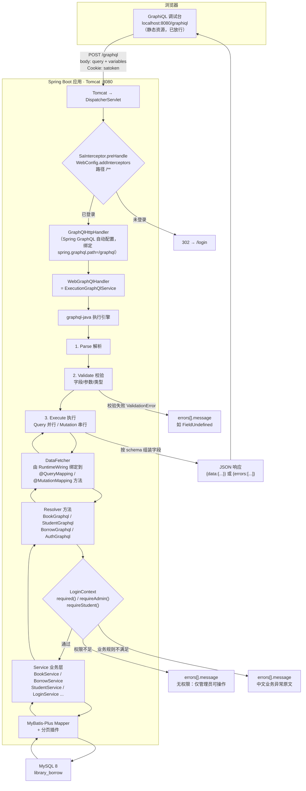

# 模板引擎

> Thymeleaf 是**服务端模板引擎（SSR，服务端渲染）**，核心能力：后端在服务器把 HTML + 数据渲染成完整页面，返回浏览器。

由于 SpringBoot 使⽤了嵌⼊式 Servlet 容器。所以 JSP 默认是不能使⽤的。 

如果需要服务端⻚⾯渲染，优先考虑使⽤  模板引擎


模板引擎⻚⾯默认放在  src/main/resources/templates

springboot模板引擎自动配置

**FreeMarker** 

**Groovy** 

**Thymeleaf**

 **Mustache** 

Thymeleaf官⽹：https://www.thymeleaf.org/ 

## Thymeleaf整合

**1导入依赖**

```
<dependency>
 <groupId>org.springframework.boot</groupId>
 <artifactId>spring-boot-starter-thymeleaf</artifactId>
 </dependency>
```

**2⾃动配置原理** 

1.  开启了org.springframework.boot.autoconfigure.thymeleaf.ThymeleafAutoConfiguration  ⾃动配置

2.  属性绑定在  ThymeleafProperties 中，对应配置⽂件  spring.thymeleaf 内容 3.  所
3.  有的模板⻚⾯默认在  classpath:/templates  ⽂件夹下 
4.  默认效果 a.  所有的模板⻚⾯在  classpath:/templates/  下⾯找 b.  找后缀名为 .html  的⻚⾯

## 基础语法

1 核心用法

2 语法实例

3 属性设置

4 遍历 

5 判断

6 属性优先级

7 行内写法

8 变量选择

9 模板布局

10 devtools

## 实战

GrapQL

- **Headers 面板：HTTP 请求头**（属于 HTTP 协议层面，发给后端的请求头部，比如 Cookie、Token、Content-Type）
- **Variables 面板：GraphQL 查询变量**（属于 GraphQL 语法层面，给 GraphQL 语句里 `$变量名` 传参数）
- 左侧上半区：GraphQL 语句编辑区（操作文档）GraphQL 特点：**只返回你指定的字段，不会返回多余数据**
- 右侧区域：服务端返回结果 Response
- 


```
mutation Login($role: String!, $username: String!, $password: String!) {

 login(role: $role, username: $username, password: $password) {

  token

  loginId

  role

  id

  username

  name

  homeUrl

 }

}
```

### 第 1 行

1. **`mutation`** GraphQL 的操作类型。代表**写操作**（会修改服务端数据 / 状态），比如：登录、新增、修改、删除。

> 对比：`query` 是读操作，只查询数据，不改变服务端状态。

1. **`Login`** 本次操作的**自定义名称**，仅用于可读性，后端不会依赖这个名字，随便取名都行。
2. **括号内 `($role: String!, $username: String!, $password: String!)` → 变量声明列表**

- `$role`：变量名，**`$` 是 GraphQL 变量标记**
- `String`：变量类型，代表字符串
- `!`：**非空约束**，表示这个参数必填，不能传 null，不传就会直接报错（就是你之前遇到的 `coerced Null value`）

> 含义：本次操作接收 3 个必填字符串变量：`$role`、`$username`、`$password`。 变量的值，从 GraphiQL 的 **Variables 面板** 传入。

### 第 2 行

- `login`：后端在 GraphQL Schema 定义的**变更方法名（DataFetcher 对应的接口）**，对应登录业务。
- `role: $role`：把变量 `$role` 的值，传给 login 方法的 `role` 参数。同理用户名、密码。

### 第 3~9 行：大括号内字段列表

```
{
    token
    loginId
    role
    id
    username
    name
    homeUrl
}
```

👉 **这一段是【你告诉后端：登录成功后，我需要返回哪些字段】** GraphQL 最大特点：**按需返回字段，不会一次性返回全部对象属性**。




每个按钮/链接绑定一个 URL → 后端一个 Controller 方法 → 返回一个"模板名"（字符串）→ Thymeleaf 在服务端把模板 + 数据渲染成完整 HTML → 整页返回


