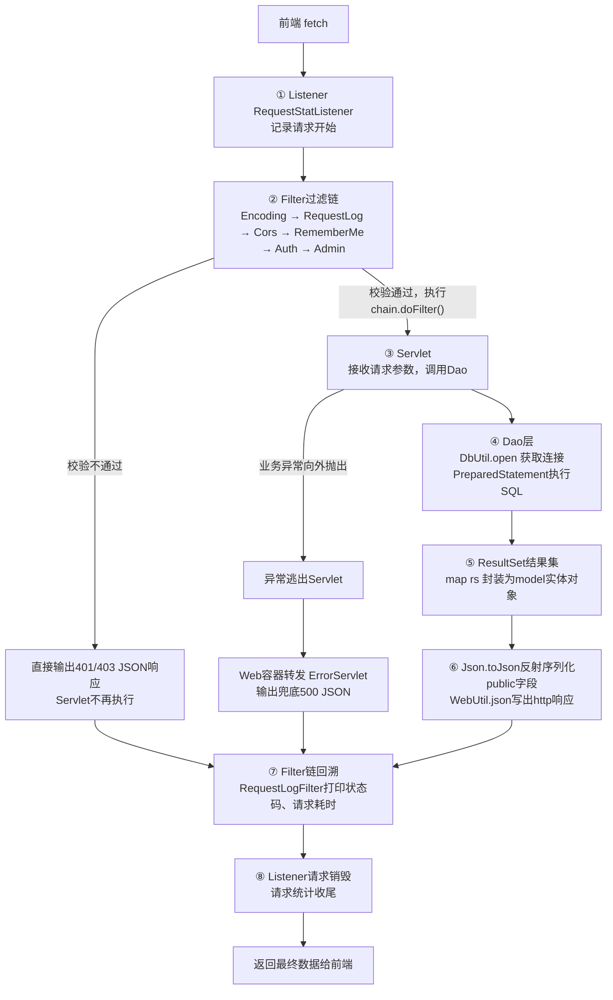
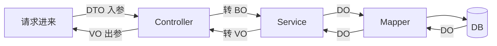

# 原生servlet-jdbc项目



## 三层架构

| 层                | 回答什么问题     | 关心什么                 | 不关心什么     |
| ----------------- | ---------------- | ------------------------ | -------------- |
| Servlet（表现层） | 怎么收、怎么回   | HTTP、参数、状态码、JSON | 业务规则、SQL  |
| Service（业务层） | 能不能做、怎么做 | 校验、流程、事务         | HTTP、SQL 语法 |
| Dao（数据层）     | 怎么存取         | SQL、连接、ResultSet     | 业务规则、HTTP |

**为什么要分三层架构**

| 不分层的后果                                                 | 分层后带来的好处                        |
| ------------------------------------------------------------ | --------------------------------------- |
| Servlet 里写 SQL → 换个接口要复制一遍                        | Dao 复用，多个 Service 都能调           |
| 业务规则散落在 Servlet 和 Dao 两处（你现在就是这样：库存在 Dao 判、下单日志在 Servlet 打） | 规则集中在 Service，只改一处            |
| 事务跨多个 Dao 时没法统一提交                                | Service 划定边界，一个事务管多张表      |
| 没法单独测试业务逻辑（必须起 Tomcat 发 HTTP）                | Service 是纯 Java，可直接 main 调用测试 |

## Servlet 层：只做协议转换

**职责：接请求 → 取参数 → 调 Service → 写响应。**

> OrderServlet.java L51‑L56

```
Order order = OrderDao.create(user.id, new LinkedHashMap<>(cart.getRaw()), payType, remark);
cart.clear();
Map<String, Object> data = new LinkedHashMap<>();
data.put("order", order);
data.put("cartCount", cart.size());
WebUtil.json(resp, Resp.ok(data));
```

它做的事：从 session 拿用户、从请求体拿 payType/remark、把结果包成 `{code,msg,data}` 写出去。

典型代码：`WebUtil.params(req)`、`WebUtil.json(resp, ...)`、`resp.setStatus(400)`。

**判断标准**：这段代码里有 `HttpServletRequest` / `HttpServletResponse` → 就该在 Servlet。

------

## Service 层：做业务决策

**职责：校验规则、编排流程、划定事务边界。**

以 "下单" 为例，Service 该做的事：

- 购物车是否为空 → 抛业务异常
- 菜品是否存在、是否下架、库存够不够
- 算总价（价格以数据库为准，不能信前端传的）
- 生成订单号
- 开启事务：写订单 + 写明细 + 扣库存，要么全成要么全滚
- 清购物车、写日志

> 伪代码：service/OrderService.java

```
public static Order submit(long userId, Map<Long,Integer> items, String payType, String remark) {
    if (items.isEmpty()) throw new BizException("购物车是空的");
    try (Connection c = DbUtil.open()) {
        c.setAutoCommit(false);         // 事务边界在这里
        try {
            Order o = OrderDao.insert(c, ...);
            DishDao.deductStock(c, ...);
            c.commit();
            return o;
        } catch (Exception e) { 
            c.rollback(); 
            throw e; 
        }
    }
}
```

**判断标准**：这段代码里既没有 `HttpServletRequest`，也没有 `ResultSet`，但描述的是 "业务规则" → 就该在 Service。

------

## Dao 层：只做数据存取

**职责：拼 SQL、执行、把结果转成对象。**

> OrderDao.java L173‑L175

```
public static List<Order> findByUser(long userId) throws SQLException {
    String sql = "SELECT id,order_no,user_id,total_amount,pay_type,remark,status,created_at"
            + " FROM t_order WHERE user_id = ? ORDER BY id DESC";
```

它只回答 "按 user_id 查出订单"，不判断这些订单能不能取消、该不该展示。

典型代码：`PreparedStatement`、`ResultSet`、`map(rs)`。

**判断标准**：方法里出现了 SQL 字符串或 `ResultSet` → 就该在 Dao。 理想状态下 Dao 里不该有 `commit/rollback`（那是 Service 的事）。

------

## 用一个请求串起来看：用户点「提交订单」

```
① Servlet  收到 POST /api/orders
           取 session 用户、取 payType/remark
           → 只做搬运，不判断库存够不够

② Service  校验购物车非空
           查菜品价格、检查库存         ← 业务规则
           算总价、生成订单号
           开启事务
             ├─ 调 Dao 写订单
             ├─ 调 Dao 写明细
             └─ 调 Dao 扣库存
           提交事务

③ Dao      "INSERT INTO t_order ..."
           "UPDATE t_dish SET stock=stock-? ..."
           → 只执行，不知道这是"下单"还是"退货"

④ 回到 Servlet：Order 对象 → Json.toJson → 响应

```

# SpringBoot三层架构

## **定义**

Web 前端发送请求，请求先经过 SpringSecurity 过滤器链，完成认证、授权以及 Web 安全防护；之后进入 Controller 层； Controller 接收请求，使用 DTO（入参）接收前端提交的数据； 向下调用 Service 层；Service 层内部使用 BO 业务对象完成多表业务数据组装，各个 Service 之间通过 BO 进行数据交互； Service 再调用 Mapper（MyBatis‑Plus / MyBatis）访问 MySQL 数据库；数据库查询结果封装为 DO 数据库实体对象返回； 业务处理完成后向上返回，Controller 封装为 VO 视图对象作为出参返回前端； 如果业务执行出错、参数校验失败，则由全局异常处理器统一捕获异常，向前端返回统一的 JSON 错误响应。

📦项目基础公共组件与文件说明

- **resources**：资源目录，存放各类配置文件、MyBatis 的 Mapper‑xml 映射文件；例如 logback‑spring.xml 日志配置、application.yml/properties 应用配置文件都放在该目录下；
- common：存放全局公共代码、统一返回结果实体、异常定义；
- config：Spring 的各类配置类（SpringSecurity 配置、Mybatis 配置等）；
- util：通用工具类；
- AOP：用于切面增强；
- 定时任务：实现后台定时业务；
- mybatis xml 文件：用来编写多表联查、分组统计等复杂 SQL；
- logback‑spring.xml：Logback 日志配置文件，定义日志输出规则、控制台与滚动日志文件；
- Knife4j：生成在线 API 接口文档，支持接口调试。

## 时序图

.png)

## memarid


.png)



# Spring三层架构