# 图

把现实里**事物**抽象成**顶点**，

事物之间的**关系 / 联系**抽象成**边**，

用「图」模型来解决的题目，全部叫**图论问题**

线性结构：数组、链表 → 一对一

树形结构：树 → 一对多

**图 结构：多对多**

只要是**多对多关系**，基本都是图论问题。

**图论问题，就是将实体抽象为顶点、关系抽象为边，利用图的遍历、最短路、拓扑、生成树、连通性等算法求解的一类算法题目。**

一、图的基础概念（开篇必问）

1. 有向图 / 无向图

2. 有权图 / 无权图

3. 邻接矩阵、邻接表（区别 + 优缺点）

   - 邻接表：稀疏图、省空间、常用
   - 邻接矩阵：稠密图、查边快、耗空间

   

4. 入度、出度、连通分量、环

5. 二分图、强连通图、弱连通图

------

二、图的两种遍历（必考）

1. DFS 深度优先

- 思想：一条路走到黑，回溯
- 实现：递归 / 栈
- 适用：连通块、岛屿问题、路径搜索、环判断

2. BFS 广度优先

- 思想：层层扩散、按层遍历
- 实现：队列
- 适用：**无权图最短路径**、层序、最少步数

------

三、拓扑排序（高频）

1. 前提：**有向无环图 DAG**

2. 作用：解决**依赖先后顺序**

3. 两种实现：

   - Kahn 算法（BFS + 入度表，最常考）
   - DFS 逆序输出

   

4. 考点：

   - 有环能不能拓扑？不能
   - 循环依赖检测（项目依赖、课程表）

   

------

四、最短路径（重中之重，背区别）

1. Dijkstra

- 场景：**单源、正权边**
- 思想：贪心 + 优先队列
- 缺点：不能处理负权

2. Bellman-Ford

- 场景：**单源、可负权**
- 原理：n-1 轮松弛
- 亮点：**负权环检测**
- 优化：SPFA（队列优化）

3. Floyd-Warshall

- 场景：**多源最短路径**（任意两点）
- 写法：三层循环 中转 k
- 复杂度 O(n3)，只适合小点集
- 可判负环：dist[i][i]<0

面试经典提问

- 负权边用什么？BF / SPFA / Floyd
- 负环怎么检测？
- Dijkstra 为什么不能用负权？

------

五、最小生成树 MST

1. 定义：无向连通图，n 个点 n-1 条边，总权最小、无环

2. 两大算法

   - **Kruskal**：边排序 + 并查集，稀疏图
   - **Prim**：加点法，稠密图，类似 Dijkstra

   

3. 场景：城市修路、网络布线、最小代价连通

------

六、高级高频考点

1. 并查集   作用：判环、连通性合并、Kruskal 标配
2. 二分图判定（染色法）
3. 强连通分量 Tarjan 算法（进阶）
4. 关键路径 AOE 网（工程工期）

## 什么是图

1. 图是由若干顶点（vertex） + 顶点之间的连接关系边（edge） 组成的非线性数据结构。
2. 有向图：边带单向方向，通行有严格指向限制。
3. 无向图：边无方向，顶点之间双向互通。
4. 度：无向图是顶点相连的边数，有向图分为入度、出度。
5. 路径：沿图中边依次穿行形成的顶点行走序列。
6. 权：依附在边上的数值，代表距离、成本、耗时等代价。
7. 环：起点与终点为同一顶点的闭合路径。 
8. 连通性：顶点之间能否相互到达的连通能力。
9. 子图：由原图部分顶点与部分边构成的局部图形。

### **有向无向**

**无向图**  边**没有方向**，顶点之间是**双向连通**关系。

如果是无向图，那么边是双向的，下面是一个无向图的例子

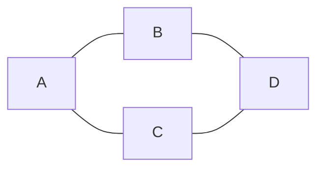

有向图边**带有方向**，顶点之间是**单向指向**关系。

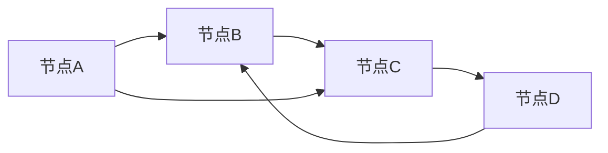

| 对比维度       | 无向图                   | 有向图                                 |
| -------------- | ------------------------ | -------------------------------------- |
| **边的方向**   | 无方向、双向             | 有方向、单向                           |
| **连通性**     | A 连 B ⇔ B 连 A          | A 指向 B，B 不一定指向 A               |
| **度的概念**   | 只有「度数」             | 分为**入度**、**出度**、总度           |
| **边重复规则** | 无重复反向边             | 允许双向两条独立边                     |
| **回路 / 环**  | 无向环                   | 有向环（严格按方向走）                 |
| **典型场景**   | 社交好友、道路互通、电网 | 网页跳转、任务依赖、单向交通、流程审批 |

1. 邻接矩阵

- 无向图：矩阵**对称**
- 有向图：矩阵**不对称**

1. 遍历

- 无向图：遍历要避免回头重复访问父节点
- 有向图：需要考虑路径方向，常考**拓扑排序**（有向无环图 DAG）

### 度

**度**是指与该顶点相邻的边的数量

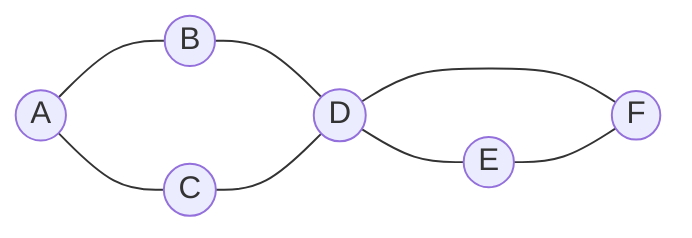

例如上图中

* A、B、C、E、F 这几个顶点度数为 2
* D 顶点度数为 4

有向图中，细分为**入度**和**出度**，参见下图

1. 出度（出去的箭头）**出度：从当前点，指出去的箭头数量**
2. 入度（进来的箭头）**入度：指向当前点，进来的箭头数量**

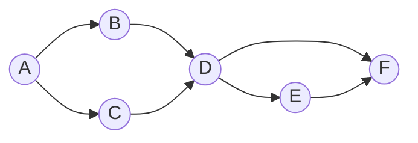

* A (2 out / 0 in)
* B、C、E (1 out / 1 in)
* D (2 out / 2 in)
* F (0 out / 2 in)

### 权

1. 边可以有权重，代表从源顶点到目标顶点的距离、费用、时间或其他度量。
2. 图里每条边上可以带一个数值，这个数就叫权 / 权重。
3. 带权的图 = 网 / 带权图 ✅ 通俗理解： 
4. 道路图：权 = 距离、耗时、过路费 社交图：
5. 权 = 亲密度 路线算法：
6. 权 = 成本 无向边、有向边都可以加权重

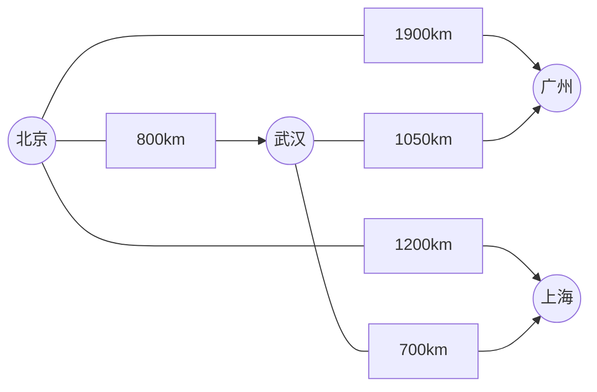

### 路径

从一个顶点出发，顺着边走，依次经过的「顶点序列」。

路径被定义为从一个顶点到另一个顶点的一系列连续边，例如上图中【北京】到【上海】有多条路径

* 北京 - 上海
* 北京 - 武汉 - 上海

路径长度

* 不考虑权重，长度就是边的数量
* 考虑权重，一般就是权重累加

### 环

在有向图中，从一个顶点开始，可以通过若干条有向边返回到该顶点，那么就形成了一个环

**环**：起点和终点是同一个点的路径

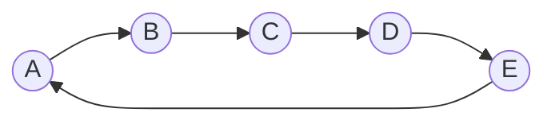


### 图的连通性

如果两个顶点之间存在路径，则这两个顶点是连通的，所有顶点都连通，则该图被称之为连通图，若子图连通，则称为连通分量

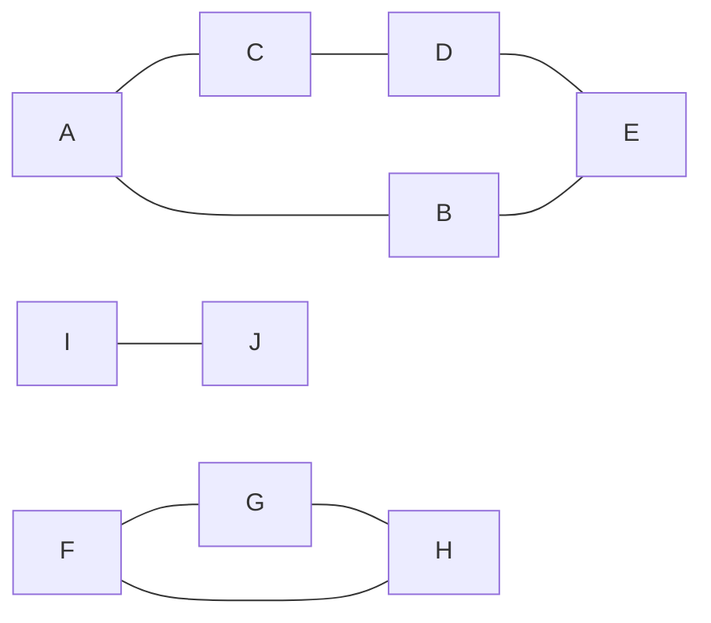


 **强连通**：有向图，两两互相能走到

**弱连通**：有向图，拆箭头才连通，单向走不通

**二分图**：点分两组，组内无边，组间互连、无奇数环

### 图的表示

1. **邻接矩阵：稠密图、查边快**
2. **邻接表：稀疏图、遍历出边**
3. **逆邻接表：有向图、遍历入边**
4. **十字链表：有向图、出入边都要查**
5. **边集数组：按边操作，Kruskal 专用**

比如说，下面的图


用**邻接矩阵**（二维数组）可以表示为：

无向图：矩阵**对称**

查找两点是否有边：**超快 O (1)**

缺点：顶点少、边少时**浪费空间**（稀疏图不适合）

```
  A B C D
A 0 1 1 0
B 1 0 0 1 
C 1 0 0 1
D 0 1 1 0
```

用**邻接表**（数组 + 链表 / 集合）可以表示为：

1. 每个顶点单独挂一个链表，存储它**直接相连的邻接点**
2. 有向图：只存出边
3. 特点

- 节省空间，**稀疏图首选**
- 遍历邻接点快
- 缺点：判断两点是否有边较慢，需要遍历链表

```
A -> B -> C
B -> A -> D
C -> A -> D
D -> B -> C
```

有向图的例子

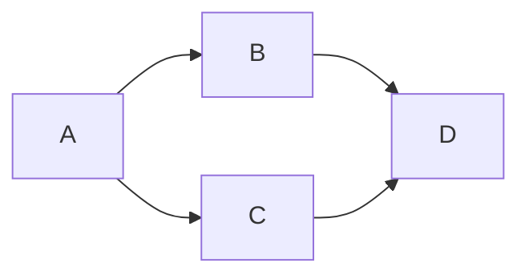

```
  A B C D
A 0 1 1 0
B 0 0 0 1
C 0 0 0 1
D 0 0 0 0
```

```
A - B - C
B - D
C - D
D - empty
```

## 遍历

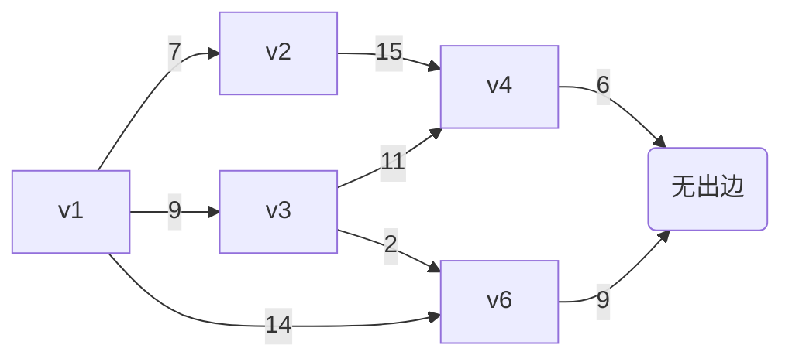

**BFS 广度**：队列、一层一层、最短路径

**DFS 深度**：递归 / 栈、一条路走到黑、回溯


### DFS

**DFS** 深度优先搜索

从起点出发，**一条路走到黑**，能往下走就一直往下钻，走不通（没路 / 都访问过）再**回头回溯**，再走别的分支。

口诀：**一条路走到底，走不动再回头**

标记当前节点 **已访问**

打印 / 处理当前节点

遍历当前所有相邻节点

没访问过的，**递归深度搜索**

全部走完自动回溯

**行走逻辑**

1. 先走 **v1 → v3**
2. v3 继续往下走 **v3 → v4**
3. v4 继续往下走 **v4 → v5**（v5 没路了）
4. 回溯回到 v3，走下一个 **v3 → v6**
5. v6 往下走 **v6 → v5（已访问）**，无路
6. 回溯回到 v1，走 **v1 → v2**
7. v2→v4（已访问），全部结束

```
package com.itheima.datastructure.graph;

import java.util.LinkedList;
import java.util.List;

/**
 * <h3>深度优先搜索 Depth-first search</h3>
 */
public class DFS {

    public static void main(String[] args) {
        Vertex v1 = new Vertex("v1");
        Vertex v2 = new Vertex("v2");
        Vertex v3 = new Vertex("v3");
        Vertex v4 = new Vertex("v4");
        Vertex v5 = new Vertex("v5");
        Vertex v6 = new Vertex("v6");

        v1.edges = List.of(
                new Edge(v3, 9),
                new Edge(v2, 7),
                new Edge(v6, 14)
        );
        v2.edges = List.of(new Edge(v4, 15));
        v3.edges = List.of(
                new Edge(v4, 11),
                new Edge(v6, 2)
        );
        v4.edges = List.of(new Edge(v5, 6));
        v5.edges = List.of();
        v6.edges = List.of(new Edge(v5, 9));

        dfs2(v1);
    }

    private static void dfs2(Vertex v) {
        LinkedList<Vertex> stack = new LinkedList<>();
        stack.push(v);
        while (!stack.isEmpty()) {
            Vertex pop = stack.pop();
            pop.visited = true;
            System.out.println(pop.name);
            for (Edge edge : pop.edges) {
                if (!edge.linked.visited) {
                    stack.push(edge.linked);
                }
            }
        }
    }

    private static void dfs(Vertex v) {
        v.visited = true;
        System.out.println(v.name);
        for (Edge edge : v.edges) {
            if (!edge.linked.visited) {
                dfs(edge.linked);
            }
        }
    }
}

```

```
v1
v6
v5
v2
v4
v3
```

### BFS

为什么BFS能求得最短路径

BFS 采用**层序遍历**，由近及远逐层搜索；

每一层对应一条边的距离，保证**先访问到目标节点的路径边数最少**；

节点只访问一次，避免重复绕路，因此**首次到达终点即为无权图最短路径**。

**BFS** 广度优先搜索

从起始顶点开始，**先访问自己 → 再把当前节点所有相邻节点全部访问完**，再一层层往下扩散，像**水波扩散、地毯式搜索**。

口诀：**先近后远，一层一层向外搜**

准备**队列**、标记 `visited` 防止重复走、死循环

起点标记已访问，入队

循环：

- 出队一个节点，打印 / 处理
- 遍历它所有相连边（邻居）
- 没访问过的：标记 + 入队

队列为空，遍历结束

**行走逻辑**

1. 第一层：访问 **v1**
2. 第二层：一次性访问 v1 所有邻居 → **v3、v2、v6**
3. 第三层：再依次访问 v3/v2/v6 的邻居 → **v4、v5**
4. 第四层：最后访问 **v5** 无邻居

```
package com.itheima.datastructure.graph;

import java.util.LinkedList;
import java.util.List;

/**
 * <h3>广度优先搜索 Breadth-first search</h3>
 */
public class BFS {

    public static void main(String[] args) {
        Vertex v1 = new Vertex("v1");
        Vertex v2 = new Vertex("v2");
        Vertex v3 = new Vertex("v3");
        Vertex v4 = new Vertex("v4");
        Vertex v5 = new Vertex("v5");
        Vertex v6 = new Vertex("v6");

        v1.edges = List.of(
                new Edge(v3, 9),
                new Edge(v2, 7),
                new Edge(v6, 14)
        );
        v2.edges = List.of(new Edge(v4, 15));
        v3.edges = List.of(
                new Edge(v4, 11),
                new Edge(v6, 2)
        );
        v4.edges = List.of(new Edge(v5, 6));
        v5.edges = List.of();
        v6.edges = List.of(new Edge(v5, 9));

        bfs(v1);
    }

    private static void bfs(Vertex v) {
        LinkedList<Vertex> queue = new LinkedList<>();
        // 1. 标记当前顶点为已访问
        v.visited = true;
        // 2. 将当前顶点加入队列
        queue.offer(v);
        while (!queue.isEmpty()) {
            Vertex poll = queue.poll();
            System.out.println(poll.name);
            // 3. 遍历当前顶点的所有邻接顶点
            // 4. 标记未访问的邻接顶点为已访问
            // 5. 将未访问的邻接顶点加入队列
            for (Edge edge : poll.edges) {
                if (!edge.linked.visited) {
                    edge.linked.visited = true;
                    queue.offer(edge.linked);
                }
            }
        }
    }
}

```

```
v1
v3
v2
v6
v4
v5
```


## 拓扑排序

拓扑排序是有向无环图 (DAG) 中，根据前后依赖关系，由入度为 0 节点开始，依次排出的线性先后顺序，用来解决任务依赖与环检测。

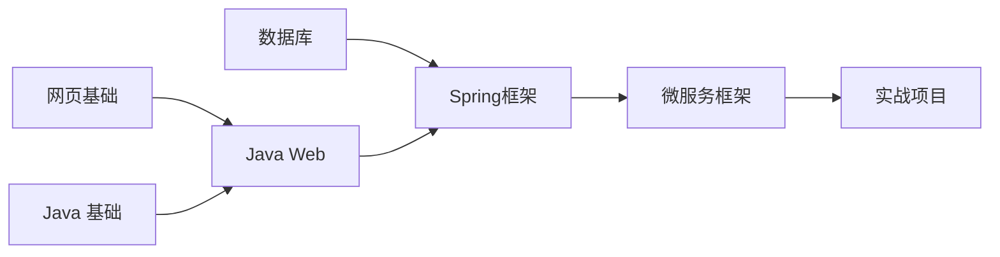

拓扑排序：针对有向无环图（DAG） 的一种排序方式简单说： 

有先后依赖关系，必须先做 A，再做 B，按依赖顺序排好所有节点 前提： 

必须是有向图（有箭头） 不能有环（不能 A→B 又 B→A，死循环排不了）

1. Kahn (入度 + 队列)

   靠入度

   干活，直观、能判环，工作考试首选。

2. DFS 后序逆序

   靠

   深度优先回溯

   干活，代码短，适合简答。

拓扑排序两种实现：

1. **Kahn 算法：入度数组 + 队列**
2. **DFS 算法：后序遍历 + 逆序**


### Kahn

**入度表 + 队列（Kahn 算法）**

1. 统计所有顶点**入度**

2. 把**入度 = 0** 的节点入队

3. 出队一个节点，加入拓扑结果

4. 它的邻接点**入度 - 1**

5. 若邻接点入度变为 0，继续入队

6. 最后：

   - 输出节点数 = 总节点数 → 无环 (DAG)
   - 少于总节点数 → **有环，无法拓扑**

   

**特点**

- 能**判断有没有环**
- 能直观看到依赖
- 面试、工程、教材**主流写法**

```
package com.itheima.datastructure.graph;

import java.util.ArrayList;
import java.util.LinkedList;
import java.util.List;
import java.util.Queue;

/**
 * <h3>拓扑排序 Kahn's algorithm</h3>
 */
public class TopologicalSort {

    public static void main(String[] args) {
        Vertex v1 = new Vertex("网页基础");
        Vertex v2 = new Vertex("Java基础");
        Vertex v3 = new Vertex("JavaWeb");
        Vertex v4 = new Vertex("Spring框架");
        Vertex v5 = new Vertex("微服务框架");
        Vertex v6 = new Vertex("数据库");
        Vertex v7 = new Vertex("实战项目");

        v1.edges = List.of(new Edge(v3)); // +1
        v2.edges = List.of(new Edge(v3)); // +1
        v3.edges = List.of(new Edge(v4));
        v6.edges = List.of(new Edge(v4));
        v4.edges = List.of(new Edge(v5));
        v5.edges = List.of(new Edge(v7));
        v7.edges = List.of();

        List<Vertex> graph = List.of(v1, v2, v3, v4, v5, v6, v7);
        // 1. 统计每个顶点的入度
        for (Vertex v : graph) {
            for (Edge edge : v.edges) {
                edge.linked.inDegree++;
            }
        }
        /*for (Vertex vertex : graph) {
            System.out.println(vertex.name + " " + vertex.inDegree);
        }*/
        // 2. 将入度为0的顶点加入队列
        LinkedList<Vertex> queue = new LinkedList<>();
        for (Vertex v : graph) {
            if (v.inDegree == 0) {
                queue.offer(v);
            }
        }
        // 3. 队列中不断移除顶点，每移除一个顶点，把它相邻顶点入度减1，若减到0则入队
        List<String> result = new ArrayList<>();
        while (!queue.isEmpty()) {
            Vertex poll = queue.poll();
//            System.out.println(poll.name);
            result.add(poll.name);
            for (Edge edge : poll.edges) {
                edge.linked.inDegree--;
                if (edge.linked.inDegree == 0) {
                    queue.offer(edge.linked);
                }
            }
        }
        if (result.size() != graph.size()) {
            System.out.println("出现环");
        } else {
            for (String key : result) {
                System.out.println(key);
            }
        }
    }
}

```


### DFS

**深度优先 DFS 逆序输出**

**原理**

1. 递归 DFS 遍历
2. 一个节点**所有后继都遍历完**，再把该节点加入集合
3. 最后**反转集合**，就是拓扑顺序

**特点**

- 代码简洁、递归实现
- 不太好直观计算入度
- 也可检测环（需要标记递归栈）

```
package com.itheima.datastructure.graph;

import java.util.LinkedList;
import java.util.List;

/**
 * <h3>拓扑排序 DFS</h3>
 */
public class TopologicalSortDFS {

    public static void main(String[] args) {
        Vertex v1 = new Vertex("网页基础");
        Vertex v2 = new Vertex("Java基础");
        Vertex v3 = new Vertex("JavaWeb");
        Vertex v4 = new Vertex("Spring框架");
        Vertex v5 = new Vertex("微服务框架");
        Vertex v6 = new Vertex("数据库");
        Vertex v7 = new Vertex("实战项目");

        v1.edges = List.of(new Edge(v3));
        v2.edges = List.of(new Edge(v3));
        v3.edges = List.of(new Edge(v4));
        v6.edges = List.of(new Edge(v4));
        v4.edges = List.of(new Edge(v5));
        v5.edges = List.of(new Edge(v7));
        v7.edges = List.of();

        List<Vertex> graph = List.of(v1, v2, v3, v4, v5, v6, v7);

        LinkedList<String> stack = new LinkedList<>();
        for (Vertex v : graph) {
            dfs(v, stack);
        }
        System.out.println(stack);
    }

    private static void dfs(Vertex v, LinkedList<String> stack) {
        if (v.status == 2) {
            return;
        }
        if (v.status == 1) {
            throw new RuntimeException("发现了环");
        }
        v.status = 1;
        for (Edge edge : v.edges) {
            dfs(edge.linked, stack);
        }
        v.status = 2;
        stack.push(v.name);
    }


}

```

## 有向图

## 无向图

##  最短路径

**找到从一个顶点到达另一个顶点的成本最小路径**


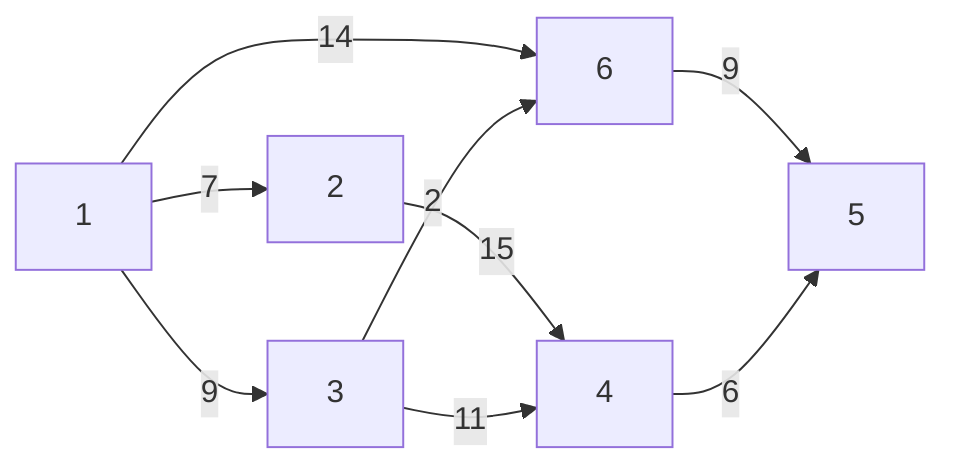

### Dijkstra

**带权有向 / 无向图**中，求**单个起点 到 所有其他顶点的最短路径**算法。

✅ 适用：**边权必须 ≥ 0**（不能有负权）

每次从**未确定最短距离的点**里，选出**当前距离最短**的顶点，

以它为中间点，**更新其他点的最短距离**（松弛操作）。

算法描述：

1. 将所有顶点标记为未访问。创建一个未访问顶点的集合。
2. 为每个顶点分配一个临时距离值
   * 对于我们的初始顶点，将其设置为零
   * 对于所有其他顶点，将其设置为无穷大。
3. 每次选择最小临时距离的未访问顶点，作为新的当前顶点
4. 对于当前顶点，遍历其所有未访问的邻居，并更新它们的临时距离为更小
   * 例如，1->6 的距离是 14，而1->3->6 的距离是11。这时将距离更新为 11
   * 否则，将保留上次距离值
5. 当前顶点的邻居处理完成后，把它从未访问集合中删除

#### 未改进

```
public class Dijkstra {
    public static void main(String[] args) {
        Vertex v1 = new Vertex("v1");
        Vertex v2 = new Vertex("v2");
        Vertex v3 = new Vertex("v3");
        Vertex v4 = new Vertex("v4");
        Vertex v5 = new Vertex("v5");
        Vertex v6 = new Vertex("v6");

        v1.edges = List.of(new Edge(v3, 9), new Edge(v2, 7), new Edge(v6, 14));
        v2.edges = List.of(new Edge(v4, 15));
        v3.edges = List.of(new Edge(v4, 11), new Edge(v6, 2));
        v4.edges = List.of(new Edge(v5, 6));
        v5.edges = List.of();
        v6.edges = List.of(new Edge(v5, 9));

        List<Vertex> graph = List.of(v1, v2, v3, v4, v5, v6);

        dijkstra(graph, v1);
    }

    private static void dijkstra(List<Vertex> graph, Vertex source) {
        ArrayList<Vertex> list = new ArrayList<>(graph);
        source.dist = 0;

        while (!list.isEmpty()) {
            // 3. 选取当前顶点
            Vertex curr = chooseMinDistVertex(list);
            // 4. 更新当前顶点邻居距离
            updateNeighboursDist(curr, list);
            // 5. 移除当前顶点
            list.remove(curr);
        }

        for (Vertex v : graph) {
            System.out.println(v.name + " " + v.dist);
        }
    }

    private static void updateNeighboursDist(Vertex curr, ArrayList<Vertex> list) {
        for (Edge edge : curr.edges) {
            Vertex n = edge.linked;
            if (list.contains(n)) {
                int dist = curr.dist + edge.weight;
                if (dist < n.dist) {
                    n.dist = dist;
                }
            }
        }
    }

    private static Vertex chooseMinDistVertex(ArrayList<Vertex> list) {
        Vertex min = list.get(0);
        for (int i = 1; i < list.size(); i++) {
            if (list.get(i).dist < min.dist) {
                min = list.get(i);
            }
        }
        return min;
    }

}
```

```
v1(0) <- null
v2(7) <- v1
v3(9) <- v1
v4(20) <- v3
v5(20) <- v6
v6(11) <- v3
右侧是上一节点是什么
```

#### **改进 - 优先级队列**

1. 创建一个优先级队列，放入所有顶点（队列大小会达到边的数量）
2. 为每个顶点分配一个临时距离值
   * 对于我们的初始顶点，将其设置为零
   * 对于所有其他顶点，将其设置为无穷大。
3. 每次选择最小临时距离的未访问顶点，作为新的当前顶点
4. 对于当前顶点，遍历其所有未访问的邻居，并更新它们的临时距离为更小，若距离更新需加入队列
   * 例如，1->6 的距离是 14，而1->3->6 的距离是11。这时将距离更新为 11
   * 否则，将保留上次距离值
5. 当前顶点的邻居处理完成后，把它从队列中删除

```java
public class DijkstraPriorityQueue {
    public static void main(String[] args) {
        Vertex v1 = new Vertex("v1");
        Vertex v2 = new Vertex("v2");
        Vertex v3 = new Vertex("v3");
        Vertex v4 = new Vertex("v4");
        Vertex v5 = new Vertex("v5");
        Vertex v6 = new Vertex("v6");

        v1.edges = List.of(new Edge(v3, 9), new Edge(v2, 7), new Edge(v6, 14));
        v2.edges = List.of(new Edge(v4, 15));
        v3.edges = List.of(new Edge(v4, 11), new Edge(v6, 2));
        v4.edges = List.of(new Edge(v5, 6));
        v5.edges = List.of();
        v6.edges = List.of(new Edge(v5, 9));

        List<Vertex> graph = List.of(v1, v2, v3, v4, v5, v6);

        dijkstra(graph, v1);
    }

    private static void dijkstra(List<Vertex> graph, Vertex source) {
        PriorityQueue<Vertex> queue = new PriorityQueue<>(Comparator.comparingInt(v -> v.dist));
        source.dist = 0;
        for (Vertex v : graph) {
            queue.offer(v);
        }

        while (!queue.isEmpty()) {
            System.out.println(queue);
            // 3. 选取当前顶点
            Vertex curr = queue.peek();
            // 4. 更新当前顶点邻居距离
            if(!curr.visited) {
                updateNeighboursDist(curr, queue);
                curr.visited = true;
            }
            // 5. 移除当前顶点
            queue.poll();
        }

        for (Vertex v : graph) {
            System.out.println(v.name + " " + v.dist + " " + (v.prev != null ? v.prev.name : "null"));
        }
    }

    private static void updateNeighboursDist(Vertex curr, PriorityQueue<Vertex> queue) {
        for (Edge edge : curr.edges) {
            Vertex n = edge.linked;
            if (!n.visited) {
                int dist = curr.dist + edge.weight;
                if (dist < n.dist) {
                    n.dist = dist;
                    n.prev = curr;
                    queue.offer(n);
                }
            }
        }
    }

}
```


#### **问题**

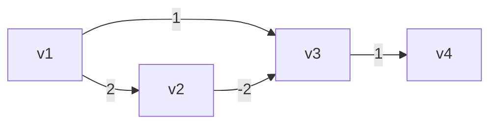

按照 Dijkstra 算法，得出

* v1 -> v2 最短距离2
* v1 -> v3 最短距离1
* v1 -> v4 最短距离2

事实应当是

* v1 -> v2 最短距离2
* v1 -> v3 最短距离0
* v1 -> v4 最短距离1


### Bellman-Ford

Bellman-Ford 单源最短路，暴力遍历所有边松弛 n-1 轮，支持负权边，可检测负权环。

**Bellman-Ford** 是**单源最短路径**算法。

- 从**一个起点**，算出到图中所有节点的最短路径
- 核心优势：**支持负权边**（Dijkstra 不行）

```java
public class BellmanFord {
    public static void main(String[] args) {
        // 正常情况
        /*Vertex v1 = new Vertex("v1");
        Vertex v2 = new Vertex("v2");
        Vertex v3 = new Vertex("v3");
        Vertex v4 = new Vertex("v4");
        Vertex v5 = new Vertex("v5");
        Vertex v6 = new Vertex("v6");

        v1.edges = List.of(new Edge(v3, 9), new Edge(v2, 7), new Edge(v6, 14));
        v2.edges = List.of(new Edge(v4, 15));
        v3.edges = List.of(new Edge(v4, 11), new Edge(v6, 2));
        v4.edges = List.of(new Edge(v5, 6));
        v5.edges = List.of();
        v6.edges = List.of(new Edge(v5, 9));

        List<Vertex> graph = List.of(v4, v5, v6, v1, v2, v3);*/

        // 负边情况
        /*Vertex v1 = new Vertex("v1");
        Vertex v2 = new Vertex("v2");
        Vertex v3 = new Vertex("v3");
        Vertex v4 = new Vertex("v4");

        v1.edges = List.of(new Edge(v2, 2), new Edge(v3, 1));
        v2.edges = List.of(new Edge(v3, -2));
        v3.edges = List.of(new Edge(v4, 1));
        v4.edges = List.of();
        List<Vertex> graph = List.of(v1, v2, v3, v4);*/

        // 负环情况
        Vertex v1 = new Vertex("v1");
        Vertex v2 = new Vertex("v2");
        Vertex v3 = new Vertex("v3");
        Vertex v4 = new Vertex("v4");

        v1.edges = List.of(new Edge(v2, 2));
        v2.edges = List.of(new Edge(v3, -4));
        v3.edges = List.of(new Edge(v4, 1), new Edge(v1, 1));
        v4.edges = List.of();
        List<Vertex> graph = List.of(v1, v2, v3, v4);

        bellmanFord(graph, v1);
    }

    private static void bellmanFord(List<Vertex> graph, Vertex source) {
        source.dist = 0;
        int size = graph.size();
        // 1. 进行 顶点个数 - 1 轮处理
        for (int i = 0; i < size - 1; i++) {
            // 2. 遍历所有的边
            for (Vertex s : graph) {
                for (Edge edge : s.edges) {
                    // 3. 处理每一条边
                    Vertex e = edge.linked;
                    if (s.dist != Integer.MAX_VALUE && s.dist + edge.weight < e.dist) {
                        e.dist = s.dist + edge.weight;
                        e.prev = s;
                    }
                }
            }
        }
        for (Vertex v : graph) {
            System.out.println(v + " " + (v.prev != null ? v.prev.name : "null"));
        }
    }
}
```


**负环**

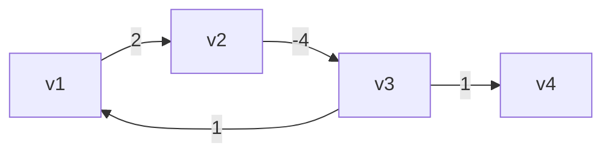

如果在【顶点-1】轮处理完成后，还能继续找到更短距离，表示发现了负环


### Floyd-Warshall

**多源最短路径算法**，一次性算出**图中任意两个顶点**之间的最短距离。

Floyd-Warshall 是**多源最短路**算法，利用中间中转点思想，三层循环动态规划，支持负权边，适合小点集全局最短路求解。

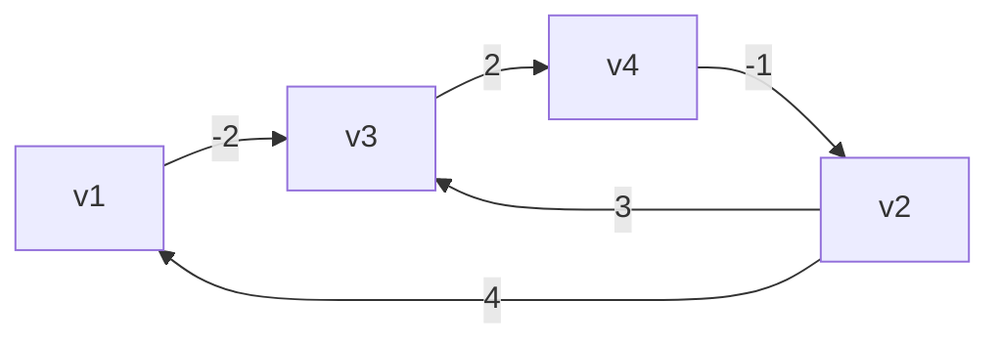

```java
public class FloydWarshall {
    public static void main(String[] args) {
        Vertex v1 = new Vertex("v1");
        Vertex v2 = new Vertex("v2");
        Vertex v3 = new Vertex("v3");
        Vertex v4 = new Vertex("v4");

        v1.edges = List.of(new Edge(v3, -2));
        v2.edges = List.of(new Edge(v1, 4), new Edge(v3, 3));
        v3.edges = List.of(new Edge(v4, 2));
        v4.edges = List.of(new Edge(v2, -1));
        List<Vertex> graph = List.of(v1, v2, v3, v4);

        /*
                直接连通
                v1  v2  v3  v4
            v1  0   ∞   -2  ∞
            v2  4   0   3   ∞
            v3  ∞   ∞   0   2
            v4  ∞   -1  ∞   0

                k=0 借助v1到达其它顶点
                v1  v2  v3  v4
            v1  0   ∞   -2  ∞
            v2  4   0   2   ∞
            v3  ∞   ∞   0   2
            v4  ∞   -1  ∞   0

                k=1 借助v2到达其它顶点
                v1  v2  v3  v4
            v1  0   ∞   -2  ∞
            v2  4   0   2   ∞
            v3  ∞   ∞   0   2
            v4  3   -1  1   0

                k=2 借助v3到达其它顶点
                v1  v2  v3  v4
            v1  0   ∞   -2  0
            v2  4   0   2   4
            v3  ∞   ∞   0   2
            v4  3   -1  1   0

                k=3 借助v4到达其它顶点
                v1  v2  v3  v4
            v1  0   -1   -2  0
            v2  4   0   2   4
            v3  5   1   0   2
            v4  3   -1  1   0
         */
        floydWarshall(graph);
    }

    static void floydWarshall(List<Vertex> graph) {
        int size = graph.size();
        int[][] dist = new int[size][size];
        Vertex[][] prev = new Vertex[size][size];
        // 1）初始化
        for (int i = 0; i < size; i++) {
            Vertex v = graph.get(i); // v1 (v3)
            Map<Vertex, Integer> map = v.edges.stream().collect(Collectors.toMap(e -> e.linked, e -> e.weight));
            for (int j = 0; j < size; j++) {
                Vertex u = graph.get(j); // v3
                if (v == u) {
                    dist[i][j] = 0;
                } else {
                    dist[i][j] = map.getOrDefault(u, Integer.MAX_VALUE);
                    prev[i][j] = map.get(u) != null ? v : null;
                }
            }
        }
        print(prev);
        // 2）看能否借路到达其它顶点
        /*
            v2->v1          v1->v?
            dist[1][0]   +   dist[0][0]
            dist[1][0]   +   dist[0][1]
            dist[1][0]   +   dist[0][2]
            dist[1][0]   +   dist[0][3]
         */
        for (int k = 0; k < size; k++) {
            for (int i = 0; i < size; i++) {
                for (int j = 0; j < size; j++) {
//                    dist[i][k]   +   dist[k][j] // i行的顶点，借助k顶点，到达j列顶点
//                    dist[i][j]                  // i行顶点，直接到达j列顶点
                    if (dist[i][k] != Integer.MAX_VALUE &&
                            dist[k][j] != Integer.MAX_VALUE &&
                            dist[i][k] + dist[k][j] < dist[i][j]) {
                        dist[i][j] = dist[i][k] + dist[k][j];
                        prev[i][j] = prev[k][j];
                    }
                }
            }
//            print(dist);
        }
        print(prev);
    }

    static void path(Vertex[][] prev, List<Vertex> graph, int i, int j) {
        LinkedList<String> stack = new LinkedList<>();
        System.out.print("[" + graph.get(i).name + "," + graph.get(j).name + "] ");
        stack.push(graph.get(j).name);
        while (i != j) {
            Vertex p = prev[i][j];
            stack.push(p.name);
            j = graph.indexOf(p);
        }
        System.out.println(stack);
    }

    static void print(int[][] dist) {
        System.out.println("-------------");
        for (int[] row : dist) {
            System.out.println(Arrays.stream(row).boxed()
                    .map(x -> x == Integer.MAX_VALUE ? "∞" : String.valueOf(x))
                    .map(s -> String.format("%2s", s))
                    .collect(Collectors.joining(",", "[", "]")));
        }
    }

    static void print(Vertex[][] prev) {
        System.out.println("-------------------------");
        for (Vertex[] row : prev) {
            System.out.println(Arrays.stream(row).map(v -> v == null ? "null" : v.name)
                    .map(s -> String.format("%5s", s))
                    .collect(Collectors.joining(",", "[", "]")));
        }
    }

}
```

**负环**

如果在 3 层循环结束后，在 dist 数组的对角线处（i==j 处）发现了负数，表示出现了负环

###  A* 启发式搜索

**核心要点：**

1. 场景：游戏寻路、地图导航、迷宫最短路径特点：**定向搜索、更快找到终点**
2. 不是纯暴力，加**估价函数 h (x)**
3. 使用**曼哈顿距离**（4 方向移动，可采纳启发，保证最优路径）
4. 增加代价缓存优化，解决简易版重复节点入队缺陷
5. 公式：f(x)=g(x)+h(x)

   - g(x)：起点到当前真实距离
   - h(x)：预估到终点距离
6. 严格遵循 A* 理论：f=g+h，g 起点到当前真实代价，h 预估代价
7. 0 = 可行走，1 = 障碍物；四方向移动，单步代价 = 1

```
import java.util.*;

public class AStarShortestPath {

    // 方向：上下左右 四连通
    private static final int[][] DIRS = {{-1, 0}, {1, 0}, {0, -1}, {0, 1}};

    /**
     * A*节点
     */
    static class Node {
        int x, y;
        int g; // 起点到当前真实代价
        int h; // 启发预估代价
        int f; // f = g + h
        Node parent;

        public Node(int x, int y) {
            this.x = x;
            this.y = y;
        }

        public void updateF() {
            this.f = this.g + this.h;
        }
    }

    /**
     * 曼哈顿距离（4方向可采纳启发，保证最短路径）
     */
    private static int manhattan(int x1, int y1, int x2, int y2) {
        return Math.abs(x1 - x2) + Math.abs(y1 - y2);
    }

    /**
     * A*寻路主函数
     * @param grid 地图 0通路 1障碍
     * @param sx 起点x
     * @param sy 起点y
     * @param ex 终点x
     * @param ey 终点y
     * @return 路径集合，无路返回null
     */
    public static List<int[]> findPath(int[][] grid, int sx, int sy, int ex, int ey) {
        int rows = grid.length;
        int cols = grid[0].length;

        // 最小优先队列，按照f从小到大排序
        PriorityQueue<Node> openList = new PriorityQueue<>(Comparator.comparingInt(n -> n.f));
        // 记录每个坐标当前已知最小g值，用于过滤劣质路径
        int[][] gMap = new int[rows][cols];
        for (int[] arr : gMap) {
            Arrays.fill(arr, Integer.MAX_VALUE);
        }

        Node start = new Node(sx, sy);
        start.g = 0;
        start.h = manhattan(sx, sy, ex, ey);
        start.updateF();
        openList.add(start);
        gMap[sx][sy] = 0;

        while (!openList.isEmpty()) {
            Node cur = openList.poll();

            // 到达终点，回溯路径
            if (cur.x == ex && cur.y == ey) {
                return reconstructPath(cur);
            }

            // 遍历四个相邻格子
            for (int[] dir : DIRS) {
                int nx = cur.x + dir[0];
                int ny = cur.y + dir[1];

                // 边界判断
                if (nx < 0 || nx >= rows || ny < 0 || ny >= cols) continue;
                // 障碍物
                if (grid[nx][ny] == 1) continue;

                // 新路径代价
                int newG = cur.g + 1;
                // 存在更优路径才拓展
                if (newG >= gMap[nx][ny]) continue;

                Node neighbor = new Node(nx, ny);
                neighbor.g = newG;
                neighbor.h = manhattan(nx, ny, ex, ey);
                neighbor.updateF();
                neighbor.parent = cur;

                gMap[nx][ny] = newG;
                openList.add(neighbor);
            }
        }
        // 无法到达终点
        return null;
    }

    /**
     * 反向回溯节点，生成正向路径
     */
    private static List<int[]> reconstructPath(Node endNode) {
        List<int[]> path = new ArrayList<>();
        Node temp = endNode;
        while (temp != null) {
            path.add(new int[]{temp.x, temp.y});
            temp = temp.parent;
        }
        Collections.reverse(path);
        return path;
    }

    public static void main(String[] args) {
        // 测试地图
        int[][] map = {
                {0, 0, 0, 0, 0},
                {0, 1, 1, 1, 0},
                {0, 0, 0, 1, 0},
                {0, 1, 0, 0, 0},
                {0, 0, 0, 0, 0}
        };

        List<int[]> path = findPath(map, 0, 0, 4, 4);
        if (path != null) {
            System.out.println("最短路径坐标：");
            for (int[] p : path) {
                System.out.printf("(%d,%d) ", p[0], p[1]);
                map[p[0]][p[1]] = 8;
            }
            System.out.println("\n地图展示：");
            for (int[] row : map) {
                for (int val : row) {
                    if (val == 1) System.out.print("# ");
                    else if (val == 8) System.out.print("* ");
                    else System.out.print("  ");
                }
                System.out.println();
            }
        } else {
            System.out.println("不存在通路");
        }
    }
}
```

**关键说明（保证最短路径核心）**

1. **启发函数满足可采纳条件**

   4 方向移动使用曼哈顿距离：h(n)≤ 真实最短距离，**A \* 一定输出最优路径**。

2. 使用 `gMap[][]` 优化

   记录每个格子当前最小 g 值，当新路径代价更大时直接跳过，避免大量无效节点入堆，相比之前 HashSet 版本更加标准、高效。

3. 区分几个容易混淆的算法

- h(n)=0 → A * 退化为 **Dijkstra**，保证最短路径，搜索范围大
- A*(可采纳 h)：保证最短路径，搜索范围远小于 Dijkstra
- 贪心 Best-First：只使用 h (n)，不看 g，不保证最短路径

**改成 8 方向移动（斜向通行）**

方向数组修改：

java

运行

```
private static final int[][] DIRS = {
        {-1,0},{1,0},{0,-1},{0,1},
        {-1,-1},{-1,1},{1,-1},{1,1}
};
```

> ⚠️ 8 方向不能继续用曼哈顿距离！需要更换**切比雪夫距离**保证可采纳：

java

运行

```
private static int chebyshev(int x1, int y1, int x2, int y2) {
    int dx = Math.abs(x1 - x2);
    int dy = Math.abs(y1 - y2);
    return Math.max(dx, dy);
}
```

如果你需要带地形权重（草地、山地不同通行代价）的升级版代码，我可以继续完善。

### 总结

| 算法               | 类型           | 能否负权边 | 能否检测负环 | 核心思想           | 时间复杂度 | 适用场景                 |
| ------------------ | -------------- | ---------- | ------------ | ------------------ | ---------- | ------------------------ |
| **Dijkstra**       | 单源最短路     | ❌ 不支持   | ❌ 不能       | 贪心 + 优先队列    | O(mlogn)   | 正权图、大规模、效率高   |
| **Bellman-Ford**   | 单源最短路     | ✅ 支持     | ✅ 可以       | 暴力松弛 n−1 轮    | O(n⋅m)     | 负权边、点数少、需判负环 |
| **Floyd-Warshall** | **多源最短路** | ✅ 支持     | ✅ 可以       | 动态规划、中转点 k | O(n3)      | 求任意两点最短路、顶点少 |

## 最小生成树

### 1. 基本概念

**生成树（Spanning Tree）**

给一个 **无向连通图**，选一部分边满足：

1. 包含**所有顶点**

2. **没有环**

3. 连通整张图

   → 这就是生成树

------

**最小生成树（MST, Minimum Spanning Tree）**

在所有生成树里，**所有边的权值总和最小** 的那一棵。

------

### 2. 核心条件

- 只针对：**无向、连通、带权图**
- 结果：
  - 边数一定是：顶点数
  - 无环、全覆盖、总权重最小

------

### 3. 大白话例子

你有 A、B、C、D 四个村庄，要修路把全部连起来；

每条路造价不同，**要求花最少的钱连通所有村子**

👉 修出来的这套路线 = 最小生成树

------

### 4. 两大经典算法（必背）

**① Prim 算法**

- 思想：**加点法**（类似 Dijkstra）
- 从一个点出发，每次选「连接已选集合 & 权值最小」的点加入
- 适合：**稠密图（点少边多）**

**② Kruskal 算法**

- 思想：**加边法 + 并查集**
- 把所有边**从小到大排序**
- 依次选最短的边，**不构成环就选，成环就跳过**
- 适合：**稀疏图（边少）**，代码更好写

------

### 5. 快速区分记忆

表格

|  算法   |     核心     |  工具  |  适用  |
| :-----: | :----------: | :----: | :----: |
|  Prim   |     选点     |  贪心  | 稠密图 |
| Kruskal | 选短边、防环 | 并查集 | 稀疏图 |

------

### 6. 关键性质

1. MST 不一定唯一，但**总权值一定相同**
2. 只要无向连通带权图，一定存在最小生成树
3. 有环的边绝对不会被选进 MST

------

### 7. 串联你前面学的

- DFS/BFS：图遍历、拓扑排序
- Dijkstra/Bellman-Ford/Floyd：**最短路**
- **Prim / Kruskal：最小生成树**

### 8.代码实践

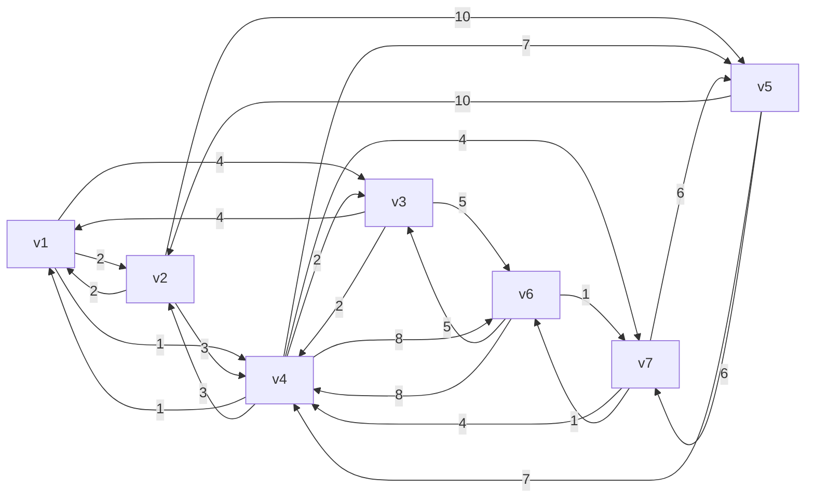

#### Prim

```java
public class Prim {
    public static void main(String[] args) {
        Vertex v1 = new Vertex("v1");
        Vertex v2 = new Vertex("v2");
        Vertex v3 = new Vertex("v3");
        Vertex v4 = new Vertex("v4");
        Vertex v5 = new Vertex("v5");
        Vertex v6 = new Vertex("v6");
        Vertex v7 = new Vertex("v7");

        v1.edges = List.of(new Edge(v2, 2), new Edge(v3, 4), new Edge(v4, 1));
        v2.edges = List.of(new Edge(v1, 2), new Edge(v4, 3), new Edge(v5, 10));
        v3.edges = List.of(new Edge(v1, 4), new Edge(v4, 2), new Edge(v6, 5));
        v4.edges = List.of(new Edge(v1, 1), new Edge(v2, 3), new Edge(v3, 2),
                new Edge(v5, 7), new Edge(v6, 8), new Edge(v7, 4));
        v5.edges = List.of(new Edge(v2, 10), new Edge(v4, 7), new Edge(v7, 6));
        v6.edges = List.of(new Edge(v3, 5), new Edge(v4, 8), new Edge(v7, 1));
        v7.edges = List.of(new Edge(v4, 4), new Edge(v5, 6), new Edge(v6, 1));

        List<Vertex> graph = List.of(v1, v2, v3, v4, v5, v6, v7);

        prim(graph, v1);

    }

    static void prim(List<Vertex> graph, Vertex source) {
        ArrayList<Vertex> list = new ArrayList<>(graph);
        source.dist = 0;

        while (!list.isEmpty()) {
            Vertex min = chooseMinDistVertex(list);
            updateNeighboursDist(min);
            list.remove(min);
            min.visited = true;
            System.out.println("---------------");
            for (Vertex v : graph) {
                System.out.println(v);
            }
        }


    }

    private static void updateNeighboursDist(Vertex curr) {
        for (Edge edge : curr.edges) {
            Vertex n = edge.linked;
            if (!n.visited) {
                int dist = edge.weight;
                if (dist < n.dist) {
                    n.dist = dist;
                    n.prev = curr;
                }
            }
        }
    }

    private static Vertex chooseMinDistVertex(ArrayList<Vertex> list) {
        Vertex min = list.get(0);
        for (int i = 1; i < list.size(); i++) {
            if (list.get(i).dist < min.dist) {
                min = list.get(i);
            }
        }
        return min;
    }
}
```

#### Kruskal

```java
public class Kruskal {
    static class Edge implements Comparable<Edge> {
        List<Vertex> vertices;
        int start;
        int end;
        int weight;

        public Edge(List<Vertex> vertices, int start, int end, int weight) {
            this.vertices = vertices;
            this.start = start;
            this.end = end;
            this.weight = weight;
        }

        public Edge(int start, int end, int weight) {
            this.start = start;
            this.end = end;
            this.weight = weight;
        }

        @Override
        public int compareTo(Edge o) {
            return Integer.compare(this.weight, o.weight);
        }

        @Override
        public String toString() {
            return vertices.get(start).name + "<->" + vertices.get(end).name + "(" + weight + ")";
        }
    }

    public static void main(String[] args) {
        Vertex v1 = new Vertex("v1");
        Vertex v2 = new Vertex("v2");
        Vertex v3 = new Vertex("v3");
        Vertex v4 = new Vertex("v4");
        Vertex v5 = new Vertex("v5");
        Vertex v6 = new Vertex("v6");
        Vertex v7 = new Vertex("v7");

        List<Vertex> vertices = List.of(v1, v2, v3, v4, v5, v6, v7);
        PriorityQueue<Edge> queue = new PriorityQueue<>(List.of(
                new Edge(vertices,0, 1, 2),
                new Edge(vertices,0, 2, 4),
                new Edge(vertices,0, 3, 1),
                new Edge(vertices,1, 3, 3),
                new Edge(vertices,1, 4, 10),
                new Edge(vertices,2, 3, 2),
                new Edge(vertices,2, 5, 5),
                new Edge(vertices,3, 4, 7),
                new Edge(vertices,3, 5, 8),
                new Edge(vertices,3, 6, 4),
                new Edge(vertices,4, 6, 6),
                new Edge(vertices,5, 6, 1)
        ));

        kruskal(vertices.size(), queue);
    }

    static void kruskal(int size, PriorityQueue<Edge> queue) {
        List<Edge> result = new ArrayList<>();
        DisjointSet set = new DisjointSet(size);
        while (result.size() < size - 1) {
            Edge poll = queue.poll();
            int s = set.find(poll.start);
            int e = set.find(poll.end);
            if (s != e) {
                result.add(poll);
                set.union(s, e);
            }
        }

        for (Edge edge : result) {
            System.out.println(edge);
        }
    }
}
```

##  并查集合

是一个用来快速处理 **集合合并、查询两点是否连通** 的数据结构

**并 Union**：把两个元素合成同一个集合

**查 Find**：判断两个元素是不是一家人（连通 / 同一个集合）

并查集是高效管理元素集合的数据结构，支持快速合并集合、查询连通性，是 Kruskal 最小生成树算法的核心工具，靠路径压缩与按秩合并保证高效。

#### 基础

```java
public class DisjointSet {
    int[] s;
    // 索引对应顶点
    // 元素是用来表示与之有关系的顶点
    /*
        索引  0  1  2  3  4  5  6
        元素 [0, 1, 2, 3, 4, 5, 6] 表示一开始顶点直接没有联系（只与自己有联系）

    */

    public DisjointSet(int size) {
        s = new int[size];
        for (int i = 0; i < size; i++) {
            s[i] = i;
        }
    }

    // find 是找到老大
    public int find(int x) {
        if (x == s[x]) {
            return x;
        }
        return find(s[x]);
    }

    // union 是让两个集合“相交”，即选出新老大，x、y 是原老大索引
    public void union(int x, int y) {
        s[y] = x;
    }

    @Override
    public String toString() {
        return Arrays.toString(s);
    }

}
```


#### 路径压缩

```java
public int find(int x) { // x = 2
    if (x == s[x]) {
        return x;
    }
    return s[x] = find(s[x]); // 0    s[2]=0
}
```


#### Union By Size

```java
public class DisjointSetUnionBySize {
    int[] s;
    int[] size;
    public DisjointSetUnionBySize(int size) {
        s = new int[size];
        this.size = new int[size];
        for (int i = 0; i < size; i++) {
            s[i] = i;
            this.size[i] = 1;
        }
    }

    // find 是找到老大 - 优化：路径压缩
    public int find(int x) { // x = 2
        if (x == s[x]) {
            return x;
        }
        return s[x] = find(s[x]); // 0    s[2]=0
    }

    // union 是让两个集合“相交”，即选出新老大，x、y 是原老大索引
    public void union(int x, int y) {
//        s[y] = x;
        if (size[x] < size[y]) {
            int t = x;
            x = y;
            y = t;
        }
        s[y] = x;
        size[x] = size[x] + size[y];
    }

    @Override
    public String toString() {
        return "内容："+Arrays.toString(s) + "\n大小：" + Arrays.toString(size);
    }

    public static void main(String[] args) {
        DisjointSetUnionBySize set = new DisjointSetUnionBySize(5);

        set.union(1, 2);
        set.union(3, 4);
        set.union(1, 3);
        System.out.println(set);
    }


}
```

# 2练习