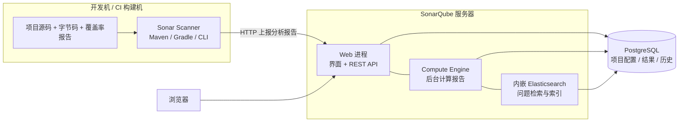
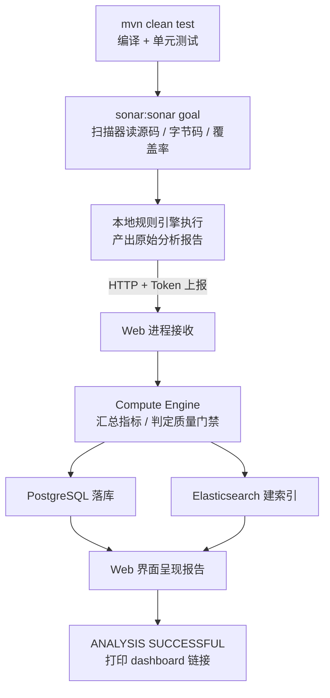
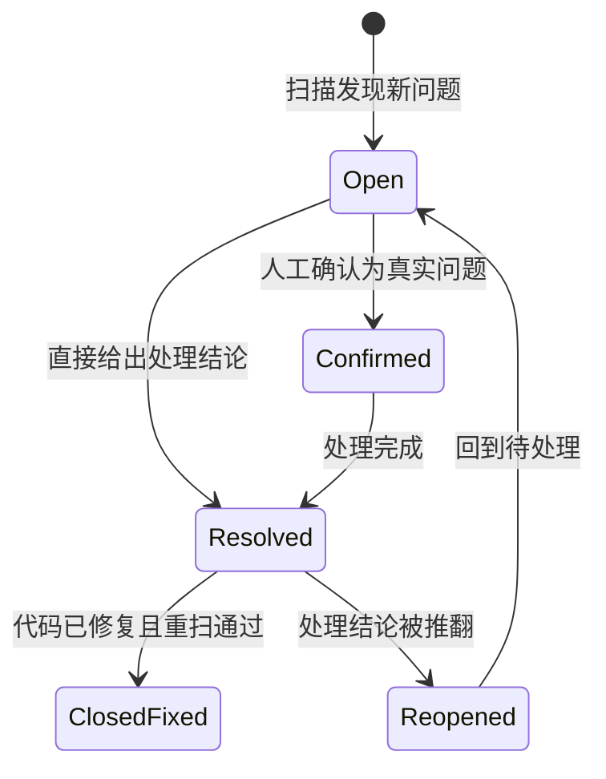
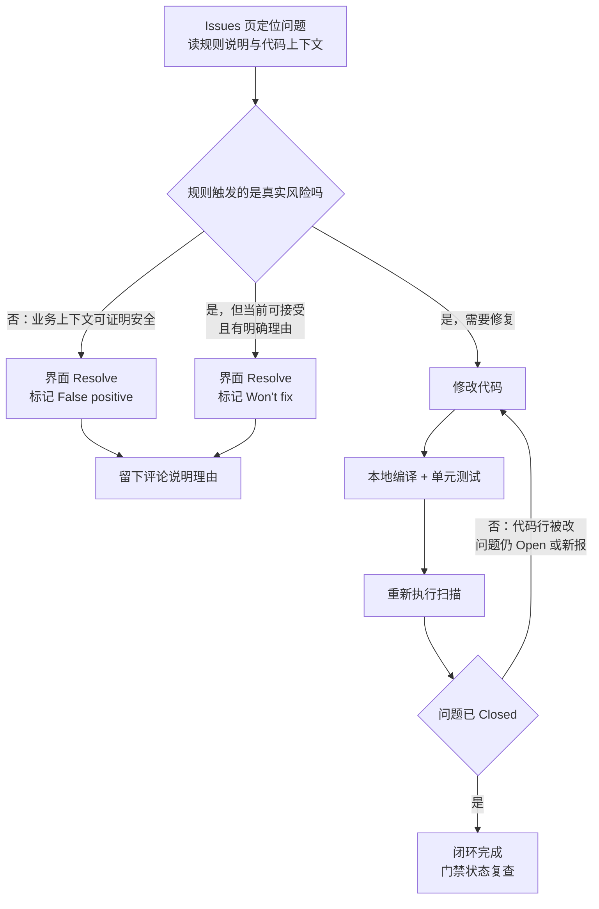

# SonarQube 全方位使用教程：从认知到漏洞修复

> **一句话定位**：SonarQube 是一套自动化代码体检工具（SAST 静态分析平台），只读代码不运行代码，自动检出 Bug、安全漏洞与代码异味，量化技术债务，Web 可视化展示，并可通过质量门禁在 CI 流水线上拦截不达标代码。
>
> - 编写日期：2026-08-30
> - 适用版本：SonarQube Server 2025–2026 系列（含 Community Build）
> - 参考环境：Windows + JDK 21 + PostgreSQL + Spring Boot（JDK 17）
> - 本文档由原始实战笔记扩写而成，关键事实已对照官方文档核实

**全文结构**：

| 篇章 | 内容 |
|------|------|
| 第一篇 是什么 | 定位、核心概念、产品形态、系统架构 |
| 第二篇 为什么 | 缺陷经济学、技术债务、安全合规、工具取舍 |
| 第三篇 怎么用 | 环境准备、部署实战、PG15 大坑、扫描、CI、界面 |
| 第四篇 如何修复 | 问题定位、修复工作流、漏洞修复实战、治理策略 |

---

# 第一篇 是什么：代码质量守门员的本体

先把概念地基打牢：SonarQube 在测试体系里站在哪个位置、它报告里的四类问题和七项指标分别指什么、产品线如何划分、内部由哪些组件构成。这一篇不涉及操作，但后续所有操作都建立在这些概念之上。

## 01 定位与核心概念

### 一句话定义

SonarQube 是 SonarSource 公司开发的静态代码分析平台，属于 SAST（Static Application Security Testing，静态应用安全测试）这一类别。它的运行方式是**只读代码、不执行代码**：扫描器读取源码、编译产物（如 Java 字节码）和测试数据，将成千上万条编码规则逐条应用到代码上，自动检出其中的 Bug、安全漏洞、安全热点和代码异味，再把结果汇总为可视化的质量报告，供开发者在 Web 界面查看，供流水线据此放行或拦截构建[1]。社区里给它起的别名是"代码质量守门员"，指的就是流水线上那道质量门禁。

一个容易忽略但很关键的理解：分析工作发生在扫描器一侧，而不是服务端。本地的 Maven 插件或独立 scanner 把代码"算"完，只把结论（哪一行触发了哪条规则）上报给服务器。这意味着大项目的 CPU 消耗在你的构建机上，服务器只负责存储、计算汇总指标和渲染界面。这个分工解释了后面很多配置行为，比如为什么扫描命令里要指定 JDK 路径、为什么断网时本地分析无法上报。

> **边界认知**：SonarQube 不是动态测试工具（DAST），不运行程序、不模拟攻击流量；它也不是纯粹的软件成分分析工具（SCA），核心强项是分析你自己的代码而非第三方依赖。不过 2026 系列正在扩展边界：2026.1 LTA 把人写的、AI 生成的、第三方引入的代码统一进同一个验证层，并加入了 JFrog 证据链等供应链能力[2][3]。它同样不替代人工评审——它负责把评审中重复、机械的部分自动化，让人的注意力留给设计。

### 静态分析在测试体系中的位置

理解 SonarQube 的价值，先要看清它在整个质量保障体系里补的是哪一块。下表把四种常见手段放在同一张图上对比：

| 手段 | 分析对象 | 是否运行程序 | 擅长发现 | 典型代表 |
|------|----------|--------------|----------|----------|
| SAST 静态分析 | 源码 / 字节码 | 否 | 注入类漏洞、空指针、资源泄漏、复杂度 | SonarQube、Checkmarx、Fortify |
| DAST 动态测试 | 运行中的系统 | 是 | 运行时配置错误、真实可利用的注入点 | OWASP ZAP、Burp Suite |
| SCA 成分分析 | 依赖清单（pom/lock） | 否 | 已知 CVE 的第三方组件 | Dependency-Check、Trivy |
| IAST 交互式检测 | 运行时插桩 | 是 | 带上下文的精确污点路径 | Contrast Security |

SAST 的独特优势在于**左移**：它不要求程序能跑起来，代码写完、提交前就能发现问题，因此可以把缺陷拦截在成本最低的阶段；代价是可能产生误报，需要人工确认，这一点在第六章的诚实评估里会展开。SonarQube 在 SAST 内部又以"开发体验完整"见长——同一套规则同时覆盖 IDE（SonarLint）、命令行（scanner）和流水线（门禁），三个层次共享同一份规则库。

### 四类问题与核心指标

扫描完成后，所有发现被归为四类，这个分类决定了你在界面上看到的图标、处理的优先级和修复方式：

| 类型 | 含义 | 典型例子 | 默认处理态度 |
|------|------|----------|--------------|
| Bug 缺陷 | 会改变程序行为的代码错误，可能抛异常、返回错误结果或崩溃 | 空指针解引用、资源未关闭、死循环 | 优先级最高，直接影响可靠性评级 |
| Vulnerability 漏洞 | 可被攻击者利用的安全弱点，对应 CWE/OWASP 条目 | SQL 注入、XSS、硬编码密钥、弱加密 | 安全评级直接挂钩，Blocker 级必须处理 |
| Security Hotspot 安全热点 | 安全敏感但需人工判断是否构成风险的代码模式 | 使用 HTTP 而非 HTTPS、日志可能泄露敏感数据 | 逐条审查后标注"安全"或转成漏洞 |
| Code Smell 代码异味 | 不影响功能但损害可读性与维护性的结构问题 | 方法过长、重复代码、深层嵌套 | 计入技术债务，规划时间偿还 |

在四类问题之外，SonarQube 还持续计算一组量化指标，构成"质量面板"的主体：单元测试覆盖率（coverage）与通过率、代码重复率（duplications）、认知复杂度（cognitive complexity）、技术债务比率（technical debt ratio）、安全热点审查比例等。这些指标把"代码好不好"从主观争论变成可以逐周对比的数字。SonarSource 的质量模型把它们归拢为三大支柱——**可靠性、安全性、可维护性**，每个支柱给出 A 到 E 的评级，评级字母比绝对数字更适合做管理层的沟通语言。

### 严重度分级与修复成本估算

每条规则都有一个严重度，从高到低共五级，它决定了问题的展示顺序以及质量门禁的判定：

| 严重度 | 语义 | 对待方式 |
|--------|------|----------|
| Blocker 阻断 | 极可能导致生产事故或可被直接利用的漏洞 | 提交前必须修复，默认质量门禁一票否决 |
| Critical 严重 | 高风险缺陷或明确的安全弱点 | 当前迭代内修复，门禁同样拦截 |
| Major 重要 | 质量缺陷或潜在性能问题 | 进入债务清单，按计划偿还 |
| Minor 次要 | 轻微的可维护性问题 | 顺手修，不阻塞 |
| Info 提示 | 信息性提示，不构成风险 | 知悉即可 |

每个问题都附带一个"修复成本"估算，单位是分钟。这个数字来自规则定义里的经验值（例如"给这个方法补一个判空需要 5 分钟"），SonarQube 把全项目所有未修复问题的成本累加起来，就得到技术债务总量。债务比率则是"偿还全部债务所需时间"与"重写整个项目所需时间"的比值，默认重写成本按每行代码约 30 分钟估算[1]。这些数字不必当作精确值看待，它们的价值在于让"代码烂不烂"变成可比较、可追踪的趋势。

## 02 产品形态与系统架构

### 一个家族，三种形态

"SonarQube"在实际语境里可能指三个不同的东西，分清楚它们是选型的第一步：

| 产品 | 形态 | 适合谁 |
|------|------|--------|
| SonarQube Server | 自托管服务，自己维护服务端和数据库 | 需要数据主权、内网环境、与自有 CI 深度集成的团队 |
| SonarQube Cloud | SaaS 云服务（原 SonarCloud，2025 年更名） | 开源项目免费，托管仓库 + GitHub Actions 生态的团队 |
| SonarLint | IDE 插件（IDEA/VS Code 等） | 所有开发者个人，写码时实时提示 |

三者共享同一套规则库，SonarLint 还能与 Server/Cloud 建立 Connected Mode，把服务器的规则和质量配置同步到 IDE，实现"本地提示与线上报告口径一致"。这也是 SonarQube 生态最实用的设计之一：问题在编辑器里就被拦下，等不到提交那一天。

### 版本谱系与定价

版本号近年经历了一次换轨：从传统的 6.x、7.x、8.x 演进到 9.x、10.x，2025 年起改为"年份.序号"（如 2026.1、2026.4），并引入 LTA（Long-Term Active Release，长期活跃版）概念——2026.1 LTA 把 2025 年全年创新打包成一个面向企业稳定性的版本[2]。选部署版本时，追新可以拿到最新特性（2026.4 已加入架构管理），求稳则选最近一个 LTA[4]。社区免费版本现在官方称 Community Build，仍是开源且免费的。

商业版本按实例和代码行数（LOC）每年授权计费，Developer 版官网起步标价约每年 720 美元、以 10 万行代码为推荐起点，覆盖 30 余种语言[5]；企业版与数据中心版按更大的 LOC 档位洽谈[6]。功能差异比价格差异更需要提前搞清楚：

| 能力 | Community Build | Developer | Enterprise / Data Center |
|------|-----------------|-----------|--------------------------|
| 基础扫描（Bug / 漏洞 / 异味） | 支持 | 支持 | 支持 |
| 分支分析 | 不支持 | 支持 | 支持 |
| PR 装饰（评论回写仓库） | 不支持 | 支持 | 支持 |
| 污点分析（Taint Analysis） | 不支持 | 支持 | 支持 |
| 组合管理（Portfolio 多项目视图） | 不支持 | 不支持 | 支持 |
| 语言覆盖 | 约 20 种 | 30 余种 | 更广（含 COBOL 等遗留语言） |

> 注：分支分析与污点分析的档位划分综合自官方定价页与第三方评测[6][7]，具体语言数随版本变化，采购前以官方对比页为准。

> **对个人开发者的含义**：Community Build 缺分支分析意味着：只有一个"主干"分析结果，无法按 feature 分支分别出报告、无法在 PR 里自动评论。个人学习、本地质量追踪完全够用；团队级 PR 集成要么上商业版，要么把扫描交给 SonarQube Cloud 的免费档（开源仓库、5 万行以内）。

### 三大组件的架构分工

一次完整的质量分析跨越三块设施，理解数据流向，后面排查任何启动、扫描、上报问题都有地图可循：



**图 1：SonarQube 系统架构与数据流——分析在扫描器本地完成，服务器负责存储、计算与展示**

服务端解压后是一个自包含的目录，内部实际跑着三个进程：**Web 进程**负责界面和 REST API；**Compute Engine**是后台批处理引擎，接收扫描器上报的原始报告，计算指标、执行质量门禁判定、写入数据库；**内嵌 Elasticsearch**为所有问题建立索引，支撑 Issues 页面的毫秒级过滤查询[3]。三者共用的状态存储是 PostgreSQL——项目配置、扫描结果、历史趋势全部落库。理解这一点有两个直接推论：其一，ES 对磁盘 I/O 敏感，生产部署强烈建议 SSD[8]；其二，数据库一旦权限不通，服务端起不来，而这正是第九章那组 PG15 踩坑的入口。

### 术语速查

后续章节会高频出现这些术语，集中列一次便于查阅：

| 术语 | 含义 |
|------|------|
| Project | 被分析的项目，以 project key 唯一标识（Maven 项目默认取 artifactId） |
| Rule 规则 | 一条静态检查逻辑，有唯一 ID（如 java:S2077）、类型和严重度 |
| Quality Profile 质量配置 | 某个语言下激活的规则集合，默认自带 Sonar way |
| Quality Gate 质量门禁 | 一组通过条件（如"新增代码 0 漏洞"），不满足则 CI 失败 |
| Issue 问题 | 规则在具体代码行上的一次触发，有状态生命周期 |
| Security Hotspot | 需要人工裁决安全性的代码模式，与普通 Issue 分开管理 |
| New Code 新代码 | 相对上一版本或最近时段的增量代码，门禁只对它严格 |
| Sonar way | 官方推荐的默认规则集/门禁模板，"够用且不吵"的平衡点 |
| LOC | Lines of Code，代码行数，商业版授权的计量单位 |
| LTA | Long-Term Active Release，官方长期支持版本，稳定环境的首选 |

---

# 第二篇 为什么：把质量左移的经济学与工程学

工具的引入需要理由。这一篇从缺陷修复成本、技术债务、安全合规三个角度说明静态分析为什么值回投入，并诚实回答"它是不是必须的"——包括与同类工具的取舍和它真实存在的短板。

## 03 缺陷经济学：修复成本随阶段放大

软件工程领域流传最久的一个量化结论是：缺陷发现得越晚，修复代价越高。行业经典估算把这条曲线概括为几个倍数——编码阶段发现并修复一个缺陷的成本记为 1，到了测试阶段约为 10 倍，流入生产环境后达到 100 倍量级，因为此时修复要跨越发布流程、数据订正、客户沟通甚至合规善后。数字本身各家研究略有出入，但"随阶段单调放大"的形状没有争议：

| 发现阶段 | 相对修复成本 | 主要代价构成 |
|----------|--------------|--------------|
| 编码阶段 | 1× | 开发者自己改，重新编译 |
| 测试阶段 | 约 10× | 定位、回归、缺陷管理流程 |
| 生产阶段 | 约 100× | 发布、数据订正、客户沟通、合规善后 |

**图 2：缺陷修复成本随发现阶段放大的行业经典估算（示意，编码阶段为基准 1）**

这条曲线是 SonarQube 存在的全部经济学理由。它把缺陷的发现时点从"测试阶段"整体拉到"编码阶段"——IDE 里的 SonarLint 在保存文件时提示，提交前的本地扫描拦截，CI 流水线的质量门禁阻断。每个环节都比它的下游便宜一个数量级。对个人开发者，收益是少踩线上事故；对团队，收益是评审会议不再纠缠"这行代码会不会空指针"这类机器就能回答的问题，人的时间留给架构和边界条件。

值得注意的是，左移的价值在今天比十年前更大。SonarSource 在 2026.1 LTA 的发布说明里引用了一项调查结论：**96% 的开发者表示不信任 AI 生成代码的准确性**[10]。AI 编码助手让代码产出速度成倍提升，也让缺陷的"生产速度"同样提升——产出提速而验证不提速，缺陷就会以新的斜率积累。这正是官方把 2026.1 的主题定为"让 AI 开发达到真实速度"的背景：把人写的、AI 生成的、第三方引入的代码放进同一个验证层，统一把关[2]。

## 04 技术债务与渐进治理

### 债务的度量

"代码烂"是一种情绪，"技术债务 42 人天"是一个可以管理的数字。SonarQube 用 SQALE 模型把每条未修复问题折算成修复工时，累加得到债务总量，再除以重写全项目所需工时，得到债务比率。项目主页那个刺眼的评级字母（A 到 E）就来自债务比率的分档。债务比率超过 5% 评级就跌破 A——这个阈值不算苛刻，多数没有治理习惯的存量项目第一次扫描往往落在 C 以下。

第一次扫描通常是一次心理冲击：几百上千个问题铺天盖地。此时最容易犯的错是两个极端——要么宣布"误报太多，不用了"，要么立项"三个月清零历史问题"。前者放弃了工具，后者几乎必然失败，因为存量清理的优先级永远拼不过新需求，最后不了了之。

### Clean as You Code：只对新代码负责

SonarSource 给出的成熟答案是 Clean as You Code（CAYC）策略：**不再承诺修完历史存量，只承诺新增代码达到门禁标准**。SonarQube 内置的 New Code 机制配合这一策略——每个项目定义"新代码"的参照基线（上一个版本，或最近 N 天），质量门禁的所有通过条件都只针对新代码：新代码零漏洞、零 Blocker/Major Bug、覆盖率不低于阈值、重复率不超标。存量债务不动，但被一道闸门封死：从今天起，质量曲线只可能持平或变好，不会继续恶化。

| 阶段 | 新代码问题密度 | 整体问题密度（示意） | 状态 |
|------|----------------|----------------------|------|
| S1–S6（引入门禁前） | 6→9 缓慢上行 | 38→44 持续恶化 | 每写一行代码都在积累新债务 |
| S7（引入门禁） | 骤降至 1–2 | 达到峰值 43 | 增量来源被闸门截断 |
| S7–S12（门禁运行中） | 稳定在 1–2 | 43→34 单调下降 | 只剩顺手修复与定向偿还两个出口 |

**图 3：Clean as You Code 策略下的质量走势示意——新代码始终达标，整体债务率随迭代单调下降**

图中两条曲线的含义：引入门禁之前，"新代码问题密度"与"整体问题密度"一起缓慢上行，项目在每写一行代码的同时积累新债务；引入门禁之后，新代码密度被压到阈值下方，整体密度不再有新增来源，只能随随手修复和定向偿还单调下降。下降的速度取决于顺手修复的比例——这也是为什么 SonarLint 的实时提示重要：让"顺手修"发生在编辑器里，而不是留给季度清债专项。

### 债务的偿还方式

存量债务不必平均用力。有效的方式是分层偿还：Blocker/Critical 级的安全漏洞和缺陷最先处理，它们有被利用或致瘫的现实风险；其次是高流量路径上的 Major 问题；Minor 级异味则在触碰相关模块时顺手清理，不值得为它单独开工单。SonarQube 的 Issues 页面支持按严重度、文件路径、规则类型过滤，配合"修复成本"排序，可以快速圈出"投入 2 人天能消掉最多债务"的那批问题——把清债从良心工程变成性价比排序问题。

## 05 安全合规与 AI 时代的代码治理

### 从 OWASP 到污点分析

SonarQube 的安全规则覆盖 OWASP Top 10、CWE 常见弱点与 SANS 危险错误清单，SQL 注入、XSS、路径穿越、反序列化、弱加密、硬编码凭据这些高频漏洞模式都有对应规则，规则描述页直接链到 CWE 编号和修复示例。商业版的污点分析（Taint Analysis）更进一步：不只匹配"这行代码调用了字符串拼接的 SQL"，而是追踪用户输入从入口（HTTP 参数、请求头）到危险出口（SQL 执行、命令执行、文件写入）的完整传播路径，把"可能可注入"升级为"确认这条链路可注入"，大幅压缩误报[7]。社区版没有污点分析，但 OWASP 类规则本身仍在，只是判定粒度更保守。

合规场景里，静态分析报告常被作为交付物。医疗（IEC 62304）、汽车（ISO 26262、MISRA）、金融等行业对"代码经过系统性静态检查"有明确要求，2026.1 LTA 相应扩展了 MISRA 等安全标准的合规覆盖，并加入 JFrog 证据链集成——分析结果自动签名并附加到构建产物上，形成可审计的单一事实源[2][3]。

### AI 代码时代的定位

过去两年，"AI 生成的代码要不要审"从哲学问题变成了工程问题。AI 助手产出的代码表面流畅、模式正确，但边界条件、安全上下文、依赖用法上的细碎错误率显著高于人写的代码，而产出速度又是人的数倍。2026 系列对此的直接回应是三件事：AI 原生 IDE 集成（Claude Code、Cursor、Windsurf、Gemini 内直接获得分析反馈）、对 AI 代码高频错误模式的新规则、以及 agentic 时代的新质量门禁——2026.4 提供的"Sonar way for Agentic AI"模板收紧了安全、可靠性与依赖检查，同时放松次要风格规则，避免把代理淹死在无关警告里[2][4]。

> **给 AI 结对开发者的建议**：把 SonarQube 门禁当作 AI 产出代码的验收标准之一：让助手生成的代码先过本地扫描再提交，Issue 列表可以直接贴回给助手作为修复指令。验证层的存在让"大胆让 AI 写"成为可持续的工作方式，而不是埋雷方式。

## 06 工具取舍与诚实评估

### 与同类工具的关系

静态分析赛道并不缺工具，先分清"替代"与"互补"，再谈选型：

| 工具 | 定位 | 与 SonarQube 的关系 |
|------|------|---------------------|
| Checkstyle / PMD / SpotBugs | Java 单语言的传统三件套 | 规则粒度更细但互不打通；SonarQube 可直接导入三者的报告，多数团队用后者取而代之 |
| ESLint / Prettier | JS/TS 生态事实标准 | 前端日常靠 ESLint，SonarQube 补跨语言的安全与质量汇总视图，二者并行不冲突 |
| CodeQL | 可编程查询的深度安全分析 | 研究型强项，写查询有学习成本；适合安全团队专项审计，日常开发用 SonarQube 门槛更低 |
| Fortify / Checkmarx | 商业企业级 SAST 套件 | 面向安全合规团队的重型方案；研发内建质量场景下 SonarQube 更贴近开发者 |
| Semgrep | 轻量自定义规则引擎 | 补丁式查特定模式极快；作为 SonarQube 之外的专项补充 |

SonarQube 的差异化不在单条规则的锐度，而在**贯穿开发全流程的一致性**：同一套规则在 IDE、本地命令行、CI 门禁三处生效，报告语言统一，历史趋势入库。对多语言仓库（Java 后端加 TS 前端）尤其有价值——一份面板看到全栈质量。

### 优点

- 社区版免费且规则量可观，个人与中小团队零成本起步[1]
- 可视化报表完整：质量评级、债务趋势、新代码视图一应俱全，管理沟通成本极低
- 与 Jenkins、GitLab CI、GitHub Actions 的集成是官方一等公民，门禁机制天然贴合 CI 语义
- SonarLint 把同一套规则前移到编辑器，实时反馈闭环完整

### 短板

- 静态分析原理上无法根除误报，需要人工复核与标记，团队里必须有人"养"这个工具
- 大型仓库扫描吃 CPU 和内存，扫描时长可能拖慢流水线，需要拆分或增量策略
- 社区版无分支分析、无污点分析、无多项目组合管理，团队化使用很快会撞到付费墙
- 部署链路长（JDK + PostgreSQL + ES），Windows 上首次搭建的踩坑密度不低——第九章就是实例

把优缺点放在一起看，结论其实清晰：如果你是个人开发者或小团队，想给代码建立一套可追踪的质量基线，Community Build 的投入产出比极高；如果是需要 PR 级门禁与深度安全分析的团队，要么预算上商业版，要么把这部分职责交给 SonarQube Cloud。最不划算的选择是"部署了但没人看报告"——工具的成本照付，收益归零。

---

# 第三篇 怎么用：从零搭建到日常扫描

以 Windows + JDK 21 + PostgreSQL + Spring Boot（JDK 17）这套真实环境为主线，覆盖环境核对、服务端部署、数据库初始化、令牌申请、首次 Maven 扫描、覆盖率与 CI 集成，以及界面与规则体系的日常使用。部署排障集中收录在本篇末尾。

## 07 环境准备

### 核对清单

| 项 | 要求 | 说明 |
|----|------|------|
| 服务端 JDK | Java 17 或 21 | ZIP 安装的硬性要求[8]；实测 26.8 用 JDK 17 启动会抛 UnsupportedClassVersionError，换 21 后正常[1]，建议直接 21 |
| 项目侧 JDK | 与项目一致（示例为 17） | 扫描器分析的是项目源码，编译环境由项目决定，与服务端 JDK 互不干扰 |
| 数据库 | PostgreSQL（专用账号 + 专用库） | 官方推荐；MySQL 自 7.9 起不再支持，别再尝试[1] |
| 内存 | 小规模 4GB 起，大规模 16GB | 小规模按 100 万行代码计，ES 建议占可用内存的一半且不超过 32GB[8] |
| 磁盘 | 小规模 30GB，SSD 优先，保持 10% 空闲 | ES 磁盘水位超 90% 会把索引锁成只读[8] |
| CPU | 2 核起步，更多核优于更高频 | ES 与 CE 都是并发友好的工作负载[8] |
| 浏览器 | Chrome / Edge / Firefox / Safari 最新版 | 仅 Web 界面要求[8] |

> **双 JDK 场景说明**：服务端跑 JDK 21 与业务项目用 JDK 17 并不冲突：前者只影响 SonarQube 服务进程，后者只影响编译。真正需要留意的是**执行扫描的那个 cmd 窗口的 JAVA_HOME 必须是项目的 JDK**，否则编译失败或产生大量语法误报，第 10 章会给出参数级的处理办法。

### 下载

Community Build 从官方下载页获取 ZIP（商业版从同一入口选择版本档位）。解压到无空格、无中文的路径下（例如 `D:\software\sonarqube`），避免路径惹出的 JVM 启动问题。目录内需要认识的位置只有两个：`conf\sonar.properties` 承载全部服务端配置，`bin\windows-x86-64\StartSonar.bat` 是启动脚本。

## 08 Windows 部署实战

### 配置 sonar.properties

打开 `conf\sonar.properties`，取消三行注释并填入数据库连接信息（第九章完成数据库初始化后再填）：

```properties
sonar.jdbc.url=jdbc:postgresql://localhost:5432/sonarqube
sonar.jdbc.username=sonar
sonar.jdbc.password=你的密码
```

与连接相关的还有两项常用调整：JVM 内存与 Web 端口。默认配置保守，扫描大型仓库时值得放开：

```properties
# Web 进程与计算引擎的堆
sonar.web.javaOpts=-Xmx1024m
sonar.ce.javaOpts=-Xmx2048m
# ES 堆，官方建议为可用内存的一半且不超过 32GB
sonar.search.javaOpts=-Xmx2g
# 访问端口，默认 9000
sonar.web.port=9000
sonar.web.context=/
```

### 指定 JDK 并启动

StartSonar.bat 默认从 PATH 找 Java，机器上多版本并存时建议在脚本顶部显式指定。在脚本开头加一行，或在执行前于当前 cmd 会话设置环境变量：

```bat
REM 方式一：会话级变量（推荐，不动官方脚本）
set SONAR_JAVA_PATH=D:\software\jdk\jdk21\bin\java.exe
StartSonar.bat

REM 方式二：把 set 写进 StartSonar.bat 顶部，一劳永逸
```

首次启动要做数据库建表与 ES 索引初始化，耐心等日志出现 `SonarQube is up` 才算就绪，过程可能持续数分钟。随后浏览器访问 `http://localhost:9000`，默认账号密码均为 `admin`，首次登录强制改密[1]。

> **启动卡住的自查顺序**：看不到 is up 时，按顺序核对：日志（`logs\sonar.log` 看整体、`logs\web.log` 与 `logs\es.log` 看分进程）→ 数据库连通与权限（第九章）→ 端口占用（`netstat -ano | findstr 9000`）→ ES 相关内核参数。Linux 下 ES 还要求 `vm.max_map_count` 调大，Windows 无此约束[8]。

### 注册为 Windows 服务

命令行窗口关闭即服务停止，日常使用建议装成服务：`bin\windows-x86-64\InstallNTService.bat` 安装，`StartNTService.bat` 启动，`SonarService.bat stop` 停止。服务方式下 JDK 路径写进 `conf\wrapper.conf` 的 `wrapper.java.command`。开发机自用则保持 bat 启动、`Ctrl+C` 停止即可[1]。

### Docker 替代路径

如果同时装着 Docker，服务端一行命令可以省掉 JDK 与服务注册的全部琐事：

```yaml
# docker-compose.yml —— 服务端 + PostgreSQL 一把起
services:
  sonarqube:
    image: sonarqube:community
    depends_on:
      db:
        condition: service_healthy
    environment:
      SONAR_JDBC_URL: jdbc:postgresql://db:5432/sonarqube
      SONAR_JDBC_USERNAME: sonar
      SONAR_JDBC_PASSWORD: 你的密码
    ports:
      - "9000:9000"
    volumes:
      - sonarqube_data:/opt/sonarqube/data
      - sonarqube_extensions:/opt/sonarqube/extensions
  db:
    image: postgres:16
    environment:
      POSTGRES_USER: sonar
      POSTGRES_PASSWORD: 你的密码
      POSTGRES_DB: sonarqube
    healthcheck:
      test: ["CMD-SHELL", "pg_isready -U sonar"]
      interval: 10s
      timeout: 5s
      retries: 10
    volumes:
      - pg_data:/var/lib/postgresql/data
volumes:
  sonarqube_data:
  sonarqube_extensions:
  pg_data:
```

镜像内的数据库初始化自动完成，PG15 权限坑在官方镜像里已被处理。但要注意：Docker 化不改变"数据库是唯一状态载体"的事实，`sonarqube_data` 与 `pg_data` 两个卷不备份，升级或重建后历史趋势全部丢失。

## 09 PostgreSQL 与 PG15 权限大坑

### 坑的根源：PG15 改了 public schema 的默认权限

网上大量旧教程基于 PG12/14 写就，搬到 PG15 上会踩进同一个坑。PostgreSQL 15 的发行说明写得很明确：**移除了 PUBLIC 角色在 public schema 上的 CREATE 权限**，同时把 public schema 的属主改为新角色 pg_database_owner[9]。两点合起来意味着：

- PG14 及以前，任何用户都能在 public schema 里建表，权限模型粗放但"能跑"；
- PG15 起，能不能建表取决于"你是不是这个库/schema 的属主"，而不是"你是不是 PUBLIC"；
- 一旦人工干预过 schema 的创建或属主，属主链条断掉，就会出现"明明是库 owner 却没有建表权限"的诡异局面。

> **三个高频致命操作**
>
> **第一，不要执行 `DROP SCHEMA public CASCADE`**。删除重建后的 public schema 属主与权限继承已经和数据库初始状态不一致，后续即使把 schema 属主改回 sonar，建表仍可能报"对模式 public 权限不够"——这是原始笔记中反复出现的那个坑[1]。数据库自带的 public schema 保留不动。
>
> **第二，DBeaver 的 SQL 编辑器不能批量执行 `DROP DATABASE`**。JDBC 管道限制会报 `cannot be executed within a pipeline`，删库重建请改用 psql 命令行[1]。
>
> **第三，只写 `CREATE DATABASE sonarqube OWNER sonar` 不等于大功告成**。设置库属主后仍可能因属主链条问题缺 CREATE 权限，PG15 下最稳妥的做法是把授权显式写出来[1]。

### 正确的初始化脚本

用 postgres 账号在 psql 终端（或 DBeaver 单条执行）按顺序跑：

```sql
-- 1. 创建专用账号
CREATE ROLE sonar WITH LOGIN ENCRYPTED PASSWORD '你的密码';

-- 2. 建库并指定属主，保留数据库自带的 public schema
CREATE DATABASE sonarqube OWNER sonar;

-- 3. 切到新库
\c sonarqube

-- 4. PG15 显式授权，两行缺一不可
GRANT USAGE, CREATE ON SCHEMA public TO sonar;
ALTER ROLE sonar SET search_path TO public;

\q
```

### 验证权限到位

用 sonar 账号登录 psql 跑一次冒烟测试，四条全绿再回头启动 SonarQube：

```sql
show search_path;                                       -- 应包含 public
SELECT has_schema_privilege('sonar','public','CREATE'); -- 返回 t
CREATE TABLE test_sonar(id int);                        -- 不报错
DROP TABLE test_sonar;                                  -- 不报错
```

> **DBeaver 缓存陷阱**：授权语句执行完后，已连接的 DBeaver 会话不会自动刷新权限视图，表现为"明明授权了还是报权限不足"。把连接断开重连，或整个关闭 DBeaver 重开，再复测[1]。

### 报错对照表

| 报错 | 根因 | 处置 |
|------|------|------|
| `错误: 对模式 public 权限不够` | PG15 默认不再给 PUBLIC 授 CREATE；或删过重建 public 破坏属主链 | 执行 `GRANT USAGE, CREATE ON SCHEMA public TO sonar`；不删 public |
| `DROP DATABASE cannot be executed within a pipeline` | DBeaver 的 JDBC 批处理限制 | 改用 psql 命令行执行删库重建 |
| `致命错误: 数据库 "sonarqube" 不存在` | 连接的库未创建或被误删 | 回到初始化脚本重新建库 |
| 服务启动日志报连接拒绝 | PG 未启动、端口或账号密码不符 | 核对 pg 服务状态与 sonar.properties 三行 |

一句话记法：**PG15 跑 SonarQube，不删 public、手动 grant、psql 操作**。三条都做到，数据库这关基本不会再出问题[1]。

## 10 令牌与首次扫描

### 创建分析令牌

扫描器向服务端上报要走认证，密码登录在 26.x 已废弃，令牌（Token）是唯一推荐方式[1]。网页端操作路径：右上角头像 → **My Account** → **Security** → **Generate Token**。类型选 Global Analysis Token（全局可扫任意项目；也可在项目创建向导里选 Project Analysis Token，仅限单个项目）。生成的令牌以 `squ_` 开头，**只在生成那一刻完整显示一次**，关闭页面后无法再查看，只能吊销重建。

> **令牌即密码**：原始笔记里留存过一个真实令牌字样。令牌等同于具备分析上报权限的凭据，不应写进任何会被提交、分享或粘贴到教程里的位置——命令示例统一用 `squ_xxxx…` 占位。如果它曾出现在共享文档中，到 Security 页将其 Revoke 并重新生成。把令牌放进环境变量而非明文命令行，也是更稳妥的习惯：

```bat
set SONAR_TOKEN=squ_xxxxxxxxxxxxxxxxxxxxxxxxxxxxxxxxxxxx
mvn clean test sonar:sonar -Dsonar.host.url=http://localhost:9000 -Dsonar.token=%SONAR_TOKEN%
```

### Maven 项目接入

Spring Boot 项目在 `pom.xml` 的 `build` 段加插件，版本按官方文档当前推荐取值：

```xml
<build>
    <plugins>
        <plugin>
            <groupId>org.sonarsource.scanner.maven</groupId>
            <artifactId>sonar-maven-plugin</artifactId>
            <version>5.0.0.4389</version>
        </plugin>
    </plugins>
</build>
```

### 执行扫描

cmd 进入项目根目录，先确认 `JAVA_HOME` 指向项目 JDK 17，再执行：

```bat
mvn clean test sonar:sonar ^
  -Dsonar.host.url=http://localhost:9000 ^
  -Dsonar.token=%SONAR_TOKEN% ^
  -Dsonar.java.jdkHome=D:\software\jdk\jdk17
```

参数含义逐项说明：

| 参数 | 作用 | 备注 |
|------|------|------|
| `clean test` | 编译并跑单元测试，产出覆盖率数据 | 只关心静态问题可换 `clean compile`，但覆盖率会是 0 |
| `sonar:sonar` | 触发分析 goal | 由上一步声明的插件提供 |
| `-Dsonar.host.url` | 服务端地址 | CI 场景换成可达的内网域名 |
| `-Dsonar.token` | 认证令牌 | 26.x 不再使用 `sonar.login`[1] |
| `-Dsonar.java.jdkHome` | 告诉扫描器用哪个 JDK 分析字节码 | 多 JDK 环境防误报的关键参数[1] |

控制台输出 `ANALYSIS SUCCESSFUL` 即上报成功，其后会打印一条 dashboard 链接，浏览器打开直达项目报告页；首次扫描项目会自动以 pom 的 `artifactId` 作为 project key 创建[1]。如果网页一时看不到项目，等几秒刷新——服务端还有一步 Compute Engine 的异步计算。

### 一次扫描内部发生了什么

把命令拆开看数据流向，排障时就能对号入座：



**图 4：一次 Maven 扫描的数据流——编译测试、本地分析、上报、服务端计算、索引展示五个阶段**

失败发生的位置决定排查方向：编译报错查 `JAVA_HOME` 与依赖；上报报 401 查令牌；服务端日志报数据库错误回第九章；网页空白查 CE 日志。命令行里的报错栈通常会指明是哪一段断了。

### 非 Maven 项目与 Gradle

没有构建器接管的项目用独立的 `sonar-scanner` 命令行工具，在项目根放一个 `sonar-project.properties`：

```properties
sonar.projectKey=demo-app
sonar.projectName=Demo App
sonar.sources=src
sonar.host.url=http://localhost:9000
sonar.token=squ_xxxxxxxxxxxxxxxxxxxxxxxxxxxxxxxxxxxx
# Java 项目需要补充的字节码路径，否则大量规则失效
sonar.java.binaries=target/classes
sonar.java.libraries=target/dependency/*.jar
```

Gradle 项目等价接入是在 `build.gradle` 里启用官方插件后执行 `gradle sonar`，参数体系与 Maven 完全一致，只是前缀换成系统属性或 `sonarqube` 扩展块。原则只有一条：**让扫描器拿到源码、字节码和覆盖率三类输入**，缺字节码时 Java 规则集只有约一半能工作。

## 11 覆盖率与 CI/CD 集成

### JaCoCo 覆盖率接入

SonarQube 自己不跑测试，只消费测试产出的覆盖率报告。Java 生态的标准做法是给 Maven 挂上 JaCoCo 插件：

```xml
<plugin>
    <groupId>org.jacoco</groupId>
    <artifactId>jacoco-maven-plugin</artifactId>
    <version>0.8.12</version>
    <executions>
        <execution>
            <goals>
                <goal>prepare-agent</goal>
            </goals>
        </execution>
        <execution>
            <id>report</id>
            <phase>test</phase>
            <goals>
                <goal>report</goal>
            </goals>
        </execution>
    </executions>
</plugin>
```

`mvn clean test` 之后，`target/site/jacoco/jacoco.xml` 生成，扫描器默认能自动发现它。报告路径非标准时显式指定：

```bat
mvn clean test sonar:sonar -Dsonar.host.url=http://localhost:9000 ^
  -Dsonar.token=%SONAR_TOKEN% ^
  -Dsonar.java.jdkHome=D:\software\jdk\jdk17 ^
  -Dsonar.coverage.jacoco.xmlReportPaths=target/site/jacoco/jacoco.xml
```

> **覆盖率为什么重要**：静态分析只看得到执行路径的语法形态，覆盖率数据告诉它"哪些分支从未被测试观察过"。两者的组合才构成完整的可靠性视图：低覆盖加上高复杂度，等于一块没有任何人踩过的雷区。这也是默认质量门禁把新代码覆盖率设为条件的原因（见第 12 章）。

### 接入流水线

CI 集成的本质不变：构建机上执行同一条 mvn 命令，令牌换成 CI 的密钥变量，服务端地址换成内网可达地址。三个主流平台的模板：

```yaml
# .github/workflows/analysis.yml —— GitHub Actions
name: SonarQube Analysis
on: [push]
jobs:
  scan:
    runs-on: ubuntu-latest
    steps:
      - uses: actions/checkout@v4
      - uses: actions/setup-java@v4
        with:
          distribution: temurin
          java-version: '17'
      - name: Analyze
        env:
          SONAR_TOKEN: ${{ secrets.SONAR_TOKEN }}
        run: >
          mvn clean test sonar:sonar
          -Dsonar.host.url=https://sonar.internal.example.com
          -Dsonar.token=$SONAR_TOKEN
```

```yaml
# .gitlab-ci.yml —— GitLab CI
sonarqube-check:
  stage: test
  image: maven:3.9-eclipse-temurin-17
  variables:
    SONAR_TOKEN: $SONAR_TOKEN_CI
  script:
    - mvn clean test sonar:sonar -Dsonar.host.url=https://sonar.internal.example.com -Dsonar.token=$SONAR_TOKEN
  only:
    - merge_requests
    - main
```

Jenkins 侧用 withSonarQubeEnv 包装器注入地址与令牌，并在流水线末尾等待质量门禁结果（`waitForQualityGate`）——不达标则当前 job 标红，从而把"不让坏代码合入"落到 CI 语义上。

### 本地服务还是云服务

| 维度 | 本地 SonarQube（Community Build） | SonarQube Cloud |
|------|-----------------------------------|-----------------|
| 部署成本 | 自己维护 JDK + PG + 升级 | 零部署 |
| 数据主权 | 代码不出内网，扫描不出本机 | 代码上传云端分析 |
| CI 集成 | GitHub Actions 需要内网可达，公网仓库基本无缘 | 与 GitHub Actions 原生直连 |
| 免费额度 | 不限 LOC | 开源仓库免费，私有仓库按量 |
| 分支/PR 能力 | 社区版不支持 | 支持 |

与原始笔记的结论一致：**本地开发调试用本地 SonarQube，想给公网仓库接流水线自动扫描，优先 SonarQube Cloud**[1]。两条路线并不互斥——同一份代码本地先扫，合并后再走云端门禁。

## 12 界面、规则与门禁的日常使用

### 项目页与 Measures

项目主页自上而下四块信息：质量门禁通过与否的大横幅、三大支柱的 A–E 评级（Reliability / Security / Maintainability）、新增代码（New Code）指标行、以及全部代码的整体指标行。**读报告先看 New Code 行**——它对应门禁的真实判定范围；整体行是历史包袱的体检表，只用于趋势观察，不用于拦截。

钻取路径按需展开：Issues 页看逐条问题（第 13 章详解）；Measures 页看覆盖率/重复/复杂度的文件级分布，定位"最烂的十个类"；Activity 页看每次扫描的历史曲线，验证治理是否有效。

### 质量门禁

默认门禁 Sonar way 的通过条件全部针对新代码，这是 CAYC 策略的落地形态。条件以界面 Quality Gates 页的实际定义为准，近年版本的条件集如下：

| 指标（新代码） | 阈值 | 不达标的后果 |
|----------------|------|--------------|
| 可靠性评级 | 必须为 A | 门禁失败（存在 Major 以上 Bug） |
| 安全性评级 | 必须为 A | 门禁失败 |
| 可维护性评级 | 必须为 A | 门禁失败（债务比率超 5%） |
| 安全热点审查比例 | 100% | 门禁失败 |
| 覆盖率 | ≥ 80% | 警告 |
| 重复行比例 | ≤ 3% | 警告 |

自定义门禁在 Quality Gates 页新建，从空白或复制 Sonar way 起步，逐条添加条件并把项目绑定过去。常见的本地化调整：覆盖率阈值降到 60% 起步再逐季上调；把"安全热点 100% 审查"从失败改为警告，先跑通流程再收紧。每个条件可以分别设置"超过阈值算失败还是警告"，梯度比一刀切更能被团队接受。

### 质量配置 Quality Profile

Profile 是规则开关的集合，Sonar way 是官方平衡后的默认。改动入口在 Quality Profiles 页：复制一个现有 Profile 作为基底（比如复制 Sonar way），在规则列表里改激活状态或严重度，然后把项目的默认 Profile 指向这份副本。改完立即生效于下一次扫描。修改原则建议保守——**先加严新代码相关的安全规则，再考虑放宽**，并且任何"关闭某条规则"的决定都应该留下理由，否则半年后没人记得为什么这条规则不再报问题。

### SonarLint 连接模式

IDEA 与 VS Code 都有 SonarLint 插件。装好后配置 Connected Mode 指向本地服务器并绑定项目，服务端的规则集、质量配置同步进编辑器：服务端报什么，编辑器就提示什么，口径完全一致。日常开发的顺序因此变成——写码时 SonarLint 实时消掉新问题，提交前本地扫描兜底，CI 门禁做最后拦截。三层漏斗能把"扫描日爆出三百个问题"的挫败体验消解在日常里。

### 扫描与启动故障速查

| 症状 | 根因 | 处置 |
|------|------|------|
| 服务启动抛 `UnsupportedClassVersionError` | JDK 版本低于当前版本要求（26.x 实测需 21） | 设置 `SONAR_JAVA_PATH` 指向 JDK 21[1] |
| 启动报数据库相关错误 | PG 未就绪 / 权限坑 / MySQL | 回第九章流程；确认不是 MySQL[1] |
| 扫描报 401 | 令牌复制错或已吊销 | 重新生成令牌，注意前后空格[1] |
| 大量 Java 17 语法误报 | 扫描器用了低于项目的 JDK 分析 | 检查 `JAVA_HOME` 与 `sonar.java.jdkHome`[1] |
| 扫描成功但网页看不到项目 | CE 异步计算未完成 | 等待几秒刷新；仍无则查 CE 日志[1] |
| 覆盖率显示 0 | 没跑 test 或 JaCoCo 报告没被发现 | 命令含 `clean test`，必要时指定 `xmlReportPaths` |
| 大项目扫描超时 | 全量扫描耗时随代码量线性增长 | 提高扫描机内存；拆模块分别扫描；CI 上只扫变更模块 |

---

# 第四篇 如何修复：用 SonarQube 关掉每一个问题

扫描只是开始，修复才是目的。这一篇讲的是工具的核心用法：问题在界面里如何定位与分诊、修复决策的三条岔路、重扫验证的闭环，以及 Java/MyBatis 生态里高频漏洞与缺陷的逐类修复示例——每一类都给出触发的规则、坏代码与好代码的对照。

## 13 问题生命周期与定位

### Issue 的状态机

SonarQube 里每个问题都是一个有生命周期的实体，不是一条静态日志。理解状态机，才能明白"为什么有的问题改完自动消失，有的要手动标记"：



**图 5：Issue 状态机——真实修复走"改代码后重扫自动关闭"，误报与暂缓走人工标记**

状态语义展开说明：

| 状态 | 含义 | 谁能改变它 |
|------|------|------------|
| Open | 新发现或未处理 | 扫描器创建 |
| Confirmed | 已确认是真实问题，进入待修队列 | 人工确认 |
| Resolved / Fixed | 代码已修改，等待下一次扫描验证 | 改代码后扫描器自动置入 |
| Resolved / False positive | 判定为误报 | 人工标记 |
| Resolved / Won't fix | 已知但暂不修复（如遗留兼容代码） | 人工标记 |
| Closed | 问题终结（修复经重扫确认，或代码已删除） | 扫描器自动 |
| Reopened | 结论被推翻，问题重新打开 | 人工操作或代码回退 |

两条关键机制值得单独强调。第一，**真实缺陷不需要在界面上点任何按钮**——修掉代码、重新扫描，问题自动转为 Closed，这是最健康的路径。第二，False positive 与 Won't fix 的标记会跟随代码位置存续：只要那行代码不变，后续扫描不会再次报出；一旦代码被改动，标记失效、问题重新打开。这个设计防止了"标记一次误报，永久掩盖真问题"。

### 在界面上定位问题

项目页点 **Issues** 进入问题浏览器，左侧是一整列过滤器，右侧是结果列表。高效的定位组合通常是三步：

1. **定范围**：Project 下拉选项目，Status 默认即 Open；要清旧账时再切到 Confirmed；
2. **定类型**：Issue Types 选 Vulnerability 或 Bug——修复优先级永远从漏洞开始；
3. **定严重度**：Severities 勾 Blocker + Critical，先消灭高风险集合。

列表顶部还有搜索栏，支持结构化查询语法，例如 `severities:BLOCKER,CRITICAL types:VULNERABILITY` 直接等价于上述两次点选，保存为书签可以形成团队统一的"每日修复队列"视图。

点开单条问题后是修复的主战场：上半屏是**带高亮的源码上下文**，触发规则的行会被标出；下半屏是规则说明，包括规则 ID、严重度、问题解释、为什么不安全、合规标准映射（CWE/OWASP）以及官方修复示例。看懂下半屏，往往问题就解决了一半——多数开发者的真实体验是：问题看不懂时 90% 是不知道这条规则在防什么攻击。

### 分配与协作

问题可以指派（Assign）给具体成员，也支持打标签和评论。团队实践的常见约定：每天站会前清一遍分配给自己的 Open 问题；误报必须留一句评论说明判定理由，避免下一个人重新花时间分析同一个误报。这些约定不依赖工具强制，但直接决定工具的长期存活率。

## 14 修复工作流

### 三分诊决策

每个问题最终落入三条路之一，决策本身是修复流程的核心：



**图 6：问题三分诊工作流——误报与暂缓走人工标记并留理由，真实问题走"改码-验证-重扫"闭环**

### 第一条：修代码

适用于真实缺陷与漏洞。流程固定为**定位 → 理解 → 修改 → 本地验证 → 重扫**五步。重扫不必跑全量测试，`mvn clean compile sonar:sonar`（不含 test）就能完成问题闭环验证，速度快得多；只有涉及覆盖率与门禁的正式扫描才需要带上 `test`。重扫后刷新 Issues 页，问题状态变为 Closed，Activity 曲线上出现一次质量改善的拐点。

### 第二条：标记误报（False positive）

判定标准是"用业务上下文能证明这段代码不可达或攻击路径不成立"。界面操作：问题详情页 → **Resolve** → **False positive**。原始笔记里的告警处理三分法与此完全对应：真实缺陷改代码，误报走 Resolve 标记，低风险可接受走第三条[1]。误报标记的成本很低，但每标记一次都应该写清楚"为什么安全"——三个月后代码变更导致问题重新打开时，这条评论就是团队的集体记忆。

### 第三条：暂不修复（Won't fix）

适用于"确认存在，但修复的代价当前大于风险"的问题，典型如死代码兼容逻辑、被框架保护的弱哈希。界面操作：Resolve → **Won't fix**。与误报的语义差别要分清：误报说"这不是问题"，暂缓说"这是问题但不修"。商业版还能把这类决策升级为"风险已接受"并走审批留痕[1]。

### 批量处理

同一规则在同一批次代码里触发几十次很常见（比如一次框架升级把某个过时 API 的用法全部点亮）。逐条点 Resolve 不现实，Issues 页顶部的 **Bulk change** 支持对当前过滤结果批量设置状态、指派或严重度——先过滤到"某个规则的 Open 问题"，一次批量标记。反过来，对"同一规则的一批真实问题"批量 Confirmed 再分给多人修，也是常见的团队分工手法。

### 修复完成的验证标准

一个修复闭环的完成不是"代码改了"，而是四项都满足：本地编译与相关单元测试通过；重扫后原问题状态 Closed；没有在同文件引入新问题（Activity 里 New Issues 为 0 或可解释）；门禁状态回到 Passed（如原先失败）。第四项常被忽略——修掉一个漏洞却在同一文件引入一个新 Critical，等于白干。

## 15 修 Bug 与安全漏洞实战

这一章按"根因 → 坏代码 → 好代码 → 修复要点"的固定结构，逐类拆解 Java 后端（Spring Boot + MyBatis）最高频的问题。所有示例都取自真实代码模式的抽象，规则 ID 以扫描界面显示为准，个别规则在不同版本间会归入安全热点而非直接判漏洞。

### SQL 注入（S3649 数据库查询注入）

MyBatis 的两种占位符是 Java 项目里最常见的注入入口：`#{}` 走 PreparedStatement 预编译，参数以绑定变量传入；`${}` 是裸字符串替换，用户输入直达 SQL 文本。后端凡是把用户可控值放进 `${}`，等于把拼接权交给了攻击者。

问题代码：

```java
@Select("SELECT id, name, phone FROM t_user " +
        "WHERE name = '${name}'")
List<User> findByName(@Param("name") String name);

// 攻击载荷 name = "' OR '1'='1"
// → SELECT ... WHERE name = '' OR '1'='1' 命中全表
```

修复后：

```java
@Select("SELECT id, name, phone FROM t_user " +
        "WHERE name = #{name}")
List<User> findByName(@Param("name") String name);

// name 作为绑定变量传入，引号被转义
// 载荷只会按字面值查询，查不到任何行
```

麻烦在于 `#{}` 不能出现在 ORDER BY 列名、表名这类"SQL 结构位置"上，不少代码因此退回 `${}`。正确做法是白名单映射：列名不接受外部字符串，而是把外部参数映射到允许的常量集合：

问题代码（XML mapper）：

```xml
<select id="pageQuery" resultType="User">
  SELECT * FROM t_user
  ORDER BY ${orderField} ${orderDir}
</select>
```

修复后（Java 侧白名单）：

```java
private static final Map<String, String> ORDER_FIELDS =
    Map.of("createTime", "create_time",
           "name", "name");

String column = ORDER_FIELDS.get(orderField);
if (column == null) {
    throw new IllegalArgumentException("非法排序字段");
}
String dir = "ASC".equalsIgnoreCase(orderDir) ? "ASC" : "DESC";
```

修复要点：所有用户可控值一律 `#{}`；SQL 结构位置（表名、列名、排序方向）用白名单常量映射；无法参数化的动态 SQL 片段要在代码层重组后整体传入。验证方式是修复后重扫，注入类问题状态转 Closed，同时检查 XML mapper 里不再残留 `${`。

### 硬编码凭据（S2068）

密钥、密码、令牌写进源码，等于把凭据分发给了每一个能读仓库的人，且 git 历史永久留痕。规则对字符串常量里的敏感模式做模式匹配，也会盯上 Base64 形态的"伪装"。

问题代码：

```java
public class PayConfig {
    private static final String API_KEY =
        "sk_live_9f8e7d6c5b4a3210fedcba";
    private static final String DB_PWD = "Prod@2026!";
}
```

修复后：

```java
@Value("${pay.api-key}")
private String apiKey;
// application.yml 从环境变量取值
// pay:
//   api-key: ${PAY_API_KEY}

// 或纯环境变量读取
String dbPwd = System.getenv("PAY_DB_PWD");
```

修复要点：凭据一律移出源码，运行时从环境变量、密钥管理服务或配置中心注入；`application.yml` 里写 `${PAY_API_KEY:}` 这类占位而不是真实值；泄露过的密钥视同已泄露，进供应商后台轮换，光从代码里删掉没有意义——git 历史里它还在。

### 弱哈希与弱加密（S4790 / S5542）

MD5 与 SHA-1 的碰撞攻击成本早已进入实用区间，用于口令存储、签名校验都属高危；对称加密用 ECB 模式或不指定 IV 同样会被点亮。两条修复路线要分场景：口令存储用慢哈希，数据摘要用 SHA-256 家族。

问题代码：

```java
public String hash(String raw) throws Exception {
    MessageDigest md = MessageDigest.getInstance("MD5");
    byte[] digest = md.digest(raw.getBytes());
    return Base64.getEncoder().encodeToString(digest);
}
```

修复后：

```java
// 口令存储：慢哈希自带盐
public String hash(String raw) {
    return BCrypt.hashpw(raw, BCrypt.gensalt(12));
}

// 摘要校验：SHA-256
MessageDigest md =
    MessageDigest.getInstance("SHA-256");
```

修复要点：口令永远走 BCrypt/Argon2/SCrypt 这类带工作因子的慢哈希，自己拼盐反而画蛇添足；文件摘要、签名走 SHA-256 及以上；AES 显式指定 GCM 或 CBC 加随机 IV。存量 MD5 口令不能一次性强制清空时，用"登录时透明升级"策略：验证通过后立刻重哈希成 BCrypt 落库。

### 不安全随机数（S2245）

`Math.random()` 和 `new Random()` 是可预测的伪随机序列，用在验证码、会话令牌、密码重置链接上等于把锁做成摆设。规则的判定语义是"安全敏感用途的随机源"，用在游戏掉落率上不会报，用在令牌上必报。

问题代码：

```java
public String genToken() {
    return String.valueOf(
        (long) (Math.random() * 1_000_000_000));
}
```

修复后：

```java
private static final SecureRandom RNG =
    new SecureRandom();

public String genToken() {
    byte[] bytes = new byte[32];
    RNG.nextBytes(bytes);
    return Base64.getUrlEncoder()
                 .withoutPadding()
                 .encodeToString(bytes);
}
```

修复要点：SecureRandom 实例声明为静态复用（反复 new 反而降低熵质量）；令牌长度至少 128 位；非安全场景继续用普通 Random 没有问题，不必全项目替换。

### 路径穿越（S2083）

把用户输入直接拼进文件路径，攻击者用 `../../etc/passwd` 一类载荷就能跳出预定目录读任意文件。下载、导出、头像上传回显这类接口是重灾区。

问题代码：

```java
@GetMapping("/download")
public void download(String fileName,
                     HttpServletResponse resp)
        throws IOException {
    File file = new File("D:/app/files", fileName);
    // fileName = "../../app/config.yml"
    // → 读到目录外的配置文件
    Files.copy(file.toPath(), resp.getOutputStream());
}
```

修复后：

```java
@GetMapping("/download")
public void download(String fileName,
                     HttpServletResponse resp)
        throws IOException {
    Path base = Paths.get("D:/app/files")
                    .toAbsolutePath().normalize();
    Path target = base.resolve(fileName)
                     .normalize();
    if (!target.startsWith(base)) {
        throw new SecurityException("路径越界");
    }
    // 再叠加一层：文件名仅允许白名单字符
    if (!fileName.matches("[A-Za-z0-9._-]+")) {
        throw new IllegalArgumentException("非法文件名");
    }
    Files.copy(target, resp.getOutputStream());
}
```

修复要点：`normalize()` 消解 `..` 之后必须用 `startsWith(base)` 验证仍在根目录内，两步缺一不可；上传文件另加"服务端生成文件名、原始名只做展示"的约束，把穿越面直接拆掉。

### XXE 外部实体注入（S2755）

XML 解析器默认可能加载外部实体（DTD、外部文件、URL），解析不可信 XML 时攻击者可以读文件、打内网、甚至打爆内存。规则盯着所有 XML 解析器的创建点。

问题代码：

```java
DocumentBuilderFactory factory =
    DocumentBuilderFactory.newInstance();
DocumentBuilder builder = factory.newDocumentBuilder();
// 解析不可信 XML，外部实体可能被加载
```

修复后：

```java
DocumentBuilderFactory factory =
    DocumentBuilderFactory.newInstance();
factory.setFeature(
    "http://apache.org/xml/features/disallow-doctype-decl",
    true);
factory.setXIncludeAware(false);
factory.setExpandEntityReferences(false);
DocumentBuilder builder = factory.newDocumentBuilder();
```

修复要点：直接 `disallow-doctype-decl` 拒绝 DTD 是最彻底的一档；JSON 能替代 XML 的接口优先 JSON；更根本的解法是让解析 XML 的输入永远来自可信源——这条修完后通常会降级为安全热点由人工确认。

### 资源泄漏（S2095）

流、连接、句柄没有在异常路径上关闭，异常抛出时 close 语句被跳过，句柄缓慢泄漏直到 `Too many open files`。这是 Bug 类问题里出现频率最高的一族。

问题代码：

```java
public String readHead(String path)
        throws IOException {
    BufferedReader reader = new BufferedReader(
        new FileReader(path));
    String line = reader.readLine();
    reader.close();   // readLine 抛异常时不会执行
    return line;
}
```

修复后：

```java
public String readHead(String path)
        throws IOException {
    try (BufferedReader reader = new BufferedReader(
             new FileReader(path))) {
        return reader.readLine();
    }   // 正常/异常路径都保证 close
}
```

修复要点：Java 7 起统一用 try-with-resources，任何实现 AutoCloseable 的对象都适用；连接池场景（数据库连接）泄漏点通常在"借出后未归还"，审查 return/finally 路径比找 close 调用更有效。

### 空指针解引用（S2259）

规则的可贵之处在于它基于字节码数据流做判定——不是"这里可能为 null"的语法猜测，而是"这个变量在这条路径上确实可能为 null 且被解引用"。修复围绕判空时机与卫语句展开：

问题代码：

```java
public String greet(User user) {
    if (user != null && user.getName() != null) {
        return "hi " + user.getName();
    }
    return "hi " + user.getNickname(); // user 可能为 null
}
```

修复后：

```java
public String greet(User user) {
    if (user == null) {
        return "hi guest";
    }
    String name = user.getName();
    if (name != null) {
        return "hi " + name;
    }
    return "hi " + Optional.ofNullable(
            user.getNickname()).orElse("guest");
}
```

修复要点：入口先判空提前返回（卫语句），不要把 null 检查埋在深层嵌套里；集合入参用 `Objects.requireNonNull` 或空集合兜底；查询返回 Optional 时链式处理而非 get()。修复后重扫是必须的——空指针规则的误报率相对高，数据流分析偶尔需要人工复核，这正是第 14 章三分诊的用武之地。

### 字符串等值比较（S1132）

用 `==` 比较字符串比较的是引用而非内容，在字面量优化下偶尔"碰巧能跑"，一旦一边来自拼接、反序列化或外部输入就必然错判。这类问题属于典型的"测试通过、线上随机出错"：

问题代码：

```java
if (status == "SUCCESS") {
    completeOrder(order);
}
```

修复后：

```java
if ("SUCCESS".equals(status)) {
    completeOrder(order);
}
```

修复要点：常量放 equals 左侧天然防 NPE；枚举能替代字符串状态时优先枚举，比较用 `==` 反而是正确写法。批量替换时善用 Bulk change 批量 Confirmed，再由 IDE 的结构化替换逐个修。

### 修复模式速查

| 问题类别 | 代表规则 | 根因模式 | 通用修复模式 |
|----------|----------|----------|--------------|
| SQL 注入 | S3649 | 用户输入进入 SQL 文本 | 预编译参数化 + 结构位置白名单 |
| 硬编码凭据 | S2068 | 密钥进源码 | 环境变量 / 密钥管理 + 轮换泄露密钥 |
| 弱哈希加密 | S4790 / S5542 | MD5/SHA-1、ECB 模式 | 口令慢哈希、摘要 SHA-256、AES-GCM |
| 不安全随机 | S2245 | 可预测随机源用于令牌 | SecureRandom + 长度 ≥ 128 位 |
| 路径穿越 | S2083 | 输入直拼文件路径 | normalize + startsWith 校验 + 文件名白名单 |
| XXE | S2755 | 解析器默认允许外部实体 | 禁 DTD / 禁外部实体 |
| 资源泄漏 | S2095 | 异常路径跳过 close | try-with-resources |
| 空指针 | S2259 | 数据流可空却解引用 | 卫语句、Optional、常量侧 equals |
| XSS | S5131 | 输入未编码回显到页面 | 框架默认转义，禁用 HTML 富文本或严格消毒 |

横向看这张表会发现规律：**多数安全漏洞的根因是"不可信输入进入敏感出口"**，修复模式收敛为参数化、白名单、禁用特性、编码输出四种。掌握模式而非记规则，新语言的项目也能快速迁移这套直觉。

## 16 安全热点审查与代码异味修复

### Security Hotspot 不是普通 Issue

热点与漏洞的分野是 SonarQube 安全模型里最容易被误解的一块。漏洞表示"代码确定存在弱点"；热点表示"代码在做一件安全敏感的事，需要人确认做的方式是否安全"。例如"执行一条 SQL"本身不是漏洞，只有确认 SQL 的输入不可信才升级为漏洞。因此热点的处理动作不是改代码，而是**审查**后给出裁决。

| 维度 | Vulnerability | Security Hotspot |
|------|---------------|------------------|
| 判定语义 | 确定存在可利用弱点 | 安全敏感模式，风险待确认 |
| 处理动作 | 修复代码 | 人工审查后标注安全或不安全 |
| 标注结果 | 修复后 Closed | 标记 Safe 关闭；确认有风险则转为漏洞 |
| 门禁条件 | 安全评级 | 新代码热点 100% 完成审查 |

### 审查操作与判断框架

项目页进入 **Security Hotspots**，列表按安全分类（加密协议、认证、日志、配置等）分组。点开单条热点后，右侧面板解释"这段代码在做什么、什么情况下危险"，你要回答的只有一个问题：**这段代码处理的数据是否可能来自不可信来源**。回答"否"点 **Mark as Safe**；回答"是"点 **Mark as Unsafe**——热点随即转成一条真正的漏洞，进入第 14 章的修复流程。

判断框架按数据来源分层最有效率：数据来自内部常量、配置白名单或数据库可信字段，标 Safe；数据直接或间接触达 HTTP 入参、请求头、消息队列、第三方回调，标 Unsafe 转漏洞；说不清来源的，宁可先 Unsafe——热点转漏洞是可逆的，漏掉一个真漏洞不是。审查完的热点在门禁里的"审查比例"立即上升，这是默认门禁最容易达成也最常被忽略的一项 100% 条件。

### 认知复杂度（S3776）

认知复杂度是 SonarSource 提出的可维护性核心指标：嵌套、递归、逻辑运算符链条、提前返回后恢复的上下文都会加分，阈值默认 15。超标的方法不是"写错了"而是"长歪了"，修复手法是结构重构而非逻辑修正：

问题代码（认知复杂度 22，超过阈值 15）：

```java
public String settle(Order order) {
    String result = "";
    if (order != null) {
        if (order.isPaid()) {
            for (Item item : order.getItems()) {
                if (item.getPrice() > 0) {
                    if (item.isVirtual()) {
                        result += "V" + item.getId();
                    } else {
                        result += "P" + item.getId();
                    }
                }
            }
        } else {
            result = "unpaid";
        }
    } else {
        result = "empty";
    }
    return result;
}
```

修复后（卫语句 + 提取方法，复杂度回落）：

```java
public String settle(Order order) {
    if (order == null) {
        return "empty";
    }
    if (!order.isPaid()) {
        return "unpaid";
    }
    return order.getItems().stream()
            .map(this::renderItem)
            .collect(Collectors.joining());
}

private String renderItem(Item item) {
    if (item.getPrice() <= 0) {
        return "";
    }
    return (item.isVirtual() ? "V" : "P")
            + item.getId();
}
```

修复要点：先卫语句拍掉异常分支，再按业务语义提取小方法，复杂度自然分摊到多个函数；不要为了压数字把逻辑强行塞进三元表达式嵌套——可读性反而恶化，也压不住多少分。S3776 修复的验收除了规则转 Closed，还看 Measures 页该方法复杂度数值回到阈值下。

### 重复代码与过长方法

重复代码（duplications）不是按规则而是按指标计算的：SonarQube 用精确的文本块匹配，跨文件重复 10 行以上即计。修复路径就是把重复块提取成共享方法或工具类，提取时的关键是识别"重复中的差异点"——参数化差异，而不是复制后改两行。过长方法与认知复杂度常常伴生，拆法一脉相承：按注释块、按空行分段的"自然段落"往往就是提取边界。

这两类异味修复后的收益是间接的：债务分钟数下降、可维护性评级改善。它们不紧急，但拖得越久每次新增功能都在重复旧成本——这就是"顺手修"策略的对象：改到哪个模块，顺手把该文件的异味清掉，不专程开工单。

## 17 辅助修复与治理策略

### AI CodeFix：从建议到补丁

2026 系列引入的 AI CodeFix 把修复环节再往前推了一步：在问题详情页点击 AI 建议按钮，模型基于规则说明与代码上下文生成修复补丁，开发者审阅后采纳或放弃。补丁不是绕过理解的黑箱——采纳前对比 diff 正是学习规则语义的过程。2026.2 起方案做到模型无关，企业可以接自托管的大模型，敏感代码不出内网[2][3]。当前的合理定位是"低悬果实加速器"：资源泄漏、equals 替换、try-with-resources 这类模式化修复的成功率高；注入类漏洞仍需人工把上下文补全后再判。

### SonarLint 里顺手修

IDE 内的 SonarLint 对多数问题提供 Quick Fix（编辑器内 alt+enter / 灯泡图标），小改动零成本落地：补 equals、包 try-with-resources、删未用变量。配合 Connected Mode，编辑器里看到的就是服务器口径的问题——写完即修，仓库里积累的待办清单自然变薄。

### 抑制手段的正确姿势

总有必须"让它闭嘴"的时刻，四种手段的适用边界要分清：

| 手段 | 写法 | 适用场景 | 风险 |
|------|------|----------|------|
| 行级 NOSONAR | 目标行行尾 `// NOSONAR` | 单行确凿误报 | 掩盖该行所有规则，代码演进后失效条件无人复查 |
| 规则级注解 | `@SuppressWarnings("java:S2259")` | 方法级、规则明确 | 范围比 NOSONAR 清晰，仍是全局豁免该规则 |
| 项目排除 | `sonar.exclusions=**/generated/**` | 生成代码、第三方源码目录 | 整个目录不再受检，路径写错会漏大片真问题 |
| Profile 停用规则 | Quality Profiles 里关闭 | 团队共识某规则不适用 | 影响所有项目，必须留决策记录 |

优先级永远排在最前的是**界面标记 False positive**而非代码内抑制——前者有记录、可追溯、随代码变更自动失效，后者会静默存续。抑制是逃生通道，不是日常工具：一旦某个仓库的 NOSONAR 超过两位数，说明问题不在工具，在流程。

### Clean as You Code 的日常节奏

把前三章的动作串成可持续的节奏，每周固定投入不超过一小时的维护量：

1. 写码阶段：SonarLint 实时清掉新代码的问题，编辑器里不留欠条；
2. 提交阶段：本地 `mvn clean compile sonar:sonar` 快速扫一遍，新代码零 Blocker/Critical 才提交；
3. 每周固定一次：Issues 页过一遍分配给自己的 Open 问题，误报标记并留理由，热点完成审查；
4. 每迭代末：看 Activity 曲线与新代码门禁状态，确认"质量只升不降"的不变量仍然成立；
5. 每季度：把门禁阈值上调一档（覆盖率 60→70→80），让标准随团队成熟度爬坡。

### 修复验收的五个硬指标

判断"修完了没有"，比"改了没有"更值得较真。一次修复活动结束时应满足：目标问题全部 Closed（含误报与暂缓的完整标记率）；新代码门禁 Passed；安全热点审查比例回到 100%；同周期 New Issues 为零或每条可解释；技术债务分钟数较上期下降。这五项在界面上一分钟内可全部核对，构成的恰恰是管理层最关心的那份"质量改善"证据。

---

# 结语

回到开头那句话：SonarQube 是一套自动化代码体检工具，把代码里的 Bug、漏洞、烂代码全部扫描出来，在提交与构建阶段拦截问题，防止它们被带到线上[1]。四篇走下来，这套工具的完整图景是——概念上，它是静态分析平台，用四类问题与量化指标给代码做体检；价值上，它把缺陷修复从昂贵的下游阶段拉回编码阶段，并用 Clean as You Code 策略让质量曲线只升不降；操作上，部署不过是 JDK 21 + PostgreSQL + 一条 mvn 命令，唯一的深坑是 PG15 的 public schema 权限，而那已有标准解法；修复上，它是一套三分诊工作流——真实问题改代码重扫闭环，误报标记留理由，暂缓决策留痕迹。

五条心法作为收束：第一，扫描不产出价值，修复闭环才产出价值，工具要有人"养"。第二，先消灭 Blocker 与 Critical，Minor 级别顺手清理即可。第三，只对新代码严格，不背存量清零的军令状。第四，令牌、密钥永远不进源码与文档——包括你自己的笔记。第五，误报标记时写下的那句理由，是三个月后团队最需要的注释。

下一步的动作建议按序推进：把 SonarLint 装进 IDE 并连上服务器，体验实时闭环；给自己的主力项目跑第一次全量扫描，直面问题清单；挑出全部 Critical 漏洞按第 15 章的模式逐类修复；两周后回看 Activity 曲线，你会看到这条治理曲线的第一个拐点。工具的价值从那个拐点开始复利。

---

## 参考资料

1. 用户上传文档：SonarQube 使用与踩坑笔记。部署环境、PG15 权限问题、Maven 扫描命令与告警处理的第一手记录。
2. SonarSource, [SonarQube Server 2026.1 LTA What's New](https://www.sonarsource.com/products/sonarqube/whats-new/2026-1/)。AI 代码验证层、供应链安全、合规覆盖与分析性能。
3. SonarSource Docs, [SonarQube Server Release Notes](https://docs.sonarsource.com/sonarqube-server/server-update-and-maintenance/release-notes/)。内嵌 Elasticsearch 8.x、数据库支持版本、AI CodeFix 与 JFrog 证据链等版本特性。
4. SonarSource, [What's New in SonarQube Server](https://www.sonarsource.com/products/sonarqube/whats-new/)。2026.4 架构管理与 agentic 质量门禁、2026.2 统一安全报告。
5. SonarSource, [SonarQube 服务器计划和定价（中文）](https://www.sonarsource.com/zh/plans-and-pricing/sonarqube/)。按实例与代码行数的年费授权方式及支持服务说明。
6. SonarSource, [SonarQube Server 产品页（定价入口）](https://www.sonarsource.com/ko/products/sonarqube/server/)。Developer 版起步价约 720 美元/年、10 万行起推荐、语言覆盖。
7. scien.cx, [SonarQube Review 2026: Pros, Cons, and Real User Feedback](https://www.scien.cx/2026/04/08/sonarqube-review-2026-pros-cons-and-real-user-feedback/)。各版本分支分析、PR 装饰、污点分析能力对比。
8. SonarSource Docs, [Server Host Requirements (Community Build)](https://docs.sonarsource.com/sonarqube-community-build/server-installation/server-host-requirements/)。硬件要求、SSD 建议、Java 17 或 21、ES 内存分配原则。
9. PostgreSQL, [Release 15 Notes](https://www.postgresql.org/docs/15/release-15.html)。移除 PUBLIC 在 public schema 上的 CREATE 权限、public schema 属主改为 pg_database_owner。
10. SonarSource Blog, [Announcing SonarQube Server 2026.1 LTA](https://www.sonarsource.com/ko/blog/announcing-sonarqube-server-2026-1-lta)。96% 开发者不信任 AI 生成代码准确性的调查结论。


