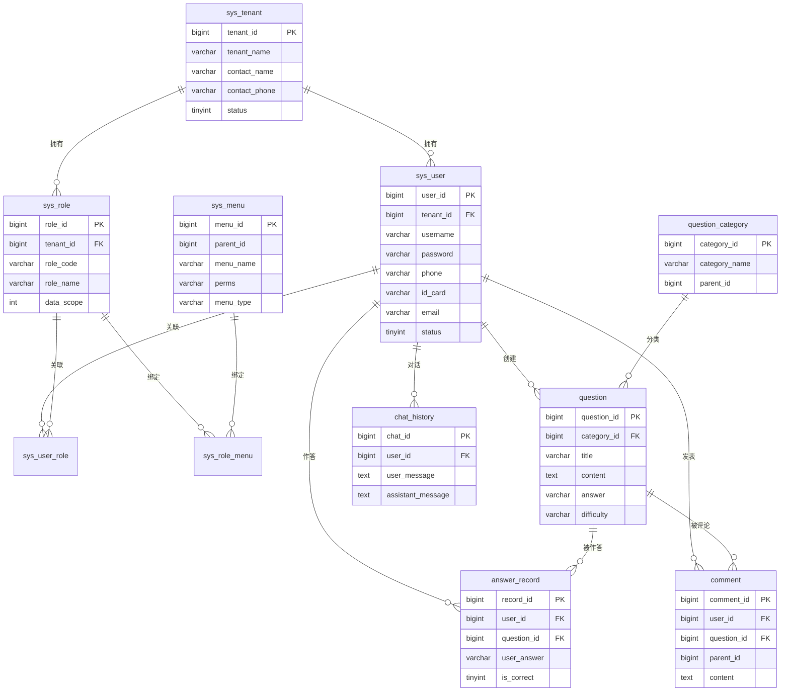

# 在线刷题平台（微服务版）数据库设计文档

> 版本：v1.0　|　更新日期：2026-08-20　|　数据库：MySQL 8.4

---

## 1. 设计概述

- **数据库引擎**：InnoDB，`utf8mb4` 字符集，排序规则 `utf8mb4_general_ci`。
- **命名规范**：表名小写蛇形命名；主键 `bigint` 雪花 ID；时间字段 `datetime`。
- **通用字段**：每张业务表包含 `create_time`、`update_time`、`deleted`（逻辑删除）、`tenant_id`（多租户隔离）。
- **分库分表**：答题记录、对话历史按租户/用户分片，规则托管 Nacos。

---

## 2. 数据模型总览（ER 关系）

---

## 3. 核心表结构

### 3.1 租户表 `sys_tenant`

| 字段 | 类型 | 约束 | 说明 |
| --- | --- | --- | --- |
| tenant_id | bigint | PK | 租户主键 |
| tenant_name | varchar(64) | NOT NULL | 租户名称 |
| contact_name | varchar(64) | | 联系人 |
| contact_phone | varchar(20) | | 联系手机（脱敏存储） |
| email | varchar(128) | | 联系邮箱 |
| status | tinyint | 默认 1 | 1 启用 / 0 停用 |
| create_time | datetime | | 创建时间 |
| update_time | datetime | | 更新时间 |
| deleted | tinyint | 默认 0 | 逻辑删除 |

### 3.2 用户表 `sys_user`

| 字段 | 类型 | 约束 | 说明 |
| --- | --- | --- | --- |
| user_id | bigint | PK | 用户主键 |
| tenant_id | bigint | FK, INDEX | 所属租户 |
| username | varchar(64) | UNIQUE | 登录账号 |
| password | varchar(128) | NOT NULL | BCrypt 密文 |
| nickname | varchar(64) | | 昵称 |
| phone | varchar(20) | | 手机号（脱敏） |
| id_card | varchar(64) | | 身份证（加密脱敏） |
| email | varchar(128) | | 邮箱 |
| avatar | varchar(255) | | 头像 URL |
| status | tinyint | 默认 1 | 账号状态 |
| dept_id | bigint | | 所属部门 |
| create_time / update_time | datetime | | 时间 |
| deleted | tinyint | 默认 0 | 逻辑删除 |

### 3.3 角色表 `sys_role`

| 字段 | 类型 | 约束 | 说明 |
| --- | --- | --- | --- |
| role_id | bigint | PK | 角色主键 |
| tenant_id | bigint | FK, INDEX | 所属租户 |
| role_code | varchar(64) | UNIQUE(tenant) | 角色编码（ADMIN/USER...） |
| role_name | varchar(64) | | 角色名称 |
| data_scope | int | 默认 1 | 数据范围：1 全部 / 2 本租户 / 3 本部门 / 4 本人 |
| remark | varchar(255) | | 备注 |
| create_time / update_time | datetime | | 时间 |
| deleted | tinyint | 默认 0 | 逻辑删除 |

### 3.4 菜单/权限表 `sys_menu`

| 字段 | 类型 | 约束 | 说明 |
| --- | --- | --- | --- |
| menu_id | bigint | PK | 菜单主键 |
| parent_id | bigint | 默认 0 | 父菜单（0 为根） |
| menu_name | varchar(64) | | 菜单名称 |
| menu_type | char(1) | | M 目录 / C 菜单 / F 按钮 |
| perms | varchar(128) | | 权限标识，如 `question:add` |
| path | varchar(128) | | 路由地址 |
| component | varchar(128) | | 前端组件 |
| icon | varchar(64) | | 图标 |
| sort_order | int | | 排序 |
| create_time | datetime | | 创建时间 |

### 3.5 用户-角色关联 `sys_user_role`

| 字段 | 类型 | 约束 | 说明 |
| --- | --- | --- | --- |
| id | bigint | PK | 主键 |
| user_id | bigint | INDEX | 用户 |
| role_id | bigint | INDEX | 角色 |

### 3.6 角色-菜单关联 `sys_role_menu`

| 字段 | 类型 | 约束 | 说明 |
| --- | --- | --- | --- |
| id | bigint | PK | 主键 |
| role_id | bigint | INDEX | 角色 |
| menu_id | bigint | INDEX | 菜单/按钮 |

---

## 4. 业务表结构

### 4.1 题库分类 `question_category`

| 字段 | 类型 | 约束 | 说明 |
| --- | --- | --- | --- |
| category_id | bigint | PK | 分类主键 |
| tenant_id | bigint | INDEX | 租户 |
| parent_id | bigint | 默认 0 | 父分类 |
| category_name | varchar(64) | | 分类名 |
| sort_order | int | | 排序 |
| deleted | tinyint | 默认 0 | 逻辑删除 |

### 4.2 题目表 `question`

| 字段 | 类型 | 约束 | 说明 |
| --- | --- | --- | --- |
| question_id | bigint | PK | 题目主键 |
| tenant_id | bigint | INDEX | 租户 |
| category_id | bigint | FK, INDEX | 分类 |
| title | varchar(255) | NOT NULL | 题干 |
| content | text | | 题目详细内容 |
| answer | varchar(64) | | 标准答案 |
| analysis | text | | 解析 |
| difficulty | tinyint | | 难度（1-5） |
| question_type | tinyint | | 题型：单选/多选/判断/简答 |
| like_count | int | 默认 0 | 点赞数 |
| view_count | int | 默认 0 | 浏览数 |
| create_by | bigint | | 创建人 |
| create_time / update_time | datetime | | 时间 |
| deleted | tinyint | 默认 0 | 逻辑删除 |

### 4.3 答题记录 `answer_record`（分表）

| 字段 | 类型 | 约束 | 说明 |
| --- | --- | --- | --- |
| record_id | bigint | PK | 记录主键 |
| tenant_id | bigint | | 租户 |
| user_id | bigint | INDEX | 用户（分片键） |
| question_id | bigint | INDEX | 题目 |
| user_answer | varchar(255) | | 用户答案 |
| is_correct | tinyint | | 是否答对 |
| duration_ms | int | | 作答耗时 |
| create_time | datetime | | 作答时间 |

> 分表策略：按 `user_id % 64` 分 64 张表，或按租户哈希分库。

### 4.4 评论表 `comment`

| 字段 | 类型 | 约束 | 说明 |
| --- | --- | --- | --- |
| comment_id | bigint | PK | 评论主键 |
| tenant_id | bigint | INDEX | 租户 |
| user_id | bigint | INDEX | 评论人 |
| question_id | bigint | INDEX | 被评论题目 |
| parent_id | bigint | 默认 0 | 父评论（楼中楼回复） |
| content | text | NOT NULL | 内容（经敏感词过滤） |
| like_count | int | 默认 0 | 点赞数 |
| create_time | datetime | | 时间 |
| deleted | tinyint | 默认 0 | 逻辑删除 |

### 4.5 AI 对话历史 `chat_history`（分表）

| 字段 | 类型 | 约束 | 说明 |
| --- | --- | --- | --- |
| chat_id | bigint | PK | 对话主键 |
| tenant_id | bigint | | 租户 |
| user_id | bigint | INDEX | 用户 |
| session_id | varchar(64) | INDEX | 会话标识 |
| user_message | text | | 用户问题 |
| assistant_message | text | | AI 回答 |
| model | varchar(64) | | 使用模型 |
| tokens | int | | 消耗 token 数 |
| create_time | datetime | | 时间 |

> 分表策略：按时间范围（月/季）滚动分表，历史数据归档。

### 4.6 操作日志 `operation_log`

| 字段 | 类型 | 约束 | 说明 |
| --- | --- | --- | --- |
| log_id | bigint | PK | 主键 |
| tenant_id | bigint | | 租户 |
| user_id | bigint | | 操作人 |
| trace_id | varchar(64) | INDEX | 链路追踪 ID |
| module | varchar(64) | | 模块 |
| action | varchar(64) | | 操作 |
| method | varchar(255) | | 方法 |
| params | text | | 脱敏后参数 |
| ip | varchar(64) | | 来源 IP |
| cost_ms | int | | 耗时 |
| create_time | datetime | | 时间 |

---

## 5. 索引设计

| 表 | 索引 | 用途 |
| --- | --- | --- |
| sys_user | `uk_username`、`idx_tenant` | 登录查询、租户过滤 |
| sys_user_role | `idx_user_id`、`idx_role_id` | 权限查询 |
| question | `idx_tenant_category`、`idx_difficulty` | 题库列表、筛选 |
| answer_record | `idx_user_question`、`idx_tenant` | 错题本、统计 |
| comment | `idx_question`、`idx_parent` | 评论列表、回复 |
| chat_history | `idx_user_session` | 会话历史 |
| operation_log | `idx_trace_id`、`idx_create_time` | 链路查询、归档 |

---

## 6. 数据脱敏与安全

| 字段 | 处理方式 |
| --- | --- |
| `phone` | DB 存 AES 密文或掩码，接口返回 `138****1234` |
| `id_card` | DB 存可逆加密，接口返回 `110***********1234` |
| `password` | BCrypt 单向哈希，永不返回 |
| 日志参数 | 结构化日志自动打码敏感字段 |

---

## 7. 一致性约束

- 所有多租户表必须以 `tenant_id` 作为过滤前缀，配合数据权限拦截器保证租户隔离。
- 逻辑删除采用 MyBatis-Plus `@TableLogic`，查询自动过滤 `deleted = 0`。
- 乐观锁字段 `version` 用于高频更新（库存、点赞数）防止并发覆盖。