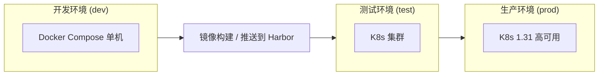
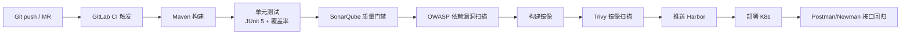

# 在线刷题平台（微服务版）部署与运维文档

> 版本：v1.0　|　更新日期：2026-08-20　|　目标环境：dev / test / prod

---

## 1. 部署架构总览



| 环境 | 形态 | 用途 |
| --- | --- | --- |
| dev | Docker Compose 单机 | 本地开发、联调 |
| test | K8s 集群（小规格） | 集成测试、压测 |
| prod | K8s 1.31 高可用 + containerd | 生产发布 |

---

## 2. 容器化

### 2.1 Dockerfile 模板（微服务统一）

```dockerfile
# 构建阶段
FROM maven:3.9-eclipse-temurin-21 AS build
WORKDIR /app
COPY pom.xml .
COPY src ./src
RUN mvn clean package -DskipTests

# 运行阶段
FROM eclipse-temurin:21-jre
WORKDIR /app
COPY --from=build /app/target/*.jar app.jar
ENV SPRING_PROFILES_ACTIVE=prod
EXPOSE 8080
ENTRYPOINT ["java", "-XX:+UseZGC", "-jar", "app.jar"]
```

### 2.2 docker-compose.yml（dev 环境基础组件）

```yaml
version: "3.9"
services:
  mysql:
    image: mysql:8.4
    environment:
      MYSQL_ROOT_PASSWORD: root
    ports: ["3306:3306"]
    volumes: ["./data/mysql:/var/lib/mysql"]

  redis:
    image: redis:7.4
    ports: ["6379:6379"]

  nacos:
    image: nacos/nacos-server:v3.1.1
    environment:
      MODE: standalone
    ports: ["8848:8848"]

  elasticsearch:
    image: docker.elastic.co/elasticsearch/elasticsearch:9.5.1
    environment:
      - discovery.type=single-node
    ports: ["9200:9200"]

  kibana:
    image: docker.elastic.co/kibana/kibana:9.5.1
    ports: ["5601:5601"]

  milvus:
    image: milvusdb/milvus:v3.0.5
    ports: ["19530:19530"]

  minio:
    image: minio/minio:RELEASE.2026-07-30T22-41-45Z
    command: server /data
    ports: ["9000:9000", "9001:9001"]
```

---

## 3. Kubernetes 部署

### 3.1 关键资源清单（Deployment + Service）

```yaml
apiVersion: apps/v1
kind: Deployment
metadata:
  name: question-service
  namespace: quiz
spec:
  replicas: 3
  selector:
    matchLabels: { app: question-service }
  template:
    metadata:
      labels: { app: question-service }
    spec:
      containers:
        - name: question-service
          image: harbor.example.com/quiz/question-service:1.0.0
          ports: [{ containerPort: 8080 }]
          env:
            - name: SPRING_PROFILES_ACTIVE
              value: prod
          resources:
            requests: { cpu: "500m", memory: "512Mi" }
            limits: { cpu: "1", memory: "1Gi" }
          readinessProbe:
            httpGet: { path: /actuator/health/readiness, port: 8080 }
            initialDelaySeconds: 20
          livenessProbe:
            httpGet: { path: /actuator/health/liveness, port: 8080 }
---
apiVersion: v1
kind: Service
metadata:
  name: question-service
spec:
  selector: { app: question-service }
  ports:
    - port: 8080
      targetPort: 8080
```

### 3.2 弹性伸缩 HPA

```yaml
apiVersion: autoscaling/v2
kind: HorizontalPodAutoscaler
metadata:
  name: question-service-hpa
spec:
  scaleTargetRef:
    apiVersion: apps/v1
    kind: Deployment
    name: question-service
  minReplicas: 3
  maxReplicas: 20
  metrics:
    - type: Resource
      resource:
        name: cpu
        target: { type: Utilization, averageUtilization: 60 }
```

---

## 4. 多环境配置

| 层面 | 方案 |
| --- | --- |
| 应用配置 | Nacos 多命名空间 / `profiles`: `application-dev.yml`、`application-test.yml`、`application-prod.yml` |
| 密钥管理 | HashiCorp Vault 下发 DB 密码、中间件密钥，禁止明文入库 |
| 镜像仓库 | Harbor 分项目区分 dev/test/prod，镜像漏洞扫描 + 签名 |
| 配置隔离 | 生产 Nacos 集群独立部署，数据库账号分环境隔离 |

---

## 5. CI/CD 流水线

### 5.1 流水线总览



### 5.2 .gitlab-ci.yml 示例

```yaml
stages:
  - build
  - test
  - quality
  - scan
  - package
  - deploy

variables:
  MAVEN_OPTS: "-Dmaven.repo.local=$CI_PROJECT_DIR/.m2/repository"
  HARBOR: harbor.example.com

build:
  stage: build
  image: maven:3.9-eclipse-temurin-21
  script: mvn clean compile
  cache:
    paths: [.m2/repository]

unit-test:
  stage: test
  image: maven:3.9-eclipse-temurin-21
  script:
    - mvn test
    - mvn jacoco:report
  coverage: '/Total.*?([0-9]{1,3})%/'
  artifacts:
    reports:
      coverage_report:
        coverage_format: cobertura
        path: target/site/jacoco/jacoco.xml

sonarqube:
  stage: quality
  image: sonarsource/sonar-scanner-cli:latest
  script:
    - sonar-scanner -Dsonar.projectKey=quiz-platform -Dsonar.qualitygate.wait=true
  allow_failure: false

dependency-check:
  stage: scan
  image: owasp/dependency-check:latest
  script:
    - dependency-check.sh --scan . --format HTML --failOnCVSS 7

package:
  stage: package
  image: docker:27
  services: [docker:27-dind]
  script:
    - docker build -t $HARBOR/quiz/question-service:$CI_COMMIT_SHORT_SHA .
    - trivy image --severity HIGH,CRITICAL $HARBOR/quiz/question-service:$CI_COMMIT_SHORT_SHA
    - docker push $HARBOR/quiz/question-service:$CI_COMMIT_SHORT_SHA

deploy:
  stage: deploy
  image: bitnami/kubectl:latest
  script:
    - kubectl set image deployment/question-service question-service=$HARBOR/quiz/question-service:$CI_COMMIT_SHORT_SHA -n quiz
    - kubectl rollout status deployment/question-service -n quiz
  environment:
    name: production
```

### 5.3 质量门禁阈值

| 指标 | 阈值 |
| --- | --- |
| 单元测试覆盖率 | ≥ 60% |
| 代码重复度 | ≤ 3% |
| 高危漏洞 | 0（阻断） |
| 严重/高危镜像漏洞 | 0（阻断） |

---

## 6. 日志与链路追踪（EFK）

- **采集**：K8s 环境使用 Fluent Bit DaemonSet；物理机使用 Fluentd。
- **存储/检索**：Elasticsearch 9.5.1 + Kibana 9.5.1（版本严格一致）。
- **链路串联**：OpenTelemetry 生成 `traceId`，日志 JSON 携带，Kibana 按 `traceId` 检索全链路。

---

## 7. 监控告警（Prometheus + Grafana）

| 监控对象 | 指标 | 告警阈值（示例） |
| --- | --- | --- |
| JVM | 堆内存、GC 停顿、线程数 | GC 停顿 > 200ms |
| 接口 | QPS、RT、错误率 | RT p99 > 500ms 持续 5min |
| 中间件 | Redis/MySQL/ES 连接数、慢查询 | 慢 SQL > 500 条/min |
| 基础设施 | CPU、内存、磁盘、网络 | CPU > 80% 持续 10min |

告警通过 Grafana Alerting 推送企业微信群/webhook，Grafana 看板覆盖服务运行、接口性能、中间件健康三大类。

---

## 8. 压测与优化

- **工具**：JMeter，脚本按业务场景分组（登录、刷题、搜索、AI 对话）。
- **目标**：热点接口 RT p99 ≤ 500ms，AI 流式接口首 token ≤ 1s。
- **流程**：基线压测 → 定位瓶颈（SQL/缓存/下游）→ 优化 → 回归压测。
- **报告记录**：接口从 1s 优化到 100ms 的完整过程数据（QPS、RT、错误率、资源占用）。

---

## 9. 安全加固

| 风险 | 防护措施 |
| --- | --- |
| SQL 注入 | MyBatis 参数绑定 + Druid 防火墙 |
| XSS | 输入过滤 + 前后端转义 + CSP |
| CSRF | JWT 无状态 + SameSite Cookie + Token 校验 |
| 越权 | 三级权限模型 + 数据权限拦截器 |
| 密码泄露 | BCrypt + Vault 密钥管理 |
| 重放攻击 | 时间戳 + nonce 签名 |
| 依赖漏洞 | OWASP Dependency-Check 增量扫描 |

---

## 10. 版本与分支管理

| 分支 | 用途 |
| --- | --- |
| `main` | 生产稳定分支，受保护，仅 MR 合入 |
| `develop` | 集成分支 |
| `feature/*` | 功能分支 |
| `hotfix/*` | 紧急修复分支 |

Commit 规范（Conventional Commits）：

```text
feat(question): 新增题目标签筛选
fix(chat): 修复 RAG 召回偶发空指针
docs(db): 更新答题记录分表说明
```

---

## 11. 发布与回滚

1. 灰度：金丝雀发布先切 5% 流量，观察错误率与 RT。
2. 全量：`kubectl rollout` 滚动更新，`maxUnavailable=0` 保证零停机。
3. 回滚：`kubectl rollout undo deployment/question-service`，镜像版本由 Harbor 保留管理。