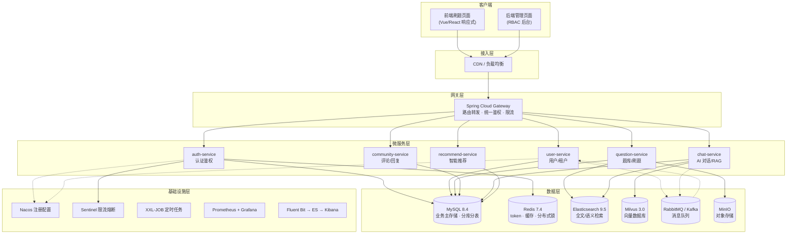
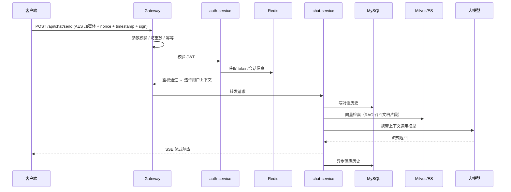

# 在线刷题平台（微服务版）技术架构文档

> 版本：v1.0　|　更新日期：2026-08-20　|　文档性质：系统设计

---

## 1. 项目概述

本项目是一个**微服务版在线刷题平台**，面向多租户（SaaS）场景，提供前端刷题页面与后端管理页面两套界面，内部实现 **RBAC 多租户权限体系**，并深度集成 AI 能力（大模型对话、RAG 知识库、语义搜索、Agent 工具调用）。

系统整体采用前后端分离架构，后端以 **Spring Boot 4.x + Spring Cloud 2025.1.x + Spring Cloud Alibaba** 为底座，围绕一条完整请求链路组织：

```text
接收请求 → 参数校验 → 登录鉴权(JWT) → MySQL(用户/对话历史) → Redis(token/缓存)
       → 业务逻辑 → 调用 LLM → 返回结果 → 全局异常处理
```

---

## 2. 总体架构设计

### 2.1 架构分层

系统自上而下划分为接入层、网关层、服务层、数据层与基础设施层：



### 2.2 服务调用方式

| 场景 | 技术选型 | 说明 |
| --- | --- | --- |
| 对外 HTTP | Spring Cloud Gateway | 统一入口，路由、鉴权、限流、灰度 |
| 服务间同步调用 | OpenFeign 4.1.x | 声明式 HTTP 调用，配合 LoadBalancer 负载均衡 |
| 服务间高性能 RPC | Apache Dubbo 3.3.x | 高并发内部调用，Nacos 作注册中心，虚拟线程透传 |
| 异步解耦 | RabbitMQ / Kafka | 事件驱动、削峰填谷、通知/埋点场景 |

### 2.3 前端技术

| 端 | 技术栈 | 要点 |
| --- | --- | --- |
| 前端刷题页 | Vue 3 / React + Vite + 组件库 | 响应式布局，组件化，适配移动端 |
| 后端管理页 | Vue 3 + 中后台模板 | 基于 RBAC 动态渲染菜单与按钮权限 |
| 构建部署 | Nginx 静态托管 | 与网关同域或跨域 CORS 配置 |

---

## 3. 微服务拆分

| 服务 | 端口 | 职责 | 核心依赖 |
| --- | --- | --- | --- |
| gateway | 8080 | 统一网关 | Gateway、Sentinel、Sa-Token |
| auth-service | 8081 | 注册/登录、JWT 签发、鉴权 | Sa-Token、Redis、BCrypt |
| user-service | 8082 | 用户、租户、组织、角色、权限 | MyBatis-Plus、MySQL、ShardingSphere |
| question-service | 8083 | 题库、分类、刷题、答题记录 | ES、Redis、ShardingSphere |
| community-service | 8084 | 评论、回复、点赞、关键词屏蔽 | MySQL、Redis、敏感词、MQ |
| chat-service | 8085 | AI 对话、RAG、Agent 工具调用 | Spring AI、Milvus、ES |
| recommend-service | 8086 | 智能推荐（个性化题目/内容） | ES 向量检索、协同过滤 |
| job-service | 8087 | 定时任务、异步任务消费 | XXL-JOB、RabbitMQ/Kafka |

---

## 4. 核心请求链路设计

### 4.1 AI 对话请求链路



### 4.2 统一接口约定

**统一返回格式**：

```json
{
  "code": 0,
  "message": "success",
  "traceId": "6ab2f0e...",
  "data": { }
}
```

- `code = 0` 成功；`code != 0` 业务失败，`message` 为友好提示。
- 全局异常处理器捕获 `BusinessException`、`ValidationException` 与未知异常，统一返回上述结构并携带 `traceId`。

---

## 5. 安全设计

### 5.1 密码加密

| 方案 | 应用场景 | 说明 |
| --- | --- | --- |
| BCrypt | 用户登录密码 | 自适应盐值、可调迭代成本，登录校验首选 |
| MD5 加盐 | 兼容旧系统 / 简单摘要 | 固定随机盐 + 多次散列，仅作兼容 |
| SHA-256 | 签名、数据指纹 | 配合盐做报文签名与校验 |

### 5.2 接口防重放

每个请求头携带签名参数：

```text
X-Timestamp: 1760000000      # 毫秒时间戳
X-Nonce: f8e2a1b9...         # 一次随机串
X-Sign: HMAC-SHA256(...)     # 签名
```

防重放策略：服务端校验 `|now - timestamp| ≤ 60s`，并利用 Redis `SET NX` 判定 `nonce` 是否重复使用，命中即拒绝，实现时间窗 + 一次性 nonce 双重防重放。

### 5.3 数据脱敏

- **数据库存储脱敏**：手机号、身份证明文不落库，使用 AES 加密或经授权的可逆脱敏存储，仅保留必要掩码。
- **接口返回脱敏**：出口统一拦截，对 `phone`（`138****1234`）、`idCard`（`110***********1234`）等字段自动掩码，通过注解 `@Sensitive` 声明字段类型实现。
- **日志脱敏**：结构化日志中敏感字段自动打码，避免泄露到 EFK。

### 5.4 接口 AES 加密传输

- 对称加密采用 **AES-256-GCM**，密钥由 Vault 统一管理下发。
- 客户端与服务端协商会话密钥，敏感接口（登录、支付、个人信息）走密文传输；普通接口可配置加密开关。
- 网关层可配置透明加解密过滤器，业务服务零侵入。

### 5.5 权限细化（三级权限模型）

| 级别 | 说明 | 实现 |
| --- | --- | --- |
| 按钮权限 | 页面内增删改查按钮是否可见/可用 | `sys_menu` + 角色菜单关联，前端 `v-permission` 指令控制 |
| 数据行权限 | 同一张表按租户/部门/本人过滤行 | 多租户 + 数据权限拦截器，SQL 自动拼 `tenant_id = ?` 与自定义数据范围 |
| 字段权限 | 部分字段仅特定角色可读写 | 字段级脱敏 + 动态列过滤 |

---

## 6. 幂等性设计

- **天然幂等**：GET/PUT/DELETE 遵循 RESTful 语义。
- **POST 幂等**：请求携带 `X-Idempotent-Key`，Redis 以 `SET NX + 过期时间` 实现去重；首次处理成功写入结果快照，重复请求直接返回缓存结果。
- **业务幂等**：扣分、提交答题、下单等操作基于业务唯一键（如 `answer_id`、订单号）加乐观锁/悲观锁防止重复写入。

---

## 7. 缓存设计

| 场景 | 缓存策略 | 说明 |
| --- | --- | --- |
| 用户 token/会话 | 写入 Redis，TTL 30min | 登出即失效，滑动续期 |
| 热点题目详情 | Cache-Aside，TTL + 随机抖动 | 防缓存雪崩，DB 兜底 |
| 排行榜/首页 | 定时预热，Redisson 防击穿 | 热点 key 加锁加载 |
| 分布式锁 | Redisson 可重入锁 + 看门狗 | 秒杀/抢购，自动续期 |
| 缓存一致性 | 延迟双删 / Canal 兜底 | 更新 DB 后删除缓存 |

---

## 8. 消息队列设计

| 场景 | 队列 | 说明 |
| --- | --- | --- |
| 邮件/短信/站内通知 | RabbitMQ | 异步发送，失败重试 + 死信队列 |
| 用户行为埋点、日志流水 | Kafka | 高吞吐，供推荐与 ELK 消费 |
| 题库变更 → 重新建索引 | RabbitMQ | 保证 ES 索引最终一致 |
| 答题提交异步评分/统计 | RabbitMQ | 削峰，消费者幂等消费 |

---

## 9. 搜索与语义检索

- **关键词检索**：Elasticsearch 9.5.1 建索引，支持中文分词（IK）、高亮、多字段查询。
- **语义检索**：题目/文档经 Embedding 向量化后写入 Milvus 3.0.5，使用向量相似度召回，与关键词结果做混合排序（RRF 融合），替代纯关键词匹配。
- **RAG**：chat-service 使用 Spring AI 2.0 编排，先到 Milvus 召回文档片段，再拼装 Prompt 调用大模型生成带引用来源的回答。

---

## 10. AI 能力设计

| 能力 | 实现 | 说明 |
| --- | --- | --- |
| AI 对话助手 | Spring AI + 大模型 API | 多轮对话、流式输出（SSE） |
| RAG 知识库 | Milvus + Embedding | 基于项目文档问答，引用溯源 |
| 智能推荐 | ES 向量 + 协同过滤 | 个性化题目/内容推荐 |
| AI 生成内容 | 文本/图片/视频生成 | 调用多模态模型 API |
| Agent 工具调用 | Spring AI Function Calling | 让 AI 操作业务系统（查题、下单、查订单） |
| 自研 Agent | 编排 + MCP | 生成图片/视频/文字，完成"能干活"的 Agent |

---

## 11. 分布式锁与秒杀

- 秒杀/抢购采用 **Redisson 分布式锁 + Redis 预扣库存**，防止超卖。
- 流程：网关限流 → 缓存库存校验 → 加锁扣减 → 异步下单落库 → 消息队列削峰。
- 锁看门狗自动续期，业务未完成时锁不会提前释放。

---

## 12. 分库分表

- 采用 **ShardingSphere-JDBC 5.5.1**，规则配置托管到 Nacos。
- **分库**：按 `tenant_id` 哈希分库，租户隔离。
- **分表**：答题记录 `answer_record` 按 `user_id` 取模分表；对话历史按时间范围分表。
- 配套读写分离与分布式主键（雪花算法）。

---

## 13. 性能优化

目标场景：热点接口从 **1s 优化到 100ms**。

| 阶段 | 优化手段 | 效果 |
| --- | --- | --- |
| SQL 层 | 索引优化、SQL 改写、避免 N+1、慢查询治理 | 数量级降低 |
| 缓存层 | Redis 热点缓存、本地缓存（Caffeine）二级缓存 | 命中率高时 < 50ms |
| 异步化 | 非核心逻辑 MQ 异步、主链路精简 | 缩短响应路径 |
| 连接池 | Druid 连接池调优、线程池合理配置 | 提升吞吐 |
| 底层 | 虚拟线程、响应式网关、请求合并 | 减少阻塞 |

---

## 14. 日志与链路追踪

- **结构化日志**：统一 JSON 格式，包含 `traceId`、`userId`、`tenantId` 等上下文字段。
- **链路追踪**：OpenTelemetry 1.43 统一埋点生成 TraceId，贯穿网关与服务。
- **采集展示**：Fluent Bit → Elasticsearch → Kibana（EFK），按 `traceId` 串联全链路。

---

## 15. 技术栈总览

| 类别 | 组件 |
| --- | --- |
| 语言/框架 | OpenJDK 21、Spring Boot 4.0、Spring Cloud 2025.1、Spring Cloud Alibaba 2025.1、Spring AI 2.0 |
| RPC/网关 | Dubbo 3.3、OpenFeign 4.1、LoadBalancer 4.1、Gateway |
| 数据存储 | MySQL 8.4、Redis 7.4、ES 9.5.1、Milvus 3.0.5、MongoDB 7.0、MinIO |
| ORM | MyBatis 3.5.17、MyBatis-Plus 3.5.17、PageHelper 2.1.1、ShardingSphere-JDBC 5.5.1 |
| 中间件 | Nacos 3.1.1、Sentinel 1.8.9、RabbitMQ 3.13、Kafka 4.3.1、XXL-JOB 3.4.2 |
| 安全 | Sa-Token 1.39.0、BCrypt、Hutool 5.8.32、Hibernate Validator 8 |
| 可观测 | Prometheus 2.54、Grafana 11.4、OpenTelemetry 1.43、Fluent Bit/Jluentd |
| 文档/工具 | Knife4j 4.5.0、Lombok 1.18.34 |
```