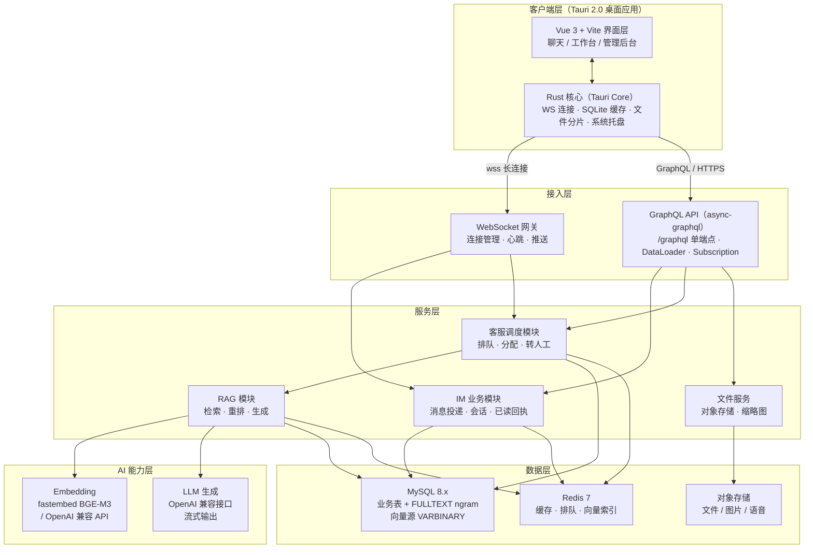
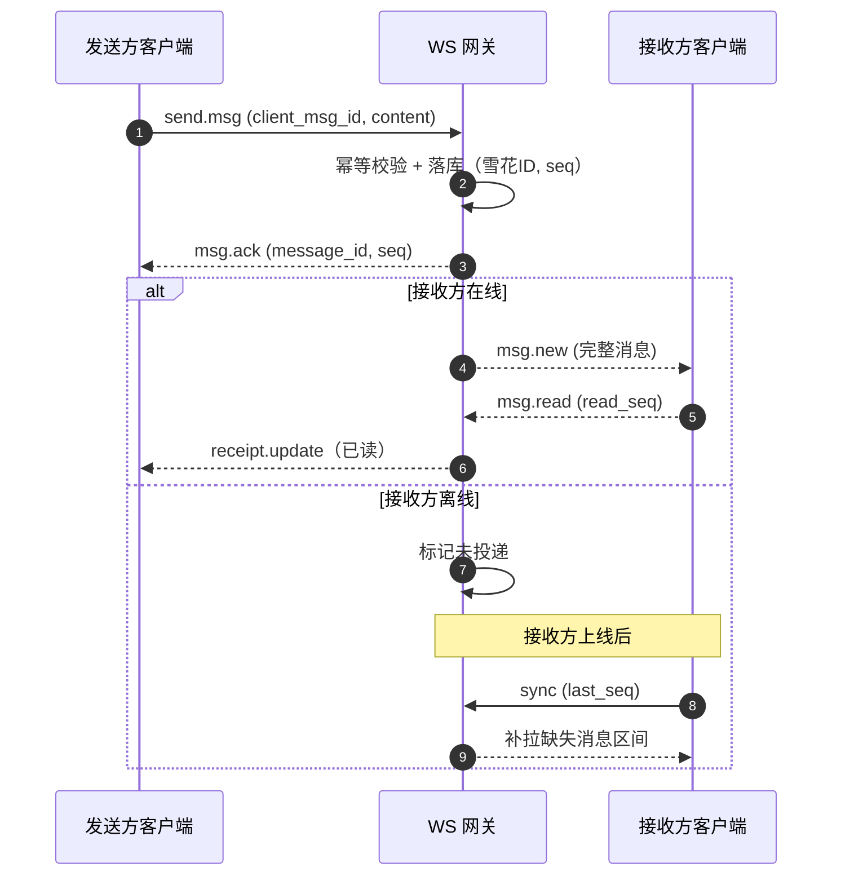
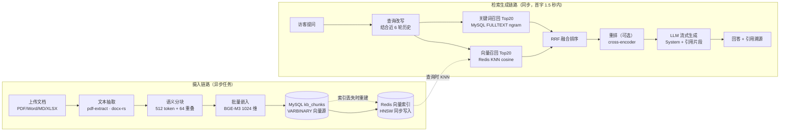
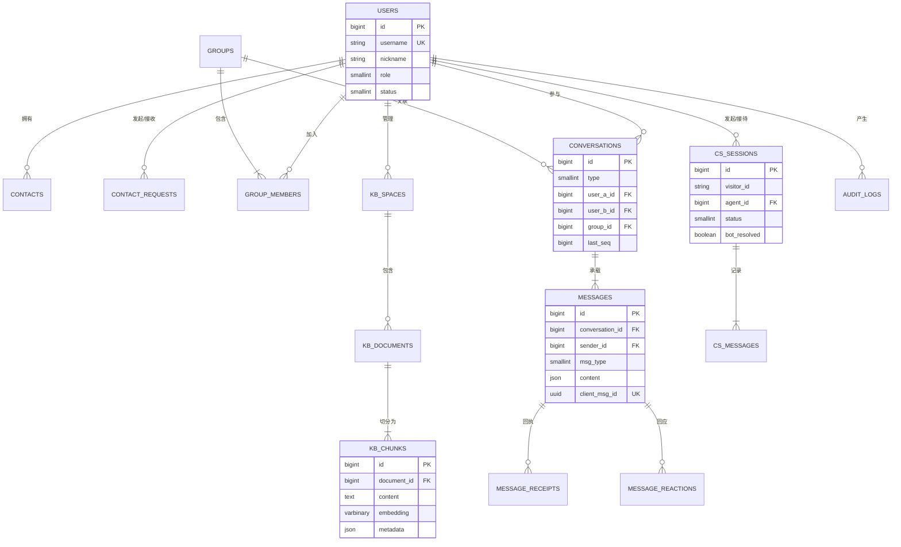
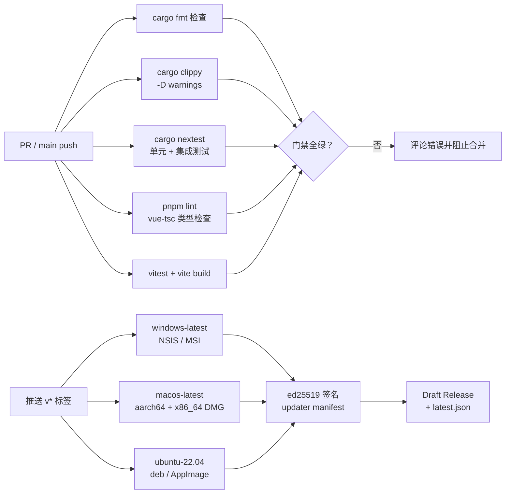

# Tauri 2.0 + Rust + Vue 3 即时通讯与智能客服 RAG 系统开发文档

> **版本 v1.2（GraphQL 版）** | 2026-09-13 | 技术栈：Tauri 2.0 · Rust · Vue 3 · Vite · async-graphql · MySQL 8.x + Redis · GitHub Actions

本文档给出「IM 即时通讯 + 智能客服 RAG」桌面应用的完整开发方案：Tauri 2.0 承载桌面客户端，Vue 3 + Vite 负责界面层，Rust（axum + async-graphql）服务端以 **GraphQL 单端点**承载全部业务查询与变更、经 WebSocket 统一消息通道，**MySQL 8.x 作为唯一持久层**承载业务数据与知识向量源，Redis 承担缓存、在线状态、客服排队与向量检索索引，GitHub Actions 打通从代码检查到 Windows/macOS/Linux 三平台安装包的自动化交付。文档覆盖核心功能、页面需求、技术设计、数据库表设计与开发里程碑，可作为团队进入开发的直接依据。

## 目录

1. [项目概述与总体架构](#1-项目概述与总体架构)
2. [核心功能设计](#2-核心功能设计)
3. [页面需求](#3-页面需求)
4. [技术开发文档](#4-技术开发文档)
5. [数据库表设计](#5-数据库表设计)
6. [GitHub Actions CI/CD](#6-github-actions-cicd)
7. [开发路线图与里程碑](#7-开发路线图与里程碑)

---

## 1 项目概述与总体架构

### 1.1 系统定位与角色边界

系统是一套面向中小团队的「即时通讯 + 智能客服」一体化平台，包含三个使用角色：**终端用户**（IM 聊天）、**客服坐席**（接待咨询、人机协作）与**管理员**（用户/知识库/运营管理）。三者共用一套 Tauri 桌面客户端，登录后按角色解锁功能入口；网页访客咨询以轻量 Web Widget 形式接入（二期范围），一期访客先以客户端「游客模式」打通全链路。

系统按单机可部署设计（服务端单体 + MySQL + Redis），模块边界按可拆分微服务划分（IM 网关、RAG 服务独立进程内模块），并发规模满足 1 万注册用户、2 千同时在线、单机 500 QPS 检索的目标，超出时以网关与服务层水平扩展承接。

### 1.2 技术选型

**表 1-1 技术选型总览**

| 分层 | 技术 / 组件 | 版本基线 | 用途说明 |
|---|---|---|---|
| 桌面框架 | Tauri | 2.x | 桌面壳与系统集成：托盘、系统通知、自动更新、多窗口、本地 SQLite |
| 前端框架 | Vue 3 + TypeScript | 3.5 / 5.6 | 界面层，Composition API + `<script setup>` 全量 TS |
| 构建工具 | Vite | 6.x | 开发 HMR 与生产构建，与 Tauri CLI 联动 |
| 状态与路由 | Pinia + Vue Router | 2.x / 4.x | 会话/消息/在线状态等客户端状态管理，路由按角色守卫 |
| UI 组件库 | Naive UI | 2.40+ | TS 友好、暗色模式完善，适合聊天类长列表组件定制 |
| 前端 GraphQL 客户端 | villus + graphql-codegen | 2.x / 5.x | Vue 3 组合式 GraphQL 客户端（useQuery/useMutation/useSubscription），按服务端 SDL 生成 TS 类型与文档 |
| 服务端框架 | axum + tokio | 0.8 / 1.x | HTTP 承载层与 WebSocket 网关，tower 中间件（限流、日志、鉴权） |
| API 层 | async-graphql + async-graphql-axum | 7.x | GraphQL 接口层：/graphql 单端点承载 Query/Mutation，Subscription 走 graphql-ws 协议；DataLoader 批量消解 N+1 |
| 数据库访问 | sqlx | 0.8 | 编译期校验 SQL、连接池、迁移管理（sqlx migrate）；启用 mysql feature |
| 业务数据库 | MySQL | 8.x（推荐 8.4 LTS） | 唯一持久层：用户、消息、知识库、审计与向量源数据；InnoDB + 原生 JSON 类型 + FULLTEXT（ngram）中文检索 |
| 缓存与队列 | Redis | 7.x（含 RediSearch 模块） | 缓存、在线状态、客服排队、限流计数、发送幂等去重；RediSearch 承担 HNSW 向量检索（deadpool-redis 连接池） |
| 认证 | jsonwebtoken + argon2 | 9.x / 0.5 | JWT 访问/刷新令牌，argon2id 密码哈希 |
| Embedding | fastembed（BGE-M3，1024 维） | 0.7 | 本地推理向量模型；可配置切换 OpenAI 兼容 API（密钥走环境变量） |
| LLM 生成 | OpenAI 兼容接口 | — | 客服回答生成，经 GraphQL Subscription 流式输出；DeepSeek / Qwen / GPT 可配置切换 |
| 文档解析 | pdf-extract · docx-rs · comrak · calamine | — | PDF / Word / Markdown / Excel 文本抽取，统一为纯文本再分块 |
| 客户端存储 | SQLite（tauri-plugin-sql） | — | 会话与历史消息本地缓存、离线可读、本地全文检索 |
| CI/CD | GitHub Actions + tauri-action | — | 代码检查、测试、三平台桌面安装包构建与自动发布 |

### 1.3 总体架构

架构分五层：客户端层（Tauri 桌面应用，界面与 Rust 核心两部分）、接入层（WebSocket 网关与 GraphQL API）、服务层（IM 业务、客服调度、RAG 检索生成、文件服务）、AI 能力层（Embedding 与 LLM，本地或远端可切换）、数据层（MySQL 业务库 + Redis 缓存与向量索引，对象存储）。客户端的 WebSocket 连接由 Rust 侧持有，界面刷新不中断连接。



*图 1-1 系统总体架构：客户端 Rust 核心持有长连接，服务层按模块划分，MySQL 为唯一持久层、Redis 承担加速与向量检索*

### 1.4 关键技术决策

**表 1-2 关键技术决策与理由**

| 决策点 | 选择 | 理由与放弃项 |
|---|---|---|
| 桌面壳 | Tauri 2.0 而非 Electron | 安装包约 8 MB（Electron 同等应用普遍 80–150 MB）、内存占用低一半以上；2.0 移动端（iOS/Android）为后续扩展留出通道。代价是依赖系统 WebView，需在 CI 中覆盖三平台渲染回归 |
| 服务端语言 | Rust（axum + async-graphql）而非 Node/Go | 与客户端 Rust 核心共享协议与模型类型定义（workspace 内公共 crate）；axum 由 tokio 团队维护，tower 中间件生态成熟，内建 WebSocket 提取器；async-graphql 是 Rust 生态最成熟的 GraphQL 实现（derive 宏、DataLoader、Subscription、multipart 上传一体化，与 axum 官方集成）。放弃 Node：长连接网关的内存与稳定性要求高 |
| API 风格 | GraphQL 而非 REST | 聊天客户端视图天然聚合——会话列表需同时取最后一条消息、未读数、对端资料，GraphQL 一次往返按需取齐，消除 REST 的 over-fetching 与多请求拼接；SDL 单一事实源 + 双端代码生成（服务端 Rust 类型 / 前端 TS 类型）杜绝字段漂移；单端点演进（只增不改删，破坏性变更走 @deprecated 两版后移除）免去 /v1、/v2 多版本治理。代价：需查询深度/复杂度限制防滥用，大文件字节流不适合 multipart 走独立端点 |
| 向量存储 | MySQL BLOB 为源 + Redis RediSearch 检索 | MySQL 8.x 无原生向量类型（9.0 才引入 VECTOR），向量检索由 Redis Stack 的 RediSearch 提供：HNSW + COSINE，10 万 chunk P95 低于 20 ms；embedding 以 float32 打包存 MySQL VARBINARY(4096) 作为 source of truth，Redis 索引丢失可从 MySQL 全量重建；纯 Redis（无模块）环境降级为应用层 rayon 并行暴力检索（10 万 chunk P95 约 100 ms）。放弃 pgvector：对齐现有 MySQL + Redis 运维栈，不引入第二套数据库 |
| 缓存与热状态 | Redis 承担缓存、排队与在线状态 | 在线状态 TTL 与心跳节奏天然匹配；客服排队用 ZSET 原子操作，优于 SQL 轮询；限流与幂等去重（SETNX）是 Redis 原生场景；网关未来水平扩展时 uid 到 gateway 的路由表直接复用 |
| WS 持有方 | Rust 核心而非 WebView 前端 | 连接不受页面刷新/路由切换影响；重连、心跳、消息暂存都在原生层完成；前端只消费事件，职责清晰。若放前端，刷新页面即断线是硬伤 |
| 客户端缓存 | SQLite 而非 IndexedDB | tauri-plugin-sql 直接支持；SQL 能力完整（本地全文检索用 FTS5），数据可迁移可备份 |
| 消息 ID | 服务端雪花 ID + 客户端 UUID | 雪花 ID 有序利于按游标翻页；客户端 UUID 幂等去重防止重发产生重复消息 |

以上选型依据各组件的官方文档与维护状态：Tauri 2.0 的插件体系与能力权限清单见官方指南 [1]，axum 由 tokio 团队维护并内建 WebSocket 支持 [2]，async-graphql 的 Schema/DataLoader/Subscription 能力见官方文档 [7]，villus 为 Vue 3 原生的轻量 GraphQL 客户端 [8]，MySQL 8.x 的 JSON 类型、FULLTEXT ngram 解析器与分区特性见官方参考手册 [3]，RediSearch 的向量索引与 KNN 检索语法见 Redis 文档 [6]，fastembed 提供 BGE 系列模型的本地推理 [5]。

> **架构约束**：所有 API 密钥（LLM、Embedding、对象存储、签名密钥）一律通过环境变量或密钥管理注入，禁止写入代码仓库与客户端配置；客户端仅持有短期 JWT，刷新令牌存储在系统凭据管理器（Windows Credential Manager / macOS Keychain）。

---

## 2 核心功能设计

### 2.1 功能总览与优先级

功能按三端四模块组织，优先级定义：P0 为 MVP 必须交付（一期），P1 为二期增强，P2 为远期规划。一期目标为「IM 单聊 + 知识库问答 + 人工接管」的最小闭环。

**表 2-1 功能模块与优先级**

| 模块 | 功能组 | 优先级 | 交付期 |
|---|---|---|---|
| IM 通讯 | 注册登录、单聊、消息类型（文本/图片/文件）、离线消息、消息可靠性 | **P0** | 一期 |
| IM 通讯 | 群聊、群管理、已读回执、输入状态、消息撤回、表情回应 | P1 | 二期 |
| IM 通讯 | 音视频通话、消息端到端加密 | P2 | 远期 |
| 智能客服 | 知识库管理（上传/解析/分块/向量化）、机器人问答、引用溯源 | **P0** | 一期 |
| 智能客服 | 转人工、坐席排队分配、坐席工作台、满意度评价 | **P0** | 一期 |
| 智能客服 | 混合检索与重排、对话上下文改写、质检报表 | P1 | 二期 |
| 管理后台 | 用户管理、角色权限、审计日志 | **P0** | 一期 |
| 管理后台 | 运营看板、知识库健康度、机器人调优 | P1 | 二期 |
| 系统体验 | 系统托盘、桌面通知、多窗口、开机自启、自动更新 | **P0** | 一期 |
| 系统体验 | 暗色模式、多语言、本地消息搜索（FTS5） | P1 | 二期 |

### 2.2 IM 即时通讯模块

- **账号与关系**：用户名/邮箱注册 + argon2id 哈希存储；好友申请—确认—备注—分组；屏蔽名单；临时会话（无好友关系可发消息，由接收方设置控制）
- **单聊与群聊**：单聊按双方用户生成会话；群聊支持建群、邀请、踢人、群主/管理员角色、群公告、@成员提醒；群成员上限默认 500
- **消息类型**：文本、图片（自动生成缩略图）、文件（分片上传断点续传）、语音消息、系统通知、结构化卡片（客服会话摘要、订单信息）
- **消息可靠性**：客户端 UUID 幂等去重、服务端雪花 ID 确认（ack）、按会话序号游标增量同步、投递失败自动重试（指数退避）、离线消息落库上线推送
- **已读与输入状态**：会话级已读回执（批量上报 read_seq）；单聊显示对方「正在输入…」；群聊显示「n 人已读」
- **消息操作**：两分钟内撤回（全员可见撤回占位）、表情回应、复制、转发、引用回复
- **多端同步**：同一账号最多 3 个在线端（桌面/移动端复用协议），同端互踢；已读状态、草稿、会话排序跨端同步
- **桌面集成**：系统托盘常驻、未读角标、新消息桌面通知（点击定位会话）、全局快捷键唤起、开机自启

### 2.3 智能客服 RAG 模块

客服模块的核心是人机协作：机器人优先应答，检索置信度不足或访客主动要求时无缝转人工，全程保留上下文。RAG 管线分「摄入」与「检索生成」两条链路，详见 4.5 节。

- **知识库管理**：多知识空间隔离；支持上传 PDF/Word/Markdown/Excel/TXT 与在线编辑条目；解析状态可视化（待解析/解析中/已向量化/失败），失败可重试
- **智能分块**：按标题层级优先切分，超长段落按 512 token 窗口 + 64 token 重叠滑窗；保留元数据（来源文件、章节、页码）用于引用溯源
- **机器人问答**：流式输出回答，答案附带引用来源（文档名 + 片段定位）；多轮对话携带近 6 轮历史；检索置信度低于阈值时明确回复「不确定」并推荐转人工，禁止编造
- **转人工**：触发条件：访客点击转人工、机器人连续两轮低置信、访客情绪关键词（可配置）；排队播报当前位次，接入后机器人自动发送会话摘要给坐席
- **坐席工作台**：坐席状态（在线/忙碌/离开）；并发接待上限与自动分配（技能组 + 最少空闲优先）；快捷短语；会话摘要一键调阅；访客信息侧栏
- **反馈闭环**：每条机器人回答可点赞/点踩并留备注；低分样本进入「待优化」列表，用于补充知识条目；满意度评价在会话结束时弹出

### 2.4 管理后台功能

- **用户与角色**：用户查询/禁用/重置密码；角色三级（管理员/坐席/普通用户）+ 自定义权限点；坐席技能组管理
- **审计日志**：敏感操作全量记录（登录、管理动作、知识库变更），可按人/时间/动作筛选，保留 180 天
- **运营看板**：会话量、机器人拦截率（转人工前的自助解决比例）、平均首响时长、满意度分布、知识库命中率与缺口关键词（二期）

### 2.5 非功能性需求

**表 2-2 性能与质量指标**

| 指标 | 目标值 | 度量方式 |
|---|---|---|
| 消息端到端延迟（在线双方） | P95 < 200 ms | 发送 ack 到对方渲染的时间差埋点 |
| 离线消息补拉 | 1 000 条 < 2 s | 登录后 sync 命令耗时 |
| 会话列表首屏查询 | P95 < 300 ms | 单次 GraphQL 往返（会话+最后消息+未读聚合，DataLoader 批量） |
| 向量检索 | 10 万 chunk 内 P95 < 20 ms | RediSearch FT.SEARCH 延迟采样 |
| 机器人首字延迟 | P95 < 1.5 s | 问题提交到首个流式 token（Subscription 事件）输出 |
| 客户端冷启动 | < 1.5 s 到会话列表可交互 | 本地缓存命中路径 |
| 客户端内存占用 | 空闲态 < 200 MB | 三平台采样均值 |
| 安装包体积 | Windows NSIS < 15 MB | tauri-action 产物 |
| 服务可用性 | 99.5%（单机部署） | 健康检查探活统计 |

---

## 3 页面需求

### 3.1 页面与路由总览

客户端采用「窗口 + 路由」两层模型：主窗口承载全部业务页面（路由切换），独立窗口用于音视频通话（远期）与图片查看器。路由按角色守卫，未授权路由重定向到工作台首页。

**表 3-1 路由与页面清单**

| 路由 | 页面 | 可见角色 | 优先级 |
|---|---|---|---|
| /login | 登录 / 注册（含找回密码） | 访客 | **P0** |
| /app | 主布局（侧边导航 + 内容区） | 登录用户 | **P0** |
| /app/chats | 会话列表 + 聊天窗口（默认页） | 全部 | **P0** |
| /app/chats/:id | 指定会话聊天窗口 | 全部 | **P0** |
| /app/contacts | 联系人 / 群组 / 好友申请 | 全部 | **P0** |
| /app/kb | 知识库列表与文档管理 | 管理员/坐席 | **P0** |
| /app/kb/:id | 知识空间详情（文档列表/分块预览） | 管理员/坐席 | **P0** |
| /app/workbench | 客服工作台（排队 + 接待 + 会话） | 坐席 | **P0** |
| /app/workbench/history | 历史会话检索 | 坐席/管理员 | P1 |
| /app/bot-chat | 智能助手问答（内部员工向机器人提问） | 全部 | P1 |
| /app/admin/:tab | 管理后台（用户/角色/审计/看板） | 管理员 | **P0** |
| /app/settings/:tab | 设置（账号/通知/快捷键/存储/关于） | 全部 | **P0** |

### 3.2 登录与注册页

单一窗口内三态切换：登录、注册、找回密码。登录支持账号/邮箱 + 密码；提交后进入「连接中」状态页，依次展示：建立 WebSocket 连接 → 拉取用户资料 → 增量同步会话与消息 → 进入主界面。任一环节失败给出可重试的错误提示与日志导出入口。注册需用户名 3–32 字符唯一性实时校验、密码强度条（最低 8 位含字母数字）。忘记密码走邮箱验证码重置。

### 3.3 主布局

左侧 56 px 图标导航栏（会话、联系人、客服工作台、知识库、管理后台、设置，按角色显隐）+ 右侧内容区。顶部为账号卡片（头像、昵称、在线状态切换）与全局搜索入口。托盘图标常驻，关闭窗口默认最小化到托盘而非退出（设置可改）。导航项显示未读角标：会话未读总数、工作台排队数。

### 3.4 会话列表与聊天窗口

主界面为双栏结构：左栏 300 px 会话列表，右栏聊天窗口；窗口最小宽度 960 px，列表可折叠为仅头像列。

**表 3-2 会话列表区需求**

| 元素 | 需求说明 |
|---|---|
| 列表项 | 头像（带在线状态点）、名称、最后一条消息摘要、时间、未读数角标；置顶会话固定在分组顶部；草稿在摘要位置以「[草稿]」前缀显示 |
| 分组与排序 | 置顶 → 普通会话按最后消息时间倒序；未读会话高亮；@我 的群消息角标变红并加 @ 标记 |
| 操作 | 右键菜单：置顶/取消、标记已读、免打扰、删除会话（本地）；搜索框按名称与本地消息全文检索（SQLite FTS5） |
| 系统会话 | 好友申请、群系统通知进入独立「系统通知」会话 |

**表 3-3 聊天窗口区需求**

| 元素 | 需求说明 |
|---|---|
| 消息区 | 虚拟滚动（长会话万级消息不卡顿）；按天分隔；已读回执文本与头像悬停浮层；图片/文件消息内联预览，下载进度条可见；语音消息波形条 + 播放 |
| 消息气泡 | 撤回显示灰色占位；表情回应聚合气泡；引用回复折叠引用块；悬停显示时间与操作按钮（撤回/复制/引用/回应） |
| 输入区 | 多行输入（Enter 发送 / Shift+Enter 换行，可配置）；表情面板；图片/文件/截图按钮；@ 联系人自动补全（群聊）；输入时向对端发送 typing 状态 |
| 发送状态 | 本地消息三态：发送中（时钟）、已到达服务器（单勾）、已读（双勾）；发送失败红色感叹号可重试 |
| 右侧信息栏 | 单聊：对方资料；群聊：成员列表（搜索 + @）、群公告、群设置入口；可折叠 |

### 3.5 联系人页

三标签页：好友（按分组字母排序，显示在线状态）、群组、好友申请（红点角标，同意/拒绝）。好友项右键：发消息、修改备注、移动分组、删除好友、屏蔽。顶部操作：添加好友（按用户名/ID 搜索）、创建群聊（多选好友向导）。

### 3.6 客服工作台

坐席专用三栏视图，是客服角色的默认落地页。

**表 3-4 客服工作台需求**

| 区域 | 需求说明 |
|---|---|
| 会话队列栏 | 我的接待中会话（按最新消息排序）+ 全局排队列表（仅组长/管理员可见位次与等待时长）；新会话到达声音与角标提醒；坐席状态开关（在线/忙碌/离开） |
| 对话区 | 与聊天窗口一致的富消息能力；顶部显示访客来源渠道、排队等待时长、当前接待轮次；机器人应答记录以机器人头像标识并附「已由机器人回复」标签 |
| 访客信息栏 | 访客资料（来源、设备、历史会话数）、历史会话记录跳转、标签管理；「AI 助手」按钮：对当前上下文生成建议回复（一键采纳可编辑） |
| 效率工具 | 快捷短语（个人 + 团队共享，支持占位变量）；会话摘要（转人工时机器人自动生成，坐席可刷新）；结束会话需选择结束原因 + 可选满意度邀请 |

### 3.7 知识库管理页

左侧知识空间列表（新建/重命名/删除，删除需二次确认且仅空空间可物理删除），右侧文档列表。文档上传采用拖拽 + 多选，单文件上限 50 MB；上传后进入解析流水线，列表内实时刷新状态标签（待解析/解析中/已向量化/失败 + 失败原因与重试按钮）。文档详情页提供：分块预览（左侧原文高亮定位，右侧 chunk 列表含 token 数）、手动新增/编辑知识条目（标题 + 正文，Markdown）、相似问题配置（同一答案的多种问法）。

### 3.8 管理后台页

顶部标签切换：用户管理（搜索/筛选/禁用/重置密码/分配角色）、坐席管理（技能组、并发上限、排班）、审计日志（筛选器 + 表格分页）、运营看板（会话量趋势、机器人拦截率、满意度分布、知识库缺口关键词 Top 20）。所有敏感操作弹出确认并写入审计日志。

### 3.9 设置页

分组设置：账号（头像、昵称、密码修改、多端在线管理——查看并踢出其他端）、通知（桌面通知开关按会话粒度、声音、免打扰时段）、快捷键（唤起主窗口、截屏、发送键位自定义）、存储（缓存占用统计、清理历史消息、数据导出）、通用（语言、主题暗色切换、开机自启、关闭行为）、关于（版本、更新检查、更新日志）。

---

## 4 技术开发文档

### 4.1 Monorepo 目录结构

仓库采用单一 Monorepo，Rust 侧以 cargo workspace 组织，服务端与客户端核心共享协议与模型 crate，前端独立于 `apps/desktop`。约定：WS 帧协议结构体只定义在 `crates/protocol`，两端引用；GraphQL 类型以服务端 SDL 为单一事实源，前端经 graphql-codegen 生成 TS 类型与 villus 操作文档，杜绝字段漂移。

```
im-rag/
├─ .github/workflows/          # CI/CD（见第 6 章）
│  ├─ ci.yml  release.yml
├─ crates/                     # Rust workspace
│  ├─ protocol/                # 共享协议：WS 帧、消息模型、错误码
│  ├─ server/                  # 服务端（axum）
│  │  ├─ src/
│  │  │  ├─ main.rs            # 启动与路由装配
│  │  │  ├─ config.rs           # 环境变量配置（密钥不落盘）
│  │  │  ├─ graphql/           # GraphQL 模块（async-graphql）
│  │  │  │  ├─ schema.rs       # Schema 装配（Query/Mutation/Subscription + DataLoader 注入）
│  │  │  │  ├─ types/          # 对象与输入类型（user/contact/group/message/kb/cs/admin）
│  │  │  │  ├─ query/          # 查询 resolver
│  │  │  │  ├─ mutation/       # 变更 resolver（auth/contact/group/kb/cs/admin）
│  │  │  │  ├─ subscription.rs # 机器人流式回答订阅（chatAnswer）
│  │  │  │  └─ dataloader.rs   # 批量加载器（最后消息/群成员/用户资料）
│  │  │  ├─ files/             # 文件字节端点（分片上传/下载，GraphQL 例外通道）
│  │  │  ├─ ws/                # WebSocket 网关
│  │  │  │  ├─ mod.rs          # 连接接入与生命周期
│  │  │  │  ├─ hub.rs          # 在线连接表（DashMap<user_id, Vec<Sender>>）
│  │  │  │  ├─ handler.rs      # 命令分发
│  │  │  │  └─ session.rs      # 连接会话状态
│  │  │  ├─ rag/                # RAG 管线
│  │  │  │  ├─ ingest.rs        # 解析→分块→嵌入→入库
│  │  │  │  ├─ retrieve.rs      # 混合检索→RRF→重排
│  │  │  │  ├─ generate.rs      # Prompt 组装→LLM 流式生成
│  │  │  │  └─ chunker.rs       # 分块策略
│  │  │  ├─ services/           # 业务逻辑（供 api 与 ws 复用）
│  │  │  └─ db/                 # sqlx 查询层 + migrations/
│  │  └─ migrations/            # SQL 迁移（sqlx migrate）
│  └─ desktop/                  # Tauri 客户端核心
│     ├─ src/
│     │  ├─ main.rs             # Tauri 入口
│     │  ├─ ws_client.rs        # WS 连接管理（重连/心跳/暂存）
│     │  ├─ commands/           # 暴露给前端的命令
│     │  ├─ store.rs            # 本地 SQLite 与配置
│     │  └─ tray.rs  notifications.rs
│     ├─ capabilities/          # Tauri 2.0 权限清单
│     └─ tauri.conf.json
├─ apps/desktop/               # Vue 3 前端（Vite）
│  ├─ src/
│  │  ├─ main.ts  App.vue  router/
│  │  ├─ stores/               # Pinia：auth/session/message/contact/cs/kb
│  │  ├─ composables/          # useWs() useTauri() useVirtualList()
│  │  ├─ graphql/              # villus 客户端 · operations/*.graphql · codegen 生成类型
│  │  ├─ components/           # 业务组件
│  │  ├─ views/                # 路由页面（对应第 3 章）
│  │  └─ styles/
│  ├─ package.json  vite.config.ts
└─ docs/                        # 本文档与 ADR 决策记录
```

### 4.2 服务端设计（axum + async-graphql）

服务端为单体进程：GraphQL 单端点 `/graphql` 承载全部业务查询与变更（async-graphql，POST JSON 执行 Query/Mutation，Subscription 复用同端点以 graphql-ws 子协议升级 [9]），大文件字节传输走独立 HTTP 端点，WS 网关处理 IM 长连接与推送，三者共享 `services/` 业务层。核心依赖装配顺序：tracing 日志 → sqlx MySQL 连接池 → deadpool-redis 连接池（缓存、在线状态、排队、幂等去重，键空间设计见 5.9）→ fastembed 模型加载（惰性单例）→ GraphQL Schema 装配（连接池、WS hub、DataLoader 注入 Context，查询深度 ≤ 10、复杂度 ≤ 200）→ 路由。部署为单二进制 + 环境变量，Docker 镜像约 80 MB（含模型需另挂载卷）。

四类传输通道的职责边界：**GraphQL 查询/变更**（POST /graphql）覆盖认证、资料、好友、群、会话消息、知识库、客服、管理后台全部业务读写；**GraphQL 订阅**（/graphql + graphql-ws）仅承载机器人流式回答；**文件字节端点**（/files/*）承担分片上传与下载——GraphQL multipart 会把文件整块缓冲在内存，不适合流式大文件；**IM 消息通道**（/ws）保留自定义帧协议——消息投递依赖客户端 ack、会话 seq 游标、心跳超时与离线补拉等可靠传输语义，超出 GraphQL Subscription 的能力（见 4.3）。错误返回约定：业务错误统一出现在 GraphQL `errors` 数组，错误码扩展在 `extensions.code`，与服务端错误码枚举一一对应。

**表 4-1 GraphQL Schema 核心操作一览**

| 类型 | 操作（节选） | 功能 | 鉴权 |
|---|---|---|---|
| Query | `me: User!` · `users(query: String!): [User!]!` | 本人资料；按用户名/ID 搜索（限流 10 次/分钟） | Bearer |
| Query | `contacts: [Contact!]!` · `contactRequests: [ContactRequest!]!` | 联系人列表、好友申请列表 | Bearer |
| Query | `conversations(first: Int, after: ID): ConversationConnection!` | 会话列表游标分页，单次聚合 lastMessage / unreadCount / 对端资料（DataLoader 批量取） | Bearer |
| Query | `messages(conversationId: ID!, beforeSeq: Int, limit: Int): [Message!]!` | 历史消息按 seq 游标翻页（20–100 条） | Bearer + 会话成员校验 |
| Query | `group(id: ID!): Group` · `kbSpaces: [KbSpace!]!` · `kbDocument(id: ID!): KbDocument`（chunks 支持 first/after 分页） | 群详情；知识空间、文档与分块查看 | Bearer + 角色 |
| Query | `csSession(id: ID!): CsSession` · `adminStats(range: StatsRange!): AdminStats!` · `auditLogs(filter: AuditLogFilter!, first: Int, after: ID): AuditLogConnection!` | 客服会话详情；运营看板；审计日志分页 | 游客令牌 / Bearer + 管理员 |
| Mutation | `register(input: RegisterInput!): AuthPayload!` · `login(input: LoginInput!): AuthPayload!` · `refreshToken(token: String!): AuthPayload!` | 注册、登录、刷新令牌（返回 access/refresh JWT） | 公开 / 刷新令牌 |
| Mutation | `updateMe(input: UpdateUserInput!): User!` · `sendContactRequest(input: SendRequestInput!): ContactRequest!` · `handleContactRequest(id: ID!, action: RequestAction!): ContactRequest!` | 修改资料；发起与处理好友申请 | Bearer |
| Mutation | `createGroup(input: CreateGroupInput!): Group!` · `addGroupMembers(groupId: ID!, userIds: [ID!]!): Group!` · `removeGroupMember(groupId: ID!, userId: ID!): Group!` | 建群、加人、踢人 | Bearer + 群角色校验 |
| Mutation | `createKbSpace(input: CreateSpaceInput!): KbSpace!` · `createKbDocument(spaceId: ID!, input: CreateDocumentInput!): KbDocument!` · `retryIngest(documentId: ID!): Boolean!` | 知识空间与文档登记（文档字节走文件端点或 Upload 直传）；解析失败重试 | Bearer + 角色 |
| Mutation | `startCsSession(input: StartSessionInput!): CsSession!` · `transferToHuman(sessionId: ID!): CsSession!` | 发起客服会话、转人工 | 游客令牌 / Bearer |
| Mutation | `uploadAvatar(file: Upload!): User!` | 小文件直传（≤ 5 MB，async-graphql 原生 Upload 标量） | Bearer |
| Subscription | `chatAnswer(sessionId: ID!): ChatAnswerEvent!` | 机器人问答流式回答：`answerToken` / `done`（含引用 citations）/ `error` 事件 | 会话令牌（graphql-ws 握手校验） |
| 独立端点（例外） | POST /files/init · POST /files/:id/chunks · POST /files/:id/complete · GET /files/:id | 大文件分片上传三步（4 MB/片）与签名 URL 下载：multipart 整块内存缓冲，不适合流式分片，故保留 HTTP 端点 | Bearer |
| WS 网关（并存） | wss://host/ws | IM 消息通道保留自定义帧协议（ack / seq 游标 / 心跳 / 离线补拉），见 4.3 | JWT |

Schema 演进规则：字段只增不删；需要破坏性变更时先标记 `@deprecated` 保留两个发布版本后移除，与 6.4 的协议主版本升级规则对齐。核心类型 SDL 节选（完整 schema 由服务端导出，代码位于 `crates/server/src/graphql/`）：

```graphql
type Conversation {
  id: ID!
  type: ConversationType!      # SINGLE / GROUP / CS
  peer: User                   # 单聊对端（DataLoader 批量取）
  group: Group
  lastMessage: Message         # 列表页聚合字段（DataLoader 批量取）
  unreadCount: Int!
  lastMessageAt: DateTime!
  messages(beforeSeq: Int, limit: Int = 20): [Message!]!   # 成员校验在 resolver 层强制
}

type Message {
  id: ID!
  seq: Int!                    # 会话内连续序号，游标翻页锚点
  sender: User!
  msgType: MsgType!            # TEXT / IMAGE / FILE / VOICE / VIDEO / SYSTEM / CARD
  content: JSON!               # 按 msgType 结构化
  replyTo: Message
  status: MessageStatus!       # NORMAL / RECALLED
  createdAt: DateTime!
}

type ChatAnswerEvent {         # Subscription 载荷
  sessionId: ID!
  token: String                # 增量回答片段
  citations: [Citation!]       # done 事件携带引用溯源
  done: Boolean!
}
```

会话列表页一次查询即可取齐「会话 + 最后一条消息 + 未读数 + 对端资料」，对端资料与最后消息经 DataLoader 合并为 `WHERE id IN (...)` 批量 SQL，消除 N+1。

### 4.3 WebSocket 协议设计

IM 消息通道保留自定义 WS 帧协议而非改用 GraphQL Subscription：消息投递依赖客户端 ack、会话 seq 游标增量同步、心跳超时与离线补拉等可靠传输语义，自定义信封在这些场景下开销与复杂度最优；GraphQL Subscription 仅承担机器人流式回答（见 4.2），两条通道职责互不重叠。连接地址 `wss://host/ws?token=JWT`。所有帧为 UTF-8 JSON 文本帧，统一信封结构：`cmd`（命令字）、`seq`（请求序号，客户端自增，响应对齐）、`ts`（毫秒时间戳）、`payload`（命令负载）。心跳：客户端每 30 s 发 `ping`，服务端回 `pong`；连续 2 个周期无心跳判定断连。

**表 4-2 WS 命令集**

| 方向 | cmd | payload 摘要 | 说明 |
|---|---|---|---|
| C→S | auth | { token } | 连接后首个命令，校验 JWT 并绑定用户 |
| C→S | ping | {} | 心跳保活 |
| C→S | send.msg | { client_msg_id, conversation_id, msg_type, content } | 发消息；幂等键 client_msg_id |
| C→S | msg.read | { conversation_id, read_seq } | 上报会话已读到 read_seq |
| C→S | typing | { conversation_id } | 输入状态，服务端节流 3 s 转发 |
| C→S | msg.recall | { message_id } | 两分钟内撤回 |
| C→S | sync | { last_synced: { conversation_id → last_seq } } | 增量同步：各会话返回缺失消息或缺失区间 |
| S→C | msg.new | { 消息完整对象 } | 新消息推送（对端发送） |
| S→C | msg.ack | { client_msg_id, message_id, seq } | 服务端确认：分配雪花 ID 与会话内 seq |
| S→C | receipt.update | { conversation_id, user_id, read_seq } | 对方已读状态推送 |
| S→C | conv.update | { 会话变更事件 } | 会话列表刷新（新会话/最后消息更新） |
| S→C | presence.update | { user_id, status } | 在线状态变更（仅订阅的联系人） |
| S→C | cs.assigned · cs.queue | { session, agent, position } | 客服：分配坐席 / 排队位次更新 |
| S→C | kick | { reason } | 多端冲突或管理员强制下线，随后关闭连接 |

消息投递的完整时序（含接收方离线场景）如下：发送方先本地落库为「发送中」，经 Rust 核心 WS 通道发出；服务端校验幂等后写库，向发送方回 `msg.ack`，向接收方所有在线端推 `msg.new`；接收方返回应用层确认，服务端记录投递时间；若接收方全部离线，消息保留在库中，待其 `sync` 时下发。



*图 4-1 消息投递时序：ack 确认、在线推送与离线补拉两条路径*

### 4.4 Tauri 客户端架构

客户端遵循「前端只管渲染、Rust 管连接与数据」的分层：Vue 侧不经浏览器网络栈建连——IM WebSocket 与文件分片传输由 Rust 核心持有并封装为 Tauri Command；GraphQL 查询与变更由 villus 经 tauri-plugin-http 提供的 fetch 发出（同样绕开浏览器 CORS 与网络栈），查询结果直接进入 Pinia/Vue 响应式层；Rust 核心维护单例 WS 连接（tokio-tungstenite），断线后按 1s/2s/4s/8s 上限 30s 的抖动指数退避重连，重连成功自动补发暂存队列并触发增量同步。Rust 收到的每一条服务端事件经 `app.emit()` 转发给前端，前端用 `listen()` 订阅。

**表 4-3 Tauri Commands 与事件**

| 类型 | 名称 | 参数 / 负载 | 说明 |
|---|---|---|---|
| Command | connect / disconnect | server_url, token | 建立/断开 WS；返回连接句柄状态 |
| Command | send_message | conversation_id, msg_type, content | 本地先落库（发送中）再发帧，返回 client_msg_id |
| Command | fetch_history | conversation_id, before_seq, limit | 先读本地 SQLite，不足再执行 GraphQL `messages` 查询并回填 |
| Command | upload_file / download_file | 本地路径或 file_id | 分片上传/下载，事件回传进度百分比 |
| Command | save_credential / get_credential | refresh token | 存取系统凭据管理器，不落明文文件 |
| Command | set_tray_badge / show_notification | 未读数 / 标题与正文 | 托盘角标与系统通知（Windows 任务栏叠加图标） |
| Event（S→Vue） | ws://message | 服务端帧原文 | msg.new / msg.ack / receipt 等统一透传 |
| Event（S→Vue） | ws://status | connecting / open / closed / retrying | 连接状态机变化，驱动 UI 连接条 |
| Event（S→Vue） | file://progress | transfer_id, percent | 文件传输进度 |

Tauri 2.0 插件清单与用途：`sql`（SQLite 本地库）、`store`（轻量配置 KV）、`notification`（桌面通知）、`updater`（自动更新，走签名 manifest）、`single-instance`（单实例锁）、`autostart`（开机自启）、`http`（GraphQL 请求与文件传输，绕过浏览器 CORS，作为 villus 的 fetch 传输层）、`dialog` 与 `fs`（文件选择与读写，capability 内限定目录）、`window-state`（记忆窗口位置）。所有权限集中在 `capabilities/main.json` 声明，遵循最小授权。

```ts
// apps/desktop/src/composables/useWs.ts —— 前端消费侧示意
import { listen } from '@tauri-apps/api/event';
import { invoke } from '@tauri-apps/api/core';

export function useWs() {
  const status = ref<'connecting'|'open'|'closed'|'retrying'>('closed');
  onMounted(async () => {
    await listen('ws://status', e => (status.value = e.payload as any));
    await listen('ws://message', e => messageStore.handleFrame(e.payload));
    await invoke('connect', { serverUrl: cfg.server, token: auth.token });
  });
  return { status, send: (c: unknown) => invoke('send_message', c) };
}
```

```ts
// apps/desktop/src/graphql/client.ts —— villus 客户端（经 tauri-plugin-http 发请求）
import { createClient, dedupExchange, cacheExchange, fetchExchange } from 'villus';
import { fetch } from '@tauri-apps/plugin-http';

export const gqlClient = createClient({
  url: `${cfg.server}/graphql`,
  fetch,                                  // Tauri 原生网络栈，绕过浏览器 CORS
  exchanges: [dedupExchange, cacheExchange, fetchExchange],
});

// 页面侧用法（操作文档由 graphql-codegen 从 SDL 生成）：
//   useQuery({ query: ConversationsDocument })          // 会话列表一次聚合取齐
//   useMutation({ query: SendContactRequestDocument })
//   useSubscription({ query: ChatAnswerDocument })       // 机器人流式回答
```

### 4.5 RAG 管线

RAG 分摄入与检索两条链路。摄入为异步任务：上传后立即返回文档 ID，解析、分块、嵌入在后台按批执行（每批 32 chunk），embedding 源数据写入 MySQL，同时同步到 Redis 向量索引；状态变化经 WS 推送给知识库页刷新。检索链路采用「向量召回（Redis）+ 关键词召回（MySQL FULLTEXT）→ RRF 融合 → 可选重排 → 生成」的结构，保证专有名词与精确术语也能命中。



*图 4-2 RAG 管线：异步摄入落库，同步检索走「双路召回 + 融合重排 + 流式生成」*

生成的 Prompt 模板将检索片段以编号注入，要求模型仅依据片段回答并输出引用标记：

```text
[SYSTEM]
你是企业的智能客服。仅依据下面的知识片段回答；片段没有的信息，
回答"知识库中未找到，可为您转接人工客服"。引用时标注 [片段编号]。

[知识片段]
[1] {chunk_1 内容}（来源：{文件名} · {章节}）
[2] {chunk_2 内容}（来源：{文件名} · {章节}）

[对话历史]（近 6 轮）
{history}

[用户问题] {query}
```

置信度判定规则：融合后 Top1 分数低于 0.35（cosine 相似度，可配置）、或生成内容包含拒答话术时，标记低置信；连续两轮低置信自动触发转人工流程，机器人向访客明示「正在为您转接人工」。

### 4.6 关键代码骨架

服务端入口、GraphQL Schema 装配与 WS 网关注册（axum 0.8 + async-graphql 7）：

```rust
// crates/server/src/main.rs（节选）
#[tokio::main]
async fn main() -> anyhow::Result<()> {
    let cfg = Config::from_env()?;                    // DATABASE_URL / REDIS_URL / JWT_SECRET / LLM_API_KEY 等
    let pool = MySqlPoolOptions::new().max_connections(20)
        .connect(&cfg.database_url).await?;
    sqlx::migrate!("./migrations").run(&pool).await?;
    let redis = deadpool_redis::Config::from_url(&cfg.redis_url)
        .create_pool()?;
    let hub = Arc::new(ConnectionHub::new());          // DashMap<UserId, Vec<mpsc::Sender<Frame>>> + Redis 路由表
    let schema = Schema::build(QueryRoot, MutationRoot, SubscriptionRoot)
        .data(pool.clone()).data(redis.clone()).data(hub.clone())   // 注入 Context，resolver 内取用
        .limit_depth(10)                               // 防恶意深嵌套查询
        .limit_complexity(200)
        .finish();
    let app = Router::new()
        .route("/graphql", post(graphql_handler).get(subscription_handler))  // POST 执行；GET 升级 graphql-ws
        .route("/files/:id/chunks", post(files::upload_chunk))               // 大文件字节端点（例外通道）
        .route("/ws", get(ws::entry))
        .layer(TraceLayer::new_for_http())
        .with_state(state);
    let listener = tokio::net::TcpListener::bind(("0.0.0.0", cfg.port)).await?;
    axum::serve(listener, app).await?;
    Ok(())
}

// 查询 resolver（节选）：会话列表聚合，DataLoader 消 N+1
#[Object]
impl QueryRoot {
    async fn conversations(&self, ctx: &Context<'_>, first: i32, after: Option<ID>)
        -> async_graphql::Result<ConversationConnection> {
        // peer / lastMessage 字段在 Conversation 的 field resolver 内经 DataLoader
        // 合并为 WHERE id IN (...) 批量 SQL，避免每会话一条查询
        ConversationService::list(ctx, first, after).await.map(Into::into)
    }
}

// WS 连接处理（节选）：鉴权 → 注册 → 命令循环
pub async fn entry(ws: WebSocketUpgrade, State(st): State<AppState>) -> Response {
    ws.on_upgrade(|socket| async move {
        let (mut sink, mut stream) = socket.split();
        // 首帧必须 auth，超时 10s 断开；通过后 hub.register(user_id, tx)
        // 循环 stream.next() 按 cmd 分发至 handler，错误以 err 帧 + seq 回传
    })
}
```

雪花 ID 与会话 seq 生成：ID 高 41 位毫秒时间戳 + 10 位机器号 + 12 位序列；会话 seq 在同一事务内先 `UPDATE conversations SET last_seq = last_seq + 1 WHERE id = ?` 再 `SELECT last_seq`（MySQL 8 不支持 UPDATE ... RETURNING，InnoDB 行锁保证同事务两步原子），消息与 seq 同事务写入。

### 4.7 安全设计

**表 4-4 安全措施清单**

| 风险面 | 措施 |
|---|---|
| 密码存储 | argon2id（默认参数 m=19456,t=2,p=1），禁止明文与可逆加密；改密后全部 JWT 失效（token_version 自增） |
| 令牌 | access JWT 2 h（claims 含 uid、device、token_version），refresh 30 天存系统凭据管理器；WS 连接用 query 传 token 时同时校验 Origin 白名单 |
| SQL 注入 | sqlx 全量参数绑定 + 编译期 `query!` 宏校验；字符串拼接 SQL 禁止入库（CI clippy lint 提示） |
| XSS | 消息文本默认转义渲染；Markdown 白名单子集；图片/链接域名白名单；file 协议头一律拒绝 |
| 文件安全 | 上传先校验魔数（真实类型）、大小与扩展名白名单；存储键随机化；下载走签名 URL（15 分钟有效） |
| 越权 | 会话成员校验在 resolver→service 层强制（无论查询字段嵌套多深）；管理操作角色守卫（async-graphql guard）+ 权限点注解；审计日志记录拒绝事件 |
| 传输与更新 | 全站 TLS 1.3；自动更新包 ed25519 签名验证（TAURI_SIGNING_PRIVATE_KEY 存 GitHub Secrets） |
| 限流 | tower 中间件按 IP 与用户双维度：登录 5 次/分钟、搜索 10 次/分钟、订阅问答 20 次/分钟 |
| GraphQL 滥用 | 查询深度 ≤ 10、复杂度 ≤ 200（async-graphql 内建校验）；生产环境禁用 introspection 与 Playground；multipart 上传单文件 ≤ 50 MB；二期引入持久化查询（APQ）收敛客户端查询白名单 |
| Redis 访问 | 内网部署 + 密码认证；键名仅由服务端白名单字符拼接，禁止用户输入直入键名或 Lua 脚本参数 |

---

## 5 数据库表设计

### 5.1 存储策略

服务端使用 MySQL 8.x（推荐 8.4 LTS）+ Redis 7 组合：MySQL 是唯一持久层，承载业务表、消息、知识库与审计，embedding 以二进制源数据同库存储；Redis 承担缓存、在线状态、排队、限流、幂等去重与向量检索索引，其数据全部可从 MySQL 重建，允许短暂丢失（键空间设计见 5.9）。客户端仍使用 SQLite 存放缓存副本。主键统一为 `BIGINT` 雪花 ID（应用层生成）；时间统一 `DATETIME(3)`，以 UTC 约定由应用层负责写入与转换（MySQL `TIMESTAMP` 有 2038 年上限，不采用）。所有表附带 `created_at`/`updated_at`，下文字段表中省略这两个公共列。迁移通过 `sqlx migrate` 管理，DDL 变更必须经评审后提交（见团队规范）。

**表 5-1 关键数据形态在本版存储下的落位**

| 数据形态 | MySQL 中的承载方式 | 说明 |
|---|---|---|
| 结构化消息内容 | JSON 列 | MySQL 8 原生 JSON 类型，支持路径查询与部分更新 |
| 全文检索 | FULLTEXT 索引 + ngram 解析器 | 两字粒度中文分词，IN BOOLEAN MODE 查询 |
| 向量 | VARBINARY(4096)（1024 维 float32 小端打包） | MySQL 为 source of truth；检索索引建在 Redis RediSearch |
| 数组成员（mentions、技能组等） | JSON 数组 | MySQL 无原生数组类型 |
| 时间 | DATETIME(3) | UTC 约定，应用层转换时区 |
| IP 地址 | VARCHAR(45) | 兼容 IPv6 最长表示 |

### 5.2 核心 ER 模型

图中只标注关键列与关系方向，完整字段见后续各表。域划分为：用户与关系、消息、知识库、客服、运营五组。



*图 5-1 核心实体关系（简化列展示，五域十四表）*

### 5.3 用户与关系域

#### users — 用户主表

| 字段 | 类型 | 约束 | 默认值 | 说明 |
|---|---|---|---|---|
| id | BIGINT | PK | — | 雪花 ID |
| username | VARCHAR(32) | UNIQUE, NOT NULL | — | 登录名，3–32 字符 |
| password_hash | VARCHAR(97) | NOT NULL | — | argon2id PHC 格式 |
| nickname | VARCHAR(64) | NOT NULL | '' | 展示昵称 |
| avatar | VARCHAR(255) | NULL | NULL | 对象存储键 |
| email | VARCHAR(255) | UNIQUE, NULL | NULL | 找回密码渠道 |
| role | SMALLINT | NOT NULL | 0 | 0 用户 / 1 坐席 / 2 管理员（位标志可叠加） |
| status | SMALLINT | NOT NULL | 0 | 0 正常 / 1 禁用 |
| token_version | INT | NOT NULL | 0 | 改密自增使旧 JWT 失效 |
| last_login_at | DATETIME(3) | NULL | NULL | 最近登录时间 |

> DDL 说明：`CREATE INDEX idx_users_role ON users(role, status);`（MySQL 不支持部分索引，以复合条件列替代）

#### contacts — 好友关系

| 字段 | 类型 | 约束 | 默认值 | 说明 |
|---|---|---|---|---|
| id | BIGINT | PK | — | 雪花 ID |
| owner_id | BIGINT | FK→users, NOT NULL | — | 关系持有方 |
| contact_id | BIGINT | FK→users, NOT NULL | — | 被添加方 |
| remark | VARCHAR(64) | NOT NULL | '' | 好友备注名 |
| group_tag | VARCHAR(32) | NOT NULL | '默认分组' | 好友分组标签 |
| blocked | BOOLEAN | NOT NULL | false | 屏蔽后不接收其消息 |
| UNIQUE(owner_id, contact_id) | — | UNIQUE | — | 单向关系，双方各一行 |

#### contact_requests — 好友申请

| 字段 | 类型 | 约束 | 默认值 | 说明 |
|---|---|---|---|---|
| id | BIGINT | PK | — | 雪花 ID |
| from_user_id | BIGINT | FK→users, NOT NULL | — | 发起方 |
| to_user_id | BIGINT | FK→users, NOT NULL | — | 接收方 |
| message | VARCHAR(128) | NOT NULL | '' | 验证消息 |
| status | SMALLINT | NOT NULL | 0 | 0 待处理 / 1 已同意 / 2 已拒绝 / 3 已过期 |
| handled_at | DATETIME(3) | NULL | NULL | 处理时间；72 小时未处理置为过期 |

#### groups / group_members — 群与成员

| 字段 | 类型 | 约束 | 默认值 | 说明 |
|---|---|---|---|---|
| groups.id | BIGINT | PK | — | 雪花 ID |
| groups.name | VARCHAR(64) | NOT NULL | — | 群名称 |
| groups.avatar | VARCHAR(255) | NULL | NULL | 群头像 |
| groups.owner_id | BIGINT | FK→users, NOT NULL | — | 群主（转让后变更） |
| groups.notice | TEXT | NULL | NULL | 群公告，Markdown |
| groups.max_members | INT | NOT NULL | 500 | 成员上限 |
| group_members(group_id, user_id) | BIGINT×2 | 复合 PK | — | 群成员联合主键 |
| group_members.role | SMALLINT | NOT NULL | 0 | 0 成员 / 1 管理员 / 2 群主 |
| group_members.muted_until | DATETIME(3) | NULL | NULL | 禁言截止时间 |

### 5.4 消息域

#### conversations — 会话表（投递与同步的锚点）

| 字段 | 类型 | 约束 | 默认值 | 说明 |
|---|---|---|---|---|
| id | BIGINT | PK | — | 雪花 ID |
| type | SMALLINT | NOT NULL | — | 1 单聊 / 2 群聊 / 3 客服 |
| user_a_id | BIGINT | NULL | NULL | 单聊时存较小的用户 ID（去重键一半） |
| user_b_id | BIGINT | NULL | NULL | 单聊时存较大的用户 ID |
| group_id | BIGINT | FK→groups, NULL | NULL | 群聊时关联群 |
| cs_session_id | BIGINT | FK→cs_sessions, NULL | NULL | 客服会话关联 |
| last_seq | BIGINT | NOT NULL | 0 | 会话内消息序号，发消息时原子自增 |
| last_message_id | BIGINT | NULL | NULL | 最后一条消息，列表页冗余 |
| last_message_at | DATETIME(3) | NULL | NULL | 列表排序键 |

> DDL 说明：`UNIQUE(user_a_id, user_b_id)`（单聊去重，a<b）；`UNIQUE(group_id)`（一群一会话）；`CREATE INDEX idx_conv_last ON conversations(last_message_at DESC);`

#### messages — 消息表（按月分区，核心大表）

| 字段 | 类型 | 约束 | 默认值 | 说明 |
|---|---|---|---|---|
| id | BIGINT | PK（与 created_at 复合） | — | 全局有序，天然分布均衡 |
| conversation_id | BIGINT | FK→conversations, NOT NULL | — | 所属会话 |
| seq | BIGINT | NOT NULL | — | 会话内连续序号，UNIQUE(conversation_id, seq) |
| sender_id | BIGINT | FK→users, NOT NULL | — | 0 表示系统消息 |
| client_msg_id | UUID | NOT NULL | — | 客户端幂等键，重发不重复落库 |
| msg_type | SMALLINT | NOT NULL | — | 1 文本 2 图片 3 文件 4 语音 5 视频 6 系统 7 卡片 |
| content | JSON | NOT NULL | — | 按 msg_type 结构化：文本 {text}；图片 {url,w,h,thumb} |
| reply_to_id | BIGINT | NULL | NULL | 引用回复 |
| mentions | JSON | NOT NULL | '[]' | @ 的成员，推送高亮用 |
| status | SMALLINT | NOT NULL | 0 | 0 正常 / 1 已撤回 |
| extra | JSON | NOT NULL | '{}' | 扩展字段（撤回时间、编辑历史等） |

> DDL 说明：`PRIMARY KEY (id, created_at)`；`INDEX idx_msg_conv_seq (conversation_id, seq DESC)`；`RANGE COLUMNS(created_at)` 月度分区，保留 24 个月后归档。MySQL 分区表要求所有唯一键包含分区键，故 (conversation_id, seq) 与 client_msg_id 的唯一约束移出数据库层：seq 唯一性由 conversations.last_seq 原子自增天然保证，client_msg_id 幂等由 Redis SETNX 前置拦截（见 5.9）。

#### message_receipts — 已读回执

| 字段 | 类型 | 约束 | 默认值 | 说明 |
|---|---|---|---|---|
| conversation_id | BIGINT | 复合 PK 之一 | — | 所属会话 |
| user_id | BIGINT | 复合 PK 之一, FK→users | — | 回执主体 |
| read_seq | BIGINT | NOT NULL | 0 | 该用户在此会话已读到的最大 seq（会话级而非逐条） |
| read_at | DATETIME(3) | NOT NULL | — | 最近一次上报时间 |

#### message_reactions — 表情回应

| 字段 | 类型 | 约束 | 默认值 | 说明 |
|---|---|---|---|---|
| message_id | BIGINT | 复合 PK 之一 | — | 消息 ID |
| user_id | BIGINT | 复合 PK 之一, FK→users | — | 回应人 |
| emoji | VARCHAR(32) | 复合 PK 之一 | — | 表情短码，如 :thumbs_up: |

### 5.5 知识库域

#### kb_spaces — 知识空间

| 字段 | 类型 | 约束 | 默认值 | 说明 |
|---|---|---|---|---|
| id | BIGINT | PK | — | 雪花 ID |
| name | VARCHAR(64) | NOT NULL | — | 空间名称 |
| description | VARCHAR(255) | NOT NULL | '' | 用途描述 |
| owner_id | BIGINT | FK→users, NOT NULL | — | 创建者 |
| embedding_model | VARCHAR(64) | NOT NULL | 'bge-m3' | 空间级锁定模型；换模型需重建向量 |
| dimension | INT | NOT NULL | 1024 | 向量维度，与模型匹配 |

#### kb_documents — 知识文档

| 字段 | 类型 | 约束 | 默认值 | 说明 |
|---|---|---|---|---|
| id | BIGINT | PK | — | 雪花 ID |
| space_id | BIGINT | FK→kb_spaces, NOT NULL | — | 所属空间，ON DELETE CASCADE |
| title | VARCHAR(255) | NOT NULL | — | 文档标题 |
| source_type | SMALLINT | NOT NULL | — | 1 手动条目 2 PDF 3 DOCX 4 XLSX 5 Markdown 6 TXT |
| file_key | VARCHAR(255) | NULL | NULL | 对象存储键；手动条目为空 |
| status | SMALLINT | NOT NULL | 0 | 0 待解析 1 解析中 2 已向量化 3 失败 |
| chunk_count | INT | NOT NULL | 0 | 分块数量，完成后回填 |
| error | TEXT | NULL | NULL | 失败原因，重试时清空 |

#### kb_chunks — 知识分块（含向量）

| 字段 | 类型 | 约束 | 默认值 | 说明 |
|---|---|---|---|---|
| id | BIGINT | PK | — | 雪花 ID |
| document_id | BIGINT | FK→kb_documents, NOT NULL | — | ON DELETE CASCADE，删文档即清向量 |
| space_id | BIGINT | FK→kb_spaces, NOT NULL | — | 冗余，避免检索时 JOIN |
| chunk_index | INT | NOT NULL | — | 文档内序号，UNIQUE(document_id, chunk_index) |
| content | TEXT | NOT NULL | — | 分块正文 |
| token_count | INT | NOT NULL | — | 分块 token 数（预算控制） |
| embedding | VARBINARY(4096) | NOT NULL | — | 1024 维 float32 小端打包；MySQL 为向量源数据，检索走 Redis |
| metadata | JSON | NOT NULL | '{}' | {章节, 页码, 标题层级}，引用溯源用 |

> DDL 说明：`FULLTEXT KEY ft_chunk_content (content) WITH PARSER ngram`（中文两字分词）；`UNIQUE(document_id, chunk_index)`（kb_chunks 不分区，唯一约束可用）。检索用向量索引建在 Redis [6]：`FT.CREATE kb:vec:{space_id} ON HASH PREFIX 1 kb:chunk: SCHEMA embedding VECTOR HNSW 6 TYPE FLOAT32 DIM 1024 DISTANCE_METRIC COSINE`，EF_CONSTRUCTION 64，查询 EF_RUNTIME 40。

### 5.6 客服域

#### cs_agents — 坐席扩展信息

| 字段 | 类型 | 约束 | 默认值 | 说明 |
|---|---|---|---|---|
| user_id | BIGINT | PK, FK→users | — | 与用户主表一对一 |
| agent_no | VARCHAR(16) | UNIQUE, NOT NULL | — | 坐席工号 |
| status | SMALLINT | NOT NULL | 0 | 0 离线 1 在线 2 忙碌 3 离开（内存态为准，落库仅审计） |
| skill_groups | JSON | NOT NULL | '[]' | 技能组标签数组，分配路由依据 |
| max_concurrent | INT | NOT NULL | 5 | 并发接待上限 |
| rating_avg | DECIMAL(3,2) | NOT NULL | 0 | 满意度均分（1–5），夜间任务重算 |

#### cs_sessions — 客服会话主表

| 字段 | 类型 | 约束 | 默认值 | 说明 |
|---|---|---|---|---|
| id | BIGINT | PK | — | 雪花 ID，与 conversations.cs_session_id 关联 |
| visitor_id | VARCHAR(64) | NOT NULL | — | 游客标识（设备指纹 UUID），UNIQUE(visitor_id, started_at) 无意义故不建 |
| user_id | BIGINT | FK→users, NULL | NULL | 登录用户则绑定 |
| agent_id | BIGINT | FK→cs_agents, NULL | NULL | 接待坐席；机器人阶段为空 |
| channel | SMALLINT | NOT NULL | 1 | 1 桌面客户端 2 网页 Widget（二期） |
| status | SMALLINT | NOT NULL | 0 | 0 排队 1 机器人接待 2 坐席接待 3 已结束 4 已放弃 |
| intent | VARCHAR(64) | NULL | NULL | 机器人识别的意图标签 |
| bot_resolved | BOOLEAN | NOT NULL | false | 机器人自助解决（未转人工即结束） |
| first_response_ms | INT | NULL | NULL | 首响时长埋点 |
| satisfaction | FLOAT | NULL | NULL | 1–5 评分 |
| close_reason | SMALLINT | NULL | NULL | 1 解决 2 无回应超时 3 访客关闭 4 坐席结束 |
| closed_at | DATETIME(3) | NULL | NULL | 结束时间 |

> DDL 说明：`CREATE INDEX idx_cs_sessions_agent ON cs_sessions(agent_id, status)`；`CREATE INDEX idx_cs_sessions_visitor ON cs_sessions(visitor_id, started_at DESC)`；排队与在线状态放 Redis（ZSET + HASH，见 5.9），MySQL 只落终态。

#### cs_messages — 客服消息（含 RAG 元数据）

| 字段 | 类型 | 约束 | 默认值 | 说明 |
|---|---|---|---|---|
| id | BIGINT | PK（与 created_at 复合） | — | 雪花 ID |
| session_id | BIGINT | FK→cs_sessions, NOT NULL | — | ON DELETE CASCADE |
| role | SMALLINT | NOT NULL | — | 1 访客 2 机器人 3 坐席 4 系统 |
| content | JSON | NOT NULL | — | 同 IM 消息结构 |
| source_chunk_ids | JSON | NOT NULL | '[]' | 机器人回答引用的 chunk，溯源与质检用 |
| confidence | REAL | NULL | NULL | 机器人回答置信度（融合分） |
| feedback | SMALLINT | NULL | NULL | 1 有用 / -1 无用（访客点踩） |
| latency_ms | INT | NULL | NULL | 生成耗时埋点 |

> DDL 说明：`PRIMARY KEY (id, created_at)`；`INDEX idx_cs_msg_session (session_id)`；`RANGE COLUMNS(created_at)` 月度分区，分区表无其他唯一约束。

#### cs_quick_replies — 快捷短语

| 字段 | 类型 | 约束 | 默认值 | 说明 |
|---|---|---|---|---|
| id | BIGINT | PK | — | 雪花 ID |
| owner_id | BIGINT | FK→users, NOT NULL | — | 0 表示团队共享 |
| title | VARCHAR(32) | NOT NULL | — | 短语标题 |
| body | VARCHAR(500) | NOT NULL | — | 正文，支持 {nickname} 等占位变量 |
| sort_order | INT | NOT NULL | 0 | 排序 |

### 5.7 运营域

#### audit_logs — 审计日志（按月分区，保留 180 天）

| 字段 | 类型 | 约束 | 默认值 | 说明 |
|---|---|---|---|---|
| id | BIGINT | PK（与 created_at 复合） | — | 雪花 ID |
| user_id | BIGINT | FK→users, NOT NULL | — | 操作人 |
| action | VARCHAR(64) | NOT NULL | — | 动作码：user.disable / kb.doc.delete … |
| target_type | VARCHAR(32) | NOT NULL | — | 目标实体类型 |
| target_id | VARCHAR(64) | NOT NULL | — | 目标 ID（字符串兼容多种键） |
| detail | JSON | NOT NULL | '{}' | 变更前后摘要（脱敏后） |
| ip | VARCHAR(45) | NULL | NULL | 来源 IP（兼容 IPv6 最长 45 字符） |

> DDL 说明：`PRIMARY KEY (id, created_at)`；`INDEX idx_audit_user (user_id, created_at)`；`RANGE COLUMNS(created_at)` 月度分区，保留 180 天后 DROP PARTITION。

### 5.8 客户端本地 SQLite 表

本地库是服务端数据的投影，只存展示必需字段，主键与服务端一致。清理策略：单会话保留最近 500 条，全文索引随删；用户退出登录整库清除。

**表 5-2 客户端 SQLite 表清单**

| 表 | 关键字段 | 用途 |
|---|---|---|
| local_conversations | conv_id PK, type, title, avatar, last_seq, unread_count, draft, pinned, muted | 会话列表缓存与本地 UI 状态 |
| local_messages | msg_id PK, conv_id, seq, sender_id, msg_type, content(JSON), send_state, client_msg_id UNIQUE | 消息缓存；(conv_id, seq DESC) 索引 + FTS5 虚表 |
| local_contacts | user_id PK, nickname, remark, avatar, status | 联系人缓存 |
| local_groups | group_id PK, name, notice, role, member_count | 群信息缓存（成员详情按需拉取） |
| local_fts | FTS5 虚表（content, msg_id, conv_id） | 本地消息全文检索 |
| kv_store | key PK, value | 本地设置项、同步游标 conv_id→last_seq 映射 |

### 5.9 Redis 键空间设计

Redis 定位为「可丢失的加速层」：全部键可由 MySQL 重建，向量索引重建约 3 分钟、其余键秒级。缓存更新遵循 cache-aside——先写 MySQL 再删缓存键，宁可重读不可脏读。内存预算：向量负载约 400 MB（10 万 chunk × 4 KB）+ 业务键 200 MB 以内，单实例 2 GB 留一倍余量；持久化 AOF everysec（索引可重建，秒级损失可接受）。

**表 5-3 Redis 键空间**

| 键 | 类型 | TTL | 用途 |
|---|---|---|---|
| im:online:{uid} | HASH（gateway、device、last_seen） | 心跳续期 90 s | 在线状态与多端路由；未来多网关时作 uid→gateway 路由表 |
| im:unread:{uid} | HASH（conv_id→未读数） | 持久 | 未读计数加速；最终写穿 MySQL |
| im:msgid:{cid}:{client_msg_id} | STRING（SETNX） | 7 天 | 发送幂等前置拦截，弥补分区表无法建唯一约束 |
| cs:queue:{skill} | ZSET（score=入队时间） | 持久 | 客服排队与最少等待优先分配 |
| cs:agent:{uid} | HASH（status、concurrent） | 60 s 续期 | 坐席状态与并发计数 |
| rl:{scope}:{key}:{窗口起点} | STRING（INCR） | 窗口长度 | 限流计数：登录 5/分、搜索 10/分、问答 20/分 |
| cache:user:{uid} / cache:convs:{uid} | STRING（JSON） | 10 分钟 / 5 分钟 | 资料与会话列表 cache-aside 缓存 |
| kb:chunk:{chunk_id} | HASH（embedding、space_id、meta） | 持久 | 向量负载，被 kb:vec 索引引用 |
| kb:vec:{space_id} | RediSearch 索引 | 持久 | HNSW 向量检索（FLOAT32 / DIM 1024 / COSINE） |

- **重建与容灾**：kb:vec 从 MySQL VARBINARY 源全量重写（10 万 chunk 约 3 分钟）；Redis 整体不可用时服务降级：在线状态退化为网关本地内存、向量检索退化为应用层 rayon 并行暴力扫描（10 万 chunk P95 约 100 ms）、排队退化为 MySQL 轮询
- **一致性**：未读数与排队 ZSET 每 5 分钟与 MySQL 对账，漂移以 MySQL 为准修正；缓存键在写路径主动删除而非更新

### 5.10 索引与容量设计

- **消息热查询**：(conversation_id, seq DESC) 普通索引覆盖翻页与增量同步两条路径；InnoDB 聚簇主键 (id, created_at) 使数据按写入时间物理局部存储，配合分区裁剪减少扫描
- **幂等与去重**：Redis SETNX 前置拦截为主（TTL 7 天），MySQL 侧以普通索引 idx_msg_client (conversation_id, client_msg_id) 支持夜间对账巡检；seq 唯一性由 last_seq 原子自增保证，无需数据库唯一约束
- **向量索引**：Redis HNSW（EF_CONSTRUCTION 64 / 查询 EF_RUNTIME 40），10 万 chunk 建索引约 2 分钟，检索 P95 在 20 ms 内 [6]
- **全文检索**：MySQL FULLTEXT + ngram（ngram_token_size=2，中文两字粒度），IN BOOLEAN MODE 查询；服务端全文索引与客户端 SQLite FTS5 各自独立
- **分区与冷热**：messages、cs_messages、audit_logs 按月 RANGE COLUMNS(created_at) 分区；24 个月前的分区用 RENAME TABLE 原子切换为归档表（MySQL 无 PostgreSQL 的 DETACH 语义），查询层透明路由
- **容量估算**：1 万用户、日均 50 万消息：messages 月增约 8 GB（含索引）；kb_chunks 每百万 chunk MySQL 约 5 GB（VARBINARY 4 KB + 正文与索引）+ Redis 向量 400 MB/10 万；单机 1 TB SSD 可支撑三年

---

## 6 GitHub Actions CI/CD

### 6.1 流水线总览

两条独立流水线：`ci.yml` 在 PR 与 main 分支 push 时触发，负责代码质量门禁；`release.yml` 在推送 `v*` 标签时触发，负责三平台构建与自动发布。Rust 缓存（Swatinem/rust-cache）与 pnpm 缓存使二次构建从 25 分钟降到 5 分钟以内。



*图 6-1 CI/CD 流水线：左侧质量门禁（ci.yml），右侧标签触发的三平台发布（release.yml）*

### 6.2 CI 质量门禁（ci.yml）

所有检查并行执行；Rust 侧要求 `cargo fmt --check` 零 diff、`clippy -D warnings` 零告警、`cargo nextest` 全绿；前端要求 ESLint、vue-tsc 严格类型检查、vitest 单测与生产构建成功。数据库集成测试用 service 容器拉起 MySQL 8.4 与 Redis Stack（`mysql:8.4` + `redis/redis-stack-server:7.4-v1`），sqlx 迁移、缓存、向量索引与 GraphQL 集成测试（schema SDL 快照比对 + auth / messages / chatAnswer 端到端用例）在真实服务上执行。

```yaml
# .github/workflows/ci.yml（核心节选）
name: CI
on:
  pull_request: { branches: [main] }
  push: { branches: [main] }

jobs:
  rust-check:
    runs-on: ubuntu-22.04
    services:
      mysql:
        image: mysql:8.4
        env: { MYSQL_ROOT_PASSWORD: ci, MYSQL_DATABASE: imrag_test }
        ports: ['3306:3306']
        options: >-
          --health-cmd "mysqladmin ping -pci" --health-interval 5s --health-timeout 5s --health-retries 20
      redis:
        image: redis/redis-stack-server:7.4-v1
        ports: ['6379:6379']
        options: >-
          --health-cmd "redis-cli ping" --health-interval 5s --health-timeout 5s --health-retries 5
    env:
      DATABASE_URL: mysql://root:ci@localhost:3306/imrag_test
      REDIS_URL: redis://localhost:6379
    steps:
      - uses: actions/checkout@v4
      - uses: dtolnay/rust-toolchain@stable
        with: { components: 'rustfmt, clippy' }
      - uses: Swatinem/rust-cache@v2
        with: { workspaces: 'crates' }
      - run: cargo fmt --all --check
      - run: cargo clippy --workspace --all-targets -- -D warnings
      - run: cargo install cargo-nextest sqlx-cli --locked
      - run: cargo sqlx migrate run
      - run: cargo nextest run --workspace

  web-check:
    runs-on: ubuntu-latest
    defaults: { run: { working-directory: apps/desktop } }
    steps:
      - uses: actions/checkout@v4
      - uses: pnpm/action-setup@v4
        with: { version: 9 }
      - uses: actions/setup-node@v4
        with: { node-version: 22, cache: 'pnpm', cache-dependency-path: apps/desktop/pnpm-lock.yaml }
      - run: pnpm install --frozen-lockfile
      - run: pnpm lint
      - run: pnpm type-check      # vue-tsc --noEmit
      - run: pnpm test             # vitest run
      - run: pnpm build            # vite build
```

### 6.3 多平台构建与发布（release.yml）

推送 `v1.2.0` 格式标签后，矩阵作业在三个平台用 `tauri-apps/tauri-action` [4] 构建。Ubuntu 需先安装 webkit2gtk-4.1 等系统依赖；macOS 一次作业出 aarch64 与 x86_64 两个 DMG。产物统一签名：更新密钥对中的私钥存 GitHub Secrets（`TAURI_SIGNING_PRIVATE_KEY`），公钥编译进客户端，`updater` 插件据此校验更新包真实性。全部产物上传到同一个 Draft Release，附带生成的 `latest.json`（自动更新清单）；人工核对后点 Publish。

```yaml
# .github/workflows/release.yml（核心节选）
name: Release
on:
  push: { tags: ['v*'] }

jobs:
  build:
    strategy:
      fail-fast: false
      matrix:
        include:
          - { platform: 'ubuntu-22.04', args: '' }
          - { platform: 'windows-latest', args: '' }
          - { platform: 'macos-latest', args: '--target aarch64-apple-darwin' }
          - { platform: 'macos-latest', args: '--target x86_64-apple-darwin' }
    runs-on: ${{ matrix.platform }}
    steps:
      - uses: actions/checkout@v4
      - if: matrix.platform == 'ubuntu-22.04'
        run: |
          sudo apt-get update
          sudo apt-get install -y libwebkit2gtk-4.1-dev build-essential curl wget file \
            libxdo-dev libssl-dev libayatana-appindicator3-dev librsvg2-dev
      - uses: dtolnay/rust-toolchain@stable
        with: { targets: ${{ matrix.platform == 'macos-latest' && 'aarch64-apple-darwin,x86_64-apple-darwin' || '' }} }
      - uses: Swatinem/rust-cache@v2
        with: { workspaces: 'crates' }
      - uses: pnpm/action-setup@v4
        with: { version: 9 }
      - uses: actions/setup-node@v4
        with: { node-version: 22, cache: 'pnpm', cache-dependency-path: apps/desktop/pnpm-lock.yaml }
      - run: pnpm install --frozen-lockfile
        working-directory: apps/desktop
      - uses: tauri-apps/tauri-action@v0
        env:
          GITHUB_TOKEN: ${{ secrets.GITHUB_TOKEN }}
          TAURI_SIGNING_PRIVATE_KEY: ${{ secrets.TAURI_SIGNING_PRIVATE_KEY }}
          TAURI_SIGNING_PRIVATE_KEY_PASSWORD: ${{ secrets.TAURI_SIGNING_PRIVATE_KEY_PASSWORD }}
        with:
          tagName: ${{ github.ref_name }}
          releaseName: 'IM-RAG ${{ github.ref_name }}'
          releaseDraft: true
          prerelease: false
          args: ${{ matrix.args }}
```

### 6.4 分支与版本策略

**表 6-1 分支模型与发布规则**

| 分支 / 标签 | 用途 | 规则 |
|---|---|---|
| main | 可发布主干 | 仅接受 PR 合入，CI 全绿为硬门禁；每次合入打 `v0.x.y-rc.n` 预发布标签验证发布链路 |
| feature/* | 功能分支 | 从 main 切出，命名 `feature/ws-gateway`；合并前 squash |
| fix/* | 修复分支 | 紧急修复可从 release tag 直接切出，修复合回 main 后打补丁版本 |
| v* | 发布标签 | SemVer：`v1.2.0`。破坏性协议变更（crates/protocol）必须升主版本并保留一版兼容层 |

> **密钥管理**：仓库 Secrets 只存 CI/CD 所需项：TAURI_SIGNING_PRIVATE_KEY（及密码）、GITHUB_TOKEN（自动注入）、LLM_API_KEY（仅集成测试 job 引用）。服务端部署密钥不进 CI，由部署机环境变量注入；SQL 迁移文件必须人工评审后才能合入 main（团队既有规范），CI 只做语法校验不自动执行生产迁移。

---

## 7 开发路线图与里程碑

### 7.1 迭代计划

按两周一个迭代推进，五个阶段覆盖从骨架到上线的完整路径。每个阶段有明确退出标准，未达标不进入下一阶段。

**表 7-1 里程碑计划**

| 阶段 | 周期 | 交付内容 | 退出标准 |
|---|---|---|---|
| M1 骨架 | 2 周 | Monorepo 与 cargo workspace、CI 流水线、数据库迁移框架、GraphQL Schema 骨架 + 登录注册 auth mutation（JWT） | CI 全绿；两平台可登录 demo 客户端 |
| M2 IM 核心 | 4 周 | WS 网关（auth/心跳/推送）、单聊收发、会话与消息表全量、本地 SQLite 缓存、增量同步与幂等 | 双端消息 P95 < 200 ms；断网重连补拉零丢失 |
| M3 RAG 客服 | 4 周 | 知识库上传解析分块、Redis 向量索引与检索、机器人 Subscription 流式问答、转人工与坐席工作台、cs 三表 | 10 万 chunk 检索 P95 < 20 ms；机器人首字 < 1.5 s |
| M4 体验完善 | 4 周 | 群聊、已读回执、表情回应、托盘通知、多端互踢、管理后台、审计日志 | 功能清单 P0 项全部验收通过 |
| M5 上线 | 2 周 | 自动更新签名链路、三平台安装包、压测（1 万用户模拟）、部署文档与运维手册 | Release 流水线一键发布成功；压测达标 |

### 7.2 风险与对策

**表 7-2 主要风险**

| 风险 | 影响 | 对策 |
|---|---|---|
| 系统 WebView 跨平台渲染差异（Windows WebView2 / macOS WKWebView / Linux WebKitGTK） | 消息气泡、虚拟滚动样式不一致 | CI 增加三平台截图对比；虚拟滚动用成熟方案不依赖浏览器私有行为 |
| LLM 生成质量不稳定 | 机器人答非所问，转人工率高 | Prompt 约束 + 拒答兜底；置信度阈值可配置；低分样本回流知识库补充 |
| 消息表膨胀 | 历史翻页变慢、存储成本上升 | 月度分区 + 24 个月冷归档；客户端 SQLite 只留最近 500 条/会话 |
| WS 网关内存泄漏（断连未清理） | 长跑后内存上涨、推送丢失 | hub 注册表定时对账 + 连接空闲超时；M2 迭代加入 72 小时长跑压测 |
| Redis 与 MySQL 双写一致性 | 缓存脏读、排队与真实状态漂移 | cache-aside 先更库后删键；排队 ZSET 与未读数每 5 分钟对账 MySQL；Redis 宕机走降级路径（网关本地内存 + 应用层暴力检索） |
| MySQL 分区表唯一键限制 | 消息幂等缺数据库唯一约束兜底 | Redis SETNX 前置拦截 + idx_msg_client 普通索引夜间巡检；seq 唯一性由 last_seq 原子自增保证 |
| Embedding 模型切换成本 | 换模型需全量重嵌入 | 空间级锁定模型与维度；MySQL 源数据重嵌入后同步重建 Redis 索引，任务幂等可重跑，夜间执行 |

下一步建议：以本文档为基线召开一次技术评审，确认数据库表结构与 WS 协议两个不可逆决策后，从 M1 骨架启动开发。协议 crate（`crates/protocol`）与迁移文件是最高优先级交付物，直接决定后续所有模块的开发节奏。

---

## 参考资料

1. Tauri 官方文档 — Tauri 2.0 指南与插件列表 <https://v2.tauri.app/>
2. axum 官方仓库与文档 <https://github.com/tokio-rs/axum>
3. MySQL 8.4 官方参考手册 — JSON 类型、FULLTEXT ngram 解析器、分区 <https://dev.mysql.com/doc/refman/8.4/en/>
4. tauri-action — GitHub Actions 多平台构建 <https://github.com/tauri-apps/tauri-action>
5. fastembed — 本地 Embedding 推理库 <https://github.com/Anush008/fastembed-rs>
6. Redis 向量搜索文档 — HNSW 索引与 KNN 查询 <https://redis.io/docs/latest/develop/interact/search-and-query/query/vector-search/>
7. async-graphql — Rust GraphQL 服务器库（Schema / DataLoader / Subscription / Upload） <https://github.com/async-graphql/async-graphql>
8. villus — Vue 3 轻量 GraphQL 客户端 <https://villus.dev/>
9. graphql-ws — GraphQL over WebSocket 协议规范 <https://github.com/enisdenjo/graphql-ws>
