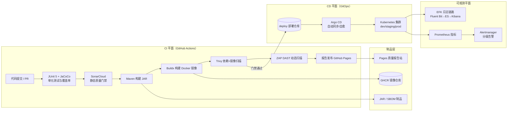

# Spring Boot 项目轻量级云原生 CI/CD 流水线技术方案

> 基于 GitHub Actions + Argo CD 的 GitOps 交付体系，集成 SonarCloud 质量门禁、Trivy 镜像扫描、OWASP ZAP 动态安全测试、JaCoCo 覆盖率门禁与 EFK + Alertmanager 可观测性

---

## 一、方案概述

本文为 Spring Boot 项目设计一条从代码提交到生产部署的完整 CI/CD 流水线，覆盖**持续集成、质量门禁、安全扫描、制品构建、GitOps 交付、运行时可观测**六个环节。方案面向中小规模团队，设计基调是快速与轻量：控制面全部采用托管或云原生组件，不自建 Jenkins、不自建镜像仓库、不自建代码分析平台，将运维成本压缩到接近零，同时保留企业级的安全与质量约束能力。

设计遵循五条原则：

| 原则 | 落地方式 |
|------|----------|
| 托管优先 | CI 引擎用 GitHub Actions，镜像仓库用 GHCR，质量分析用 SonarCloud，报告发布用 GitHub Pages，全部零基础设施运维 |
| GitOps 声明式交付 | Argo CD 以 Git 仓库为唯一部署事实源，集群状态与 Git 声明持续对账，杜绝手工 kubectl |
| 安全左移 | 依赖漏洞（Trivy fs 模式）、镜像漏洞（Trivy image 模式）、运行时漏洞（ZAP DAST）三道闸门前移到合并前 |
| 质量门禁前置 | 覆盖率、静态质量、漏洞等级在 PR 阶段强制阻断，未达标代码无法进入主干 |
| 可观测内建 | EFK 日志链路与 Prometheus + Alertmanager 告警规则随部署同步落地，出问题时 1 分钟内触达值班人 |

方案给出量化的性能目标：PR 流水线端到端不超过 8 分钟（并发取消旧构建、Maven 与 buildx 双层缓存）；main 分支完整流水线不超过 15 分钟；Argo CD 检测到 Git 变更到滚动更新完成不超过 2 分钟；生产回滚通过 `argocd app rollback` 或回退 Git 提交完成，控制在 1 分钟内；最终运行镜像基于 JRE 精简层，体积控制在 250 MB 以内。

覆盖范围上，流水线同时产出两类制品：可执行 JAR 包（供虚拟机或离线环境直接运行）与 OCI 镜像（供 Kubernetes 环境部署），两者由同一次构建生成、共享同一个版本标识，杜绝"测试的 JAR 和部署的镜像不是同一份代码"的经典问题。Python 辅助服务（RAG 检索、ES 数据同步脚本等）复用同一套门禁框架，用 pytest 与 coverage.py 提供等价的测试与覆盖率约束。

## 二、整体架构

流水线由三个平面构成：CI 平面、CD 平面、可观测平面。开发者推送代码后，GitHub Actions 完成"测试 → 质量门禁 → 扫描 → 构建"的流水作业，产出三类制品：可执行 JAR 包、Docker 镜像（推送 GHCR）、质量与安全报告（发布 GitHub Pages）。CI 最后一步向独立的部署仓库写入新镜像 tag，Argo CD 监听到变更后自动同步到 Kubernetes 集群；应用运行产生的日志与指标分别进入 EFK 与 Prometheus，异常由 Alertmanager 分级路由到值班渠道。



各组件职责边界如下：

| 组件 | 职责 | 交互对象 |
|------|------|----------|
| GitHub Actions | CI 引擎，编排测试、扫描、构建、发布四类作业 | SonarCloud、GHCR、Pages、deploy 仓库 |
| SonarCloud | 云端静态代码分析，输出质量门禁结论 | Actions、PR 检查 |
| JUnit 5 + JaCoCo | 单元测试执行与行/分支覆盖率统计 | Maven、SonarCloud |
| Trivy | 依赖清单与容器镜像的 CVE 漏洞扫描 | Actions、GHCR |
| OWASP ZAP | 部署后运行时 DAST 扫描 | Review 环境 |
| GHCR | OCI 镜像与 SBOM 存储 | Argo CD 拉取 |
| Argo CD | GitOps 同步引擎，自动部署与自愈 | deploy 仓库、K8s |
| EFK | 日志采集、存储、检索 | Spring Pod、ES |
| Prometheus + Alertmanager | 指标采集与告警分级路由 | Micrometer、值班渠道 |

## 三、技术栈选型

选型的核心逻辑是"用 SaaS 换运维人力"。下表列出每个环节的组件与选型理由：

| 环节 | 选型 | 选型理由 |
|------|------|----------|
| 代码托管与 CI | GitHub + Actions | 托管运行器免运维，与仓库原生集成，OIDC 免长期密钥 |
| 静态质量分析 | SonarCloud | SonarQube 的云托管版，免服务器，PR 装饰直接展示新代码问题 |
| 镜像构建 | Docker Buildx + GHA 缓存 | 层缓存命中率可达 90%，增量构建秒级 |
| 镜像仓库 | GHCR | 与 GITHUB_TOKEN 原生打通，免额外凭证 |
| 漏洞扫描 | Trivy | 单二进制、速度快，同时覆盖 fs 与 image 两种模式 |
| DAST | OWASP ZAP Baseline | 官方 GitHub Action，无头扫描开箱即用 |
| 覆盖率（Java） | JaCoCo | Maven 生态事实标准，与 SonarCloud 报告格式互通 |
| 覆盖率（Python） | coverage.py + pytest-cov | 辅助 Python 服务（如 RAG 检索、ES 同步脚本）的等价门禁 |
| CD 引擎 | Argo CD | CNCF 毕业项目，GitOps 事实标准，UI 直观、回滚一键化 |
| 日志 | Elasticsearch + Fluent Bit + Kibana | Fluent Bit 比 Fluentd/Filebeat 资源占用低一个数量级，契合轻量基调 |
| 指标与告警 | Prometheus + Alertmanager | Spring Boot Actuator + Micrometer 原生暴露格式 |

SonarCloud 与自建 SonarQube 的取舍：公开仓库 SonarCloud 免费；私有仓库按代码行数订阅（约 10 美元/月起）。若团队已有内网 SonarQube 实例，将 workflow 中的 `sonarqube-scan-action` 指向自建地址即可，门禁语义完全一致，迁移成本约为半天。

与传统自建体系的对比同样值得说明：Jenkins 方案需要至少一台常驻构建机、专人负责升级维护与插件治理，团队规模在十人以下时这部分投入常常超过收益；本方案的 CI 控制面随用量弹性伸缩，GitHub 托管运行器在空闲时不产生任何成本，账单与代码提交量线性相关，成本结构对中小团队更友好。

## 四、CI 流水线设计

### 4.1 触发与并发策略

PR 触发快速检查（测试 + 质量门禁 + 依赖扫描，约 6 分钟），main 分支推送触发完整流水线（追加镜像构建、DAST、报告发布），版本 tag 触发发布流水线。三个入口共享同一份 reusable workflow，避免配置漂移。并发控制取消同分支的过期构建，节省 Actions 配额：

```yaml
name: CI
on:
  push:
    branches: [main]
    tags: ['v*.*.*']
  pull_request:
    branches: [main]

concurrency:
  group: ci-${{ github.ref }}
  cancel-in-progress: true

permissions:
  contents: read
  packages: write
  pull-requests: write
```

### 4.2 作业编排

流水线拆分为四个作业，除报告发布外全部并行执行，配合缓存控制总时长：

| 作业 | 内容 | 预计耗时 | 产出 |
|------|------|----------|------|
| test | JUnit 单元测试、JaCoCo 覆盖率、SonarCloud 门禁 | 4–6 min | 覆盖率 HTML |
| scan | Trivy fs 模式扫描依赖与 IaC 配置 | 1–2 min | 漏洞报告 |
| build-image | 构建并推送镜像，Trivy image 模式复扫 | 5–8 min | GHCR 镜像 + SBOM |
| dast | 部署 Review 环境后 ZAP Baseline 扫描 | 2–3 min | ZAP 报告 |
| report | 聚合全部报告发布 GitHub Pages | 1 min | 报告站点 |

作业之间通过 `needs` 显式声明依赖：`build-image` 等待 `test` 通过后才启动，避免把已知有问题的代码打成镜像；`dast` 依赖 `build-image` 产出的镜像地址；`report` 汇总全部上游制品。任何一道门禁失败都会让依赖链即时中断（fail-fast），不继续消耗后续作业的运行时间，同分支的过期构建也会被并发策略直接取消。

### 4.3 单元测试与覆盖率门禁（JUnit + JaCoCo）

JaCoCo 在 Maven 侧配置三段执行：`prepare-agent` 注入探针、`verify` 阶段生成报告、`check` 目标执行本地门禁。行覆盖率低于 80% 时构建直接失败，不等待远端 SonarCloud 结论：

```xml
<plugin>
  <groupId>org.jacoco</groupId>
  <artifactId>jacoco-maven-plugin</artifactId>
  <version>0.8.12</version>
  <executions>
    <execution>
      <id>prepare-agent</id>
      <goals><goal>prepare-agent</goal></goals>
    </execution>
    <execution>
      <id>report</id>
      <phase>verify</phase>
      <goals><goal>report</goal></goals>
    </execution>
    <execution>
      <id>check</id>
      <goals><goal>check</goal></goals>
      <configuration>
        <rules>
          <rule>
            <element>BUNDLE</element>
            <limits>
              <limit>
                <counter>LINE</counter>
                <value>COVEREDRATIO</value>
                <minimum>0.80</minimum>
              </limit>
            </limits>
          </rule>
        </rules>
      </configuration>
    </execution>
  </executions>
</plugin>
```

仓库内若存在 Python 辅助服务（RAG 检索、数据同步脚本），用 pytest + coverage.py 建立等价门禁，同一作业中并行执行，失败语义与 Java 侧一致：

```bash
pytest --cov=app --cov-report=xml --cov-report=html --cov-fail-under=80
```

### 4.4 SonarCloud 质量门禁

扫描动作将 JaCoCo 生成的 `jacoco.xml` 作为覆盖率数据源上传，分析范围限定为相对目标分支的增量代码，PR 装饰直接在会话内标注新增问题。质量门禁动作采用轮询等待，结果失败时作业以非零码退出，PR 被分支保护规则阻断：

```yaml
- name: SonarCloud 扫描
  uses: SonarSource/sonarqube-scan-action@v4
  env:
    SONAR_TOKEN: ${{ secrets.SONAR_TOKEN }}
- name: 质量门禁
  uses: sonarsource/sonarqube-quality-gate-action@v1
  timeout-minutes: 5
  env:
    SONAR_TOKEN: ${{ secrets.SONAR_TOKEN }}
```

### 4.5 制品构建与镜像构建

Maven 作业产出带 SHA 后缀的 JAR 制品，随 `upload-artifact` 归档；镜像构建采用多阶段 Dockerfile，构建层与运行层分离，运行层使用 JRE 而非 JDK 基础镜像，并以非 root 用户运行：

```dockerfile
FROM maven:3.9-eclipse-temurin-21 AS builder
WORKDIR /app
COPY pom.xml .
RUN mvn -B -q dependency:go-offline
COPY src ./src
RUN mvn -B -q package -DskipTests

FROM eclipse-temurin:21-jre-alpine
RUN addgroup -S app && adduser -S app -G app
USER app
COPY --from=builder /app/target/*.jar /app/app.jar
EXPOSE 8080
ENTRYPOINT ["java","-XX:MaxRAMPercentage=75","-jar","/app/app.jar"]
```

镜像 tag 策略禁用 `latest`：PR 合并镜像打 `sha-<短哈希>`，正式版打语义化版本 `1.4.2`，两者都带 `org.opencontainers.image.revision` 等 OCI 标准标签，供 Argo CD 追溯。Buildx 开启 GitHub Actions 层缓存（`cache-from: type=gha`），依赖未变时构建仅耗时 20–40 秒。

### 4.6 Trivy 安全扫描

扫描分两道：fs 模式在依赖安装后扫描 `pom.xml` 解析出的依赖树与配置文件，image 模式在镜像推送后扫描最终镜像层内的 CVE。两者都只对 CRITICAL 与 HIGH 等级未修复漏洞执行阻断（`exit-code: 1`），已知误报通过仓库内 `.trivyignore` 显式登记并注明原因：

```yaml
- name: Trivy 镜像扫描
  uses: aquasecurity/trivy-action@0.28.0
  with:
    image-ref: ghcr.io/${{ github.repository }}:sha-${{ github.sha }}
    format: 'table'
    exit-code: '1'
    severity: 'CRITICAL,HIGH'
    ignore-unfixed: true
```

### 4.7 DAST 动态安全测试

镜像通过门禁后，workflow 调用 Argo CD API 在隔离命名空间拉起一个 Review 实例，等待健康检查通过后执行 ZAP Baseline 扫描，目标为该实例的 Service 地址。Baseline 模式只报告被动发现的告警，不发起攻击载荷，高危条目导致作业失败。扫描结束后实例随命名空间一并销毁，不留运行时足迹：

```yaml
- name: ZAP Baseline 扫描
  uses: zaproxy/action-baseline@v0.12.0
  with:
    target: 'http://review-${{ github.event.pull_request.number }}.svc:8080'
    cmd_options: '-a -I'
```

### 4.8 报告聚合与发布（GitHub Pages）

全部报告（JaCoCo HTML、Trivy SARIF、ZAP HTML、SBOM 清单）由各作业经 `upload-artifact` 上传，`report` 作业下载后聚合到统一目录，通过 Pages 专用动作链发布。该作业是流水线唯一持有 `pages: write` 与 `id-token: write` 权限的环节，采用 GitHub OIDC 短期令牌完成部署，不落任何长期凭证：

```yaml
  report:
    needs: [test, scan, build-image, dast]
    runs-on: ubuntu-latest
    permissions:
      pages: write
      id-token: write
    environment:
      name: github-pages
      url: ${{ steps.deploy.outputs.page_url }}
    steps:
      - uses: actions/download-artifact@v4
        with:
          path: reports/
          merge-multiple: true
      - uses: actions/configure-pages@v5
      - uses: actions/upload-pages-artifact@v3
        with:
          path: reports/
      - id: deploy
        uses: actions/deploy-pages@v4
```

报告站点按构建覆盖式发布，主干每次推送都能访问到最新的覆盖率与漏洞状况；版本 tag 构建时报告目录携带版本号归档，供发布审计追溯。Trivy 与 ZAP 的 SARIF 结果同时经 `github/codeql-action/upload-sarif` 上传到仓库 Security 面板，与代码扫描告警在同一视图内呈现。

## 五、CD：Argo CD GitOps 交付

部署配置与应用代码分仓存放：应用仓库只管源码，deploy 仓库保存 Kustomize 结构（`base/` 与 `overlays/{dev,staging,production}`），目录按环境隔离差异：

```text
springboot-demo-deploy/
├── base/
│   ├── deployment.yaml      # Deployment + Service 基础声明
│   ├── hpa.yaml             # 水平伸缩策略
│   └── kustomization.yaml
└── overlays/
    ├── dev/                 # 1 副本、低配额、自动同步
    │   └── kustomization.yaml
    ├── staging/             # 生产镜像的预演配置
    └── production/          # 多副本、资源上限、Ingress 与域名覆盖
```

CI 在全部门禁通过后，把新镜像 tag 写入 deploy 仓库对应 overlay 的 `kustomization.yaml` 的 images 字段，这是部署的唯一入口。写入策略按环境分权：dev 环境由 workflow 直接推送（走 `GITHUB_TOKEN` 免密），staging 与 production 环境一律由 `peter-evans/create-pull-request` 发起 PR，经审批合并后 Argo CD 才会感知，生产变更因此天然带评审记录：

```yaml
images:
  - name: ghcr.io/org/springboot-demo
    newTag: sha-a1b2c3d
```

Argo CD 持续对账，发现漂移（有人手工改了集群）会按 `selfHeal` 策略自动纠正回 Git 声明状态。

```yaml
apiVersion: argoproj.io/v1alpha1
kind: Application
metadata:
  name: springboot-demo
  namespace: argocd
spec:
  project: default
  source:
    repoURL: https://github.com/org/springboot-demo-deploy.git
    targetRevision: main
    path: overlays/production
  destination:
    server: https://kubernetes.default.svc
    namespace: production
  syncPolicy:
    automated:
      prune: true
      selfHeal: true
    syncOptions: [CreateNamespace=true]
    retry:
      limit: 5
      backoff: { duration: 15s, factor: 2 }
```

环境晋升沿 dev → staging → production 单向流动：同一个镜像 tag 在三个 overlay 间传递，staging 观察 30 分钟无告警后由负责人合并 promotion PR 进入生产。生产回滚两条路径任选：Git 层面 revert 镜像 tag 提交（保留完整审计轨迹，首选），或紧急情况下 `argocd app rollback springboot-demo` 快速止血后补 Git 记录。

多服务团队建议采用 app-of-apps 模式收敛管理：一个根 Application 的 source 指向 deploy 仓库内全部子 Application 定义所在的目录，新增服务只需在 Git 里追加一个 YAML 文件，根应用同步时自动创建对应的 Argo CD 应用实例，无需任何界面手工操作；服务下线则删除该文件即可，同步策略中的 `prune` 会连带清理集群资源。

## 六、质量门禁体系

四道门禁按流水线时序串联，任何一道失败即终止交付：

| 门禁 | 检测工具 | 阻断阈值 | 失败动作 |
|------|----------|----------|----------|
| 覆盖率门禁 | JaCoCo / coverage.py | 行覆盖率 < 80%（整体），新代码 < 85% | Maven/pytest 构建失败 |
| 静态质量门禁 | SonarCloud Quality Gate | 新代码存在 Blocker 级 Bug 或漏洞 | PR 检查失败，禁止合并 |
| 依赖与镜像门禁 | Trivy | CRITICAL/HIGH 未修复漏洞 ≥ 1 | 作业退出码 1 |
| 运行时安全门禁 | ZAP Baseline | 高危告警 ≥ 1 | DAST 作业失败 |

门禁阈值应当渐进收紧：项目接入初期覆盖率阈值从 60% 起步，每两周上调 5 个百分点直至 80%，避免存量代码一次性卡死全部流水线。`.trivyignore` 与 ZAP 的告警豁免必须写明工单号与有效期，到期后重新评估。

## 七、可观测性：EFK + Alertmanager

### 7.1 日志链路

Spring Boot 通过 `logstash-logback-encoder` 输出结构化 JSON 日志，字段包含 `trace_id`、`level`、`logger`、`service`，为后续按请求聚合排查提供索引键：

```xml
<appender name="JSON" class="ch.qos.logback.core.ConsoleAppender">
  <encoder class="net.logstash.logback.encoder.LogstashEncoder">
    <customFields>{"service":"springboot-demo"}</customFields>
    <includeMdcKeyName>trace_id</includeMdcKeyName>
  </encoder>
</appender>
<root level="INFO">
  <appender-ref ref="JSON"/>
</root>
```

Fluent Bit 以 DaemonSet 形式运行在每个节点，tail 容器 stdout 后按 `service` 字段打标签，批量写入 Elasticsearch；ES 侧用 ILM 策略管理生命周期：热节点保留 7 天，温节点 30 天，之后删除，单服务日志存储成本可预估。Kibana 预置两个看板：按 `trace_id` 追踪单请求全链路日志，按服务聚合 ERROR 趋势。

### 7.2 指标与告警

应用通过 Actuator 暴露 `/actuator/prometheus` 端点，Micrometer 自动转换 HTTP 指标。Prometheus 抓取后由以下规则评估，Alertmanager 按 `severity` 分级路由——critical 走电话与即时消息，warning 走群机器人，工作时间外的 warning 自动静默：

```yaml
groups:
  - name: springboot-alerts
    rules:
      - alert: HighErrorRate
        expr: |
          sum(rate(http_server_requests_seconds_count{status=~"5.."}[5m]))
            / sum(rate(http_server_requests_seconds_count[5m])) > 0.05
        for: 5m
        labels: { severity: critical }
        annotations:
          summary: "5xx 错误率超 5%（{{ $labels.service }}）"
      - alert: HighLatency
        expr: |
          histogram_quantile(0.99,
            sum(rate(http_server_requests_seconds_bucket[5m])) by (le, service)) > 1
        for: 10m
        labels: { severity: warning }
```

Alertmanager 的路由配置承担分级触达：告警先按 `alertname` 与 `service` 分组去重，critical 级别在 30 秒分组等待后立即送值班电话通道，warning 级别走群机器人并按 4 小时重复提醒，静默规则覆盖非工作时间的 warning 级告警：

```yaml
route:
  receiver: default
  group_by: [alertname, service]
  group_wait: 30s
  group_interval: 5m
  repeat_interval: 4h
  routes:
    - match: { severity: critical }
      receiver: oncall-phone
    - match: { severity: warning }
      receiver: team-chat
receivers:
  - name: oncall-phone
    webhook_configs:
      - url: 'http://alert-gateway:8080/phone'
  - name: team-chat
    webhook_configs:
      - url: 'http://alert-gateway:8080/chat'
```

## 八、性能优化与最佳实践

缓存是流水线提速的第一杠杆。Maven 依赖缓存由 `setup-java` 声明式开启，构建层缓存由 Buildx 接管，Trivy 漏洞库则缓存在独立 key 下按周刷新：

```yaml
- uses: actions/setup-java@v4
  with:
    distribution: temurin
    java-version: '21'
    cache: maven
- uses: docker/build-push-action@v6
  with:
    cache-from: type=gha
    cache-to: type=gha,mode=max
```

三层缓存全部命中后，main 流水线可从 15 分钟压缩到 8 分钟以内，PR 快速检查从 12 分钟压缩到 6 分钟左右。安全方面，全部出站凭证走 GitHub OIDC 短期令牌或自带作用域限定的 `GITHUB_TOKEN`，SonarCloud 令牌以外的长期密钥一个都不引入；workflow 权限声明坚持最小化（`contents: read` 为默认，仅发布作业放开 `packages: write`）。分支保护将"CI 通过 + 质量门禁通过 + 至少一人审批"设为合并硬条件，主干永远可发布。流水线配置本身纳入版本评审，reusable workflow 让多服务复用同一套门禁定义，避免某个仓库悄悄降级阈值。

## 九、落地路线图

| 阶段 | 周期 | 交付内容 |
|------|------|----------|
| 第 1 周 | 基础 CI | Actions 测试作业、JaCoCo 覆盖率、JAR 与镜像构建推送 GHCR |
| 第 2 周 | 质量与安全 | SonarCloud 门禁、Trivy 双模式扫描、覆盖率阈值接入分支保护 |
| 第 3 周 | GitOps CD | deploy 仓库、Argo CD 接入、dev/staging 晋升、回滚演练 |
| 第 4 周 | 可观测性 | EFK 部署、告警规则配置、ZAP DAST 接入、Pages 报告站 |

四个阶段相互独立可并行推进，单服务全链路接入的总工时约一个迭代（两周内两人投入）。该体系的关键收益在于：门禁全部代码化、部署全部声明式、故障定位有日志与指标双通道，团队规模翻倍前无需引入专职运维角色。

流水线建设的验收标准直接对齐前文的量化指标：连续 20 次 PR 构建的中位耗时不超过 8 分钟；生产回滚演练能在 5 分钟内完成；人为注入含 CRITICAL 漏洞的测试镜像能被 Trivy 门禁稳定拦截；SonarCloud 对新代码的 Blocker 级问题阈值为 0 且门禁生效。四条全部满足即视为流水线达到设计目标，后续迭代方向是覆盖率阈值渐进收紧与 ZAP 规则集扩展（从 Baseline 升级为 Full Scan 或 API Scan 覆盖接口层）。
